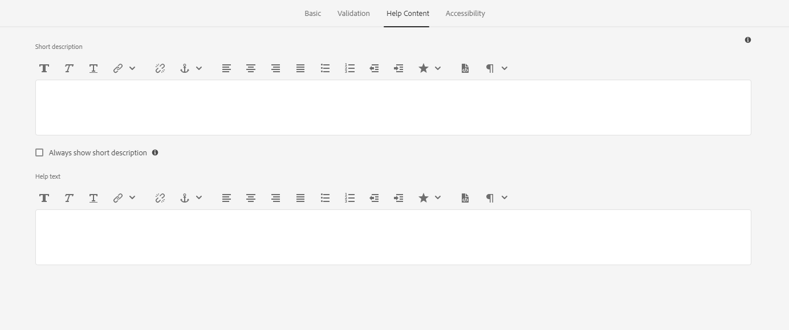

# 적응형 양식 이미지 선택 필드 {#image-choice}

양식의 이미지 선택 구성 요소를 사용하면 텍스트 기반 옵션이 아닌 이미지와 같은 시각적 표현에 따라 선택할 수 있습니다. 각각 고유한 선택을 나타내는 일련의 이미지를 제공합니다. 사용자는 자신의 선택을 나타내는 시각적 피드백과 함께, 하나 이상의 이미지를 선택할 수 있다. 이 구성 요소는 제품 변형, 설문 조사 답변 또는 프로필 사진과 같은 옵션에 유용합니다. 직관적이고 시각적으로 매력적인 선택 방법을 제공하여 사용자 참여도와 명확성을 향상시킵니다.

## 사용량

이미지 선택 구성 요소에는 다음과 같은 몇 가지 주요 기능이 있습니다.

- **이미지 표시:** 사용자가 일반 텍스트 레이블이나 라디오 단추 대신 이미지를 봅니다. 각 이미지는 선택할 수 있는 옵션에 해당하므로 사용 가능한 옵션을 시각적으로 표현합니다.

- **클릭 가능한 이미지:** 사용자는 이미지를 직접 클릭하여 옵션을 선택할 수 있습니다. 선택한 이미지가 종종 강조 표시되어 선택된 것임을 나타냅니다.

- **단일 또는 다중 선택:** 구성 요소의 디자인에 따라 사용자는 단일 이미지 또는 여러 이미지를 선택할 수 있습니다.

## 버전 및 호환성 {#version-and-compatibility}

적응형 Forms 이미지 선택 구성 요소는 핵심 구성 요소 2.0.64의 일부로 릴리스되었습니다. 다음 테이블에서는 지원되는 모든 버전, AEM 호환성 및 해당 문서에 대한 링크를 보여 줍니다.

| 구성 요소 버전 | AEM as a Cloud Service |
|---|---|
| v1 |  [릴리스 2.0.64](/help/adaptive-forms/version.md) 이상 버전과 호환 가능 |

핵심 구성 요소 버전 및 릴리스에 대한 자세한 내용은 [핵심 구성 요소 버전](/help/adaptive-forms/version.md) 문서를 참조하십시오.

## 기술 세부 정보 {#technical-details}

[GitHub](https://github.com/adobe/aem-core-forms-components/tree/master/ui.af.apps/src/main/content/jcr_root/apps/core/fd/components/form/)의 기술 설명서에서 적응형 Forms 이미지 선택 핵심 구성 요소에 대한 최신 정보를 알아보십시오. 핵심 구성 요소 개발에 대한 자세한 내용은 [핵심 구성 요소 개발자 설명서](/help/developing/overview.md)를 확인하십시오.

## 구성 대화 상자 {#configure-dialog}

구성 대화 상자를 통해 방문자에 대한 이미지 선택 구성 요소 경험을 손쉽게 맞춤화할 수 있습니다.

### 기본 탭 {#basic-tab}

- **이름** - 양식과 규칙 편집기 모두에서 고유한 이름으로 양식 구성 요소를 쉽게 식별할 수 있습니다. 단, 이름에는 공백이나 특수 문자가 포함되어서는 안 됩니다.

- **제목** - 제목을 사용하면 적응형 양식에서 구성 요소 유형을 쉽게 식별할 수 있으며, 기본적으로 제목은 구성 요소 옆에 표시됩니다.

- **제목 숨기기** - 제목 숨기기 상자를 선택하여 제목을 숨길 수 있습니다.

- **옵션** - 하나 또는 여러 이미지를 추가하고 이미지 선택 속성을 사용자 지정하는 데 도움이 됩니다. 이미지 선택 속성에는 각 이미지에 대한 데이터 값, 이미지 참조 에셋 및 대체 텍스트가 포함됩니다.

- **바인드 참조** - 바인드 참조는 외부 데이터 소스에 저장되고 양식에서 사용되는 데이터 요소에 대한 참조입니다. 바인드 참조를 사용하면 데이터를 양식 필드에 동적으로 바인딩하여 양식이 데이터 소스의 최신 데이터를 표시하도록 할 수 있습니다.

  예를 들어 바인드 참조를 사용하여 양식에 입력된 고객의 ID를 기반으로 고객의 이름과 주소를 양식에 표시할 수 있습니다. 바인드 참조를 사용하여 양식에 입력된 데이터로 데이터 소스를 업데이트할 수도 있습니다. 이러한 방식으로 AEM Forms를 사용하면 외부 데이터 소스와 상호 작용하는 양식을 만들어 데이터 수집 및 관리를 위한 원활한 사용자 경험을 제공할 수 있습니다.

- **언바운드 양식 요소로 표시**: 어떤 스키마에도 연결되지 않은 양식 필드를 구성하려면 이 옵션을 선택합니다. 이 옵션을 사용하면 데이터 소스를 업데이트하지 않고도 데이터를 저장할 수 있습니다. 또한 표준 데이터베이스 통합과 별도로 사용자 정의 방식으로 데이터를 처리할 수 있습니다.

- **제출된 값의 데이터 유형**: 이 옵션을 선택하면 전송되는 값의 데이터 유형이 지정됩니다. **제출된 값의 데이터 유형**&#x200B;이 `Number`로 설정되어 있고 **옵션** 탭의 **데이터 값**&#x200B;에 문자열 데이터를 추가하면 화면에 `Value type mismatch` 오류 메시지가 표시됩니다.

- **표시 옵션**: 이미지 선택 필드를 가로 또는 세로로 표시할 수 있는 옵션이 제공됩니다.

- **기본값**: 이 옵션을 사용하면 양식 필드에 기본값(데이터 값)을 추가할 수 있습니다. **비활성화된 구성 요소** 또는 **읽기 전용 구성 요소**&#x200B;를 선택하면 화면에 기본값이 표시됩니다. 양식 필드에 사용자가 값을 입력하지 않으면 양식 제출 시 이 값이 제출됩니다.

- **구성 요소 숨기기**: 양식에서 구성 요소를 숨기려면 옵션을 선택합니다. 구성 요소는 다른 용도로(예: 규칙 편집기에서 계산에 사용) 계속 액세스할 수 있습니다. 구성 요소 숨기기는 사용자가 보거나 직접 변경할 필요가 없는 정보를 저장해야 할 때 유용합니다.

- **구성 요소 사용 안 함**: 구성 요소를 사용하지 않도록 설정하거나 잠그는 옵션을 선택하십시오. 비활성화된 구성 요소는 활성 상태가 아니므로 최종 사용자가 편집할 수 없습니다. 사용자는 필드 값을 볼 수 있지만 수정할 수는 없습니다. 구성 요소는 다른 용도로(예: 규칙 편집기에서 계산에 사용) 계속 액세스할 수 있습니다.

- **읽기 전용**: 이 옵션을 사용하면 양식 필드에 기본값(데이터 값)을 추가할 수 있습니다. **비활성화된 구성 요소** 또는 **읽기 전용 구성 요소**&#x200B;를 선택하면 화면에 기본값이 표시됩니다. 양식 필드에 사용자가 값을 입력하지 않으면 양식 제출 시 이 값이 제출됩니다.

- **선택 유형**: 이 옵션을 사용하면 사용자가 하나 또는 여러 개의 이미지 선택 필드를 선택할 수 있습니다.

### 유효성 검사 탭 {#validation-tab}

- **필수** - 적응형 양식에 구성 요소를 표시하려면 이 옵션을 선택합니다. 이 옵션을 선택하면 양식 제출을 진행하기 전에 선택을 해야 합니다. 이 옵션을 선택하면 **기본** 탭에서 **구성 요소 숨기기** 또는 **구성 요소 사용 안 함&rbrace;을 선택할 수 없습니다.

- **오류 메시지** - 이 옵션을 사용하면 **필수** 확인란을 선택하고 이미지 선택 필드를 선택하지 않은 경우 표시되는 메시지를 입력할 수 있습니다.

- **스크립트 유효성 검사 메시지** - 이 옵션을 사용하면 스크립트 유효성 검사가 실패할 경우 표시할 메시지를 입력할 수 있습니다.

### 도움말 콘텐츠 탭 {#helpcontent-tab}

- **간단한 설명** - 간단한 설명은 특정 양식 필드의 용도에 대한 추가 정보 또는 설명을 제공하는 간단한 텍스트 설명입니다. 사용자가 필드에 입력해야 하는 데이터 유형을 이해하는 데 도움이 되며 입력된 정보가 유효하고 원하는 기준을 충족하는지 확인하는 데 도움이 되는 지침 또는 예시를 제공할 수 있습니다. 기본적으로 간단한 설명은 숨겨진 상태로 유지됩니다. **간단한 설명 항상 표시** 옵션을 활성화하여 구성 요소 아래에 표시할 수 있습니다.

- **간단한 설명 항상 표시** - 이 옵션을 활성화하여 구성 요소 아래에 간단한 설명을 표시할 수 있습니다.

- **도움말 텍스트** - 도움말 텍스트는 양식 필드를 올바르게 작성하는 데 도움이 되도록 사용자에게 제공되는 추가 정보 또는 지침을 나타냅니다. 구성 요소 옆에 있는 도움말 아이콘(i)을 클릭하면 표시됩니다. 도움말 텍스트는 양식 필드의 레이블이나 플레이스홀더 텍스트보다 더 자세한 정보를 제공하며 사용자가 필드의 요구 사항이나 제한 사항을 이해하는 데 도움이 되도록 설계되었습니다. 또한 양식을 보다 쉽고 정확하게 작성할 수 있도록 제안이나 예시를 제공할 수도 있습니다.

### 접근성 탭 {#accessibility-tab}

- **화면 판독기용 텍스트** - 화면 판독기용 텍스트는 시각 장애인이 사용하는 화면 판독기와 같은 보조 기술로 읽을 수 있도록 고안된 추가 텍스트를 나타냅니다. 이 텍스트는 양식 필드의 용도에 대한 오디오 설명을 제공하며, 여기에는 필드의 제목, 설명, 이름 및 관련 메시지(사용자 정의 텍스트)에 대한 정보가 포함될 수 있습니다. 화면 판독기 텍스트는 시각 장애가 있는 사용자를 포함한 모든 사용자가 양식에 액세스할 수 있도록 돕고 양식 필드 및 해당 요구 사항을 완전히 이해할 수 있도록 합니다.
   - **사용자 정의 텍스트**: ARIA 접근성 레이블에 사용자 정의 텍스트를 사용하려면 이 옵션을 선택합니다. 이 옵션을 선택하면 사용자 정의 텍스트 대화 상자가 표시됩니다. 사용자 정의 텍스트 대화 상자에서 관련 정보를 추가할 수 있습니다.
   - **제목**: ARIA 접근성 레이블에 제목을 사용하려면 이 옵션을 선택합니다.

## 관련 문서 {#related-articles}

{{more-like-this}}

## 추가 참조 {#see-also}

{{see-also}}

