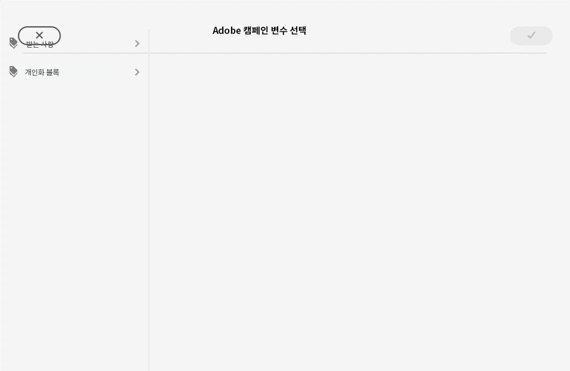
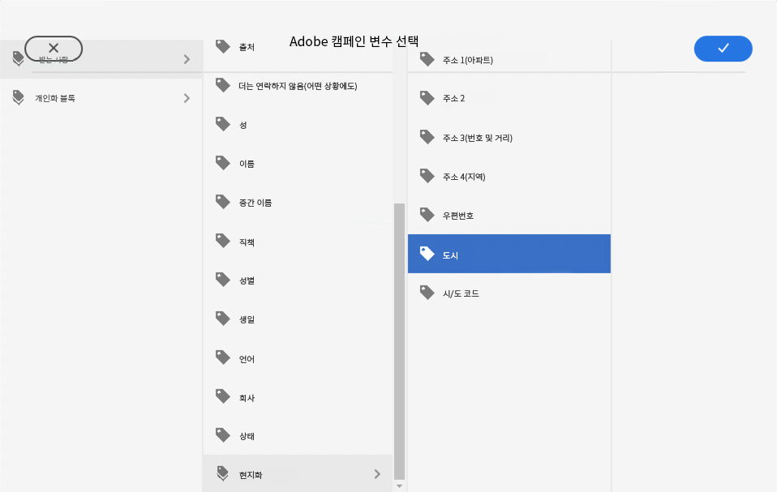
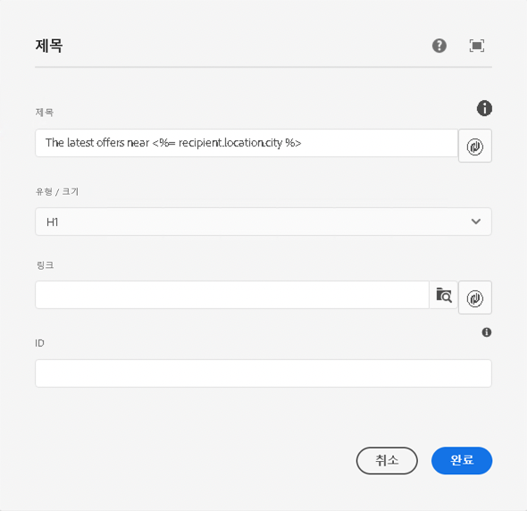

# 캠페인 변수 {#campaign-variables}

캠페인 변수를 사용하여 개인화된 이메일 콘텐츠를 작성합니다. 캠페인 변수는 이메일 콘텐츠에 삽입할 수 있는 Adobe Campaign 값의 자리 표시자 역할을 합니다. 콘텐츠가 Adobe Campaign을 통해 전송되면 Campaign은 해당 변수를 수신자의 개인화된 콘텐츠로 대체합니다.

## 사용 {#usage}

이메일 핵심 구성 요소를 사용하면 공통 텍스트 필드 옆에 있는 개인화 버튼을 통해 캠페인 변수에 쉽게 액세스할 수 있습니다. 누르면 개인화 필드를 선택할 수 있는 대화 상자가 나타납니다.

사용 가능한 개인화 필드 목록은 Adobe Campaign 인스턴스와 동기화됩니다. 필드는 스키마 `nms:seedMember`의 Adobe Campaign에서 관리됩니다. `nms:seedMember`의 모든 필드는 수신자 표에도 표시되어야 합니다.

## Adobe Campaign 변수 선택 대화 상자 {#dialog}

Adobe Campaign 변수 선택 대화 상자는 이메일 핵심 구성 요소의 많은 편집 대화 상자에서 사용할 수 있습니다. 사용하려면 해당 필드 옆의 **Adobe Campaign 변수 선택** 아이콘을 클릭하면 됩니다. 이 아이콘은 두 가지 형태일 수 있습니다.

두 아이콘을 클릭하면 **Adobe Campaign 변수 선택** 대화 상자가 열립니다.

열 보기를 사용하여 삽입하려는 변수를 찾습니다. 열에서 노드를 클릭하면 오른쪽의 새 열에 하위 항목이 표시됩니다. 이 방법으로 가변 콘텐츠 구조를 탐색할 수 있습니다.

삽입하려는 변수를 선택한 다음 대화 상자의 오른쪽 상단에 있는 확인 표시를 클릭합니다.

이후 변수는 이메일 핵심 구성 요소의 편집 대화 상자 필드에 삽입됩니다.

대화 상자를 취소하고 닫으려면 언제든지 대화 상자의 왼쪽 상단에 있는 X를 클릭합니다.
