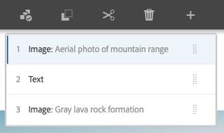

# Accordion Component{#accordion-component}

핵심 구성 요소 아코디언 구성 요소를 사용하면 페이지에 아코디언 배열로 배열된 패널 모음을 만들 수 있습니다.

## 사용량 {#usage}

The Core Component Accordion component allows for the creation of a collection of components, composed as panels, and arranged in an accordion on a page, similar to the [Tabs Component](tabs.md), but allows for expanding and collapsing of the panels.

* The accordion&#39;s properties can be defined in the [configure dialog](#configure-dialog).
* The order of the panels of the accordion can be defined in the configure dialog as well as the [select panel popover](#select-planel.md).
* Defaults for the Accordion Component when adding it to a page can be defined in the [design dialog](#design-dialog).

## Version and Compatibility {#version-and-compatibility}

현재 버전의 아코디언 구성 요소는 2019 년 6 월에 핵심 구성 요소의 릴리스 2.5.0에서 처음 소개된 v 1 이며, 이 문서에서는 설명합니다.

다음 표에서는 구성 요소의 지원되는 모든 버전, 구성 요소의 버전과 호환되는 AEM 버전 및 이전 버전에 대한 설명서에 대한 링크를 제공합니다.

| 구성 요소 버전 | AEM 6.3 | AEM 6.4 | AEM 6.5 |
|--- |--- |--- |---|
| v1 | 호환 가능 | 호환 가능 | 호환 가능 |

For more information about Core Component versions and releases, see the document [Core Components Versions](versions.md).

## Sample Component Output {#sample-component-output}

To experience the Accordion Component as well as see examples of its configuration options as well as HTML and JSON output, visit the [Component Library](http://opensource.adobe.com/aem-core-wcm-components/library/accordion.html).

## Technical Details {#technical-details}

The latest technical documentation about the Accordion Component [can be found on GitHub](https://github.com/adobe/aem-core-wcm-components/tree/master/content/src/content/jcr_root/apps/core/wcm/components/accordion/v1/accordion).

Further details about developing Core Components can be found in the [Core Components developer documentation](developing.md).

## Configure Dialog {#configure-dialog}

구성 대화 상자에서는 컨텐츠 작성자가 아코디언 항목, 패널의 패널 및 방문자에 대해 어떻게 행동하고 표시되는지를 정의할 수 있습니다.

### Items Tab {#items-tab}

**추가** 단추를 사용하여 구성 요소 선택기를 열어 패널로 추가할 구성 요소를 선택합니다. 추가된 항목이 목록에 추가되면 다음 열이 포함됩니다.

* **아이콘** - 목록에서 쉽게 식별할 수 있는 패널의 구성 요소 유형의 아이콘입니다. 마우스를 놓으면 전체 구성 요소 이름이 툴팁으로 표시됩니다.
* **설명** - 패널의 텍스트로 사용된 설명에, 패널에 대해 선택된 구성 요소의 이름으로 기본 설정됩니다.
* **삭제** - 아코디언 구성 요소에서 패널을 삭제하려면 탭하거나 클릭합니다.
* **재배치** - 패널 순서를 재배치하려면 탭하거나 클릭하고 드래그합니다.

### Properties Tab {#properties-tab}

* **단일 항목 확장** - 이 옵션을 선택하면 한 번에 하나의 아코디언 항목이 확장됩니다. 한 항목을 확장하면 다른 모든 항목이 축소됩니다.
* **확장된 항목** - 이 옵션은 페이지를 로드할 때 기본적으로 확장되는 항목을 정의합니다.
   * When **Single item expansion** is selected, one panel must be selected. 기본적으로 첫 번째 패널이 선택되어 있습니다.
   * **단일 항목 확장을** 선택하지 않은 경우 이 옵션은 다중 선택이며 선택 사항입니다.

## Select Panel Popover {#seelct-panel-popover}

The content author can use the **Select Panel** option on the component toolbar to change to a different panel for editing as well as to easily rearrange the order of the panels within the accordion.

Once selecting the **Select Panel** option in the component toolbar, the configured accordion panels are displayed as a drop-down.

* 목록은 패널의 지정된 배열로 순서가 지정되며 번호 매기기에 반영됩니다.
* 패널의 구성 요소 유형이 먼저 표시되고 패널 설명이 더 밝은 글꼴로 표시됩니다.
* 드롭다운에서 항목을 탭하거나 클릭하면 편집기의 보기를 해당 패널로 전환합니다.
* 드래그하는 핸들을 사용하여 패널을 즉석에서 배치할 수 있습니다.

## Design Dialog {#design-dialog}

템플릿 작성자는 디자인 대화 상자를 사용하여 아코디언 구성 요소를 사용하는 컨텐츠 작성자와 아코디언 구성 요소를 배치할 때 설정한 기본값을 템플릿 작성자가 정의할 수 있습니다.

### Properties Tab {#properties-tab-design}

* **허용되는 제목 요소** - 이 다중 선택 드롭다운은 작성자가 선택할 수 있는 아코디언 항목 머리글 HTML 요소를 정의합니다.
* **기본 제목 요소** - 이 드롭다운은 기본 아코디언 항목 머리글 HTML 요소를 정의합니다.

### Allowed Components Tab {#allowed-components-tab}

**허용된 구성 요소** 탭은 컨텐츠 작성자가 아코디언 구성 요소의 패널에 항목으로 추가할 수 있는 구성 요소를 정의하는 데 사용됩니다.

The Allowed Components tab functions in the same way as the tab of the same name when [defining the policy and properties of a Layout Container in the Template Editor.](https://helpx.adobe.com/experience-manager/6-5/sites/authoring/using/templates.html)

### Styles Tab {#styles-tab}

The Accordion Component supports the AEM [Style System](authoring.md#component-styling).
