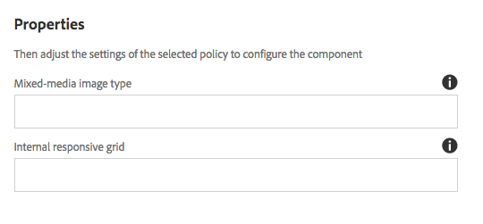

# 컨텐츠 조각 구성 요소{#content-fragment-component}

핵심 구성 요소 컨텐츠 조각 구성 요소는 [컨텐츠 조각을 표시할 수 있습니다](https://helpx.adobe.com/experience-manager/6-5/assets/using/content-fragments.html).

>[!NOTE]
>
>핵심 구성 요소의 릴리스 2.4.0 이전 버전에서 컨텐츠 조각 구성 요소는 핵심 구성 요소에 대한 확장으로 사용할 수 있었고 별도로 다운로드되어 명시적으로 활성화되어 있어야 했습니다.

## 사용량 {#usage}

핵심 구성 요소 조각 구성 요소를 사용하면 페이지에 [컨텐츠 조각을](https://helpx.adobe.com/experience-manager/6-5/assets/using/content-fragments.html) 포함할 수 있습니다.

* 조각 및 해당 속성은 [구성 대화 상자에서 선택할](#configure-dialog)수 있습니다.
* 특정 이미지와 격자를 처리할 리소스 유형은 [디자인 대화 상자에서 정의할](#design-dialog)수 있습니다.
* 편집 옵션은 컨텐츠 조각 편집기 내에서 선택한 [조각을 엽니다](https://helpx.adobe.com/content/help/en/experience-manager/6-5/assets/using/content-fragments.html).

## 버전 및 호환성 {#version-and-compatibility}

컨텐츠 조각 구성 요소의 현재 버전은 2017 년 10 월에 핵심 구성 요소의 릴리스 1.1.0에 도입된 v 1 이며, 이 문서에서는 설명합니다.

다음 표에서는 구성 요소의 지원되는 모든 버전, 구성 요소의 버전과 호환되는 AEM 버전 및 이전 버전에 대한 설명서에 대한 링크를 제공합니다.

| 구성 요소 버전 | AEM 6.3 | AEM 6.4 | AEM 6.5 |
|--- |--- |--- |---|
| v1 | 호환 가능 | 호환 가능 | 호환 가능 |

핵심 구성 요소 버전 및 릴리스에 대한 자세한 내용은 문서 [코어 구성 요소 버전을 참조하십시오](versions.md).

## 샘플 구성 요소 출력 {#sample-component-output}

컨텐츠 조각 구성 요소를 경험하고 HTML 및 JSON 출력뿐만 아니라 구성 옵션의 예를 보려면 [구성 요소 라이브러리를 참조하십시오](http://opensource.adobe.com/aem-core-wcm-components/library/content-fragment.html).

## 기술 세부 정보 {#technical-details}

컨텐츠 조각 구성 요소에 [대한 최신 기술 설명서는 Github](https://github.com/adobe/aem-core-wcm-components/tree/master/content/src/content/jcr_root/apps/core/wcm/components/contentfragment/v1/contentfragment)에서 찾을 수 있습니다.

핵심 구성 요소 개발에 대한 자세한 내용은 [핵심 구성 요소 개발자 설명서를](developing.md)참조하십시오.

## 구성 대화 상자 {#configure-dialog}

컨텐츠 작성자는 구성 대화 상자를 사용하여 포함할 컨텐츠 조각 및 해당 조각의 요소를 정의할 수 있습니다.

* **컨텐츠 조각**

   * 원하는 컨텐츠 조각 경로
   * **선택 대화 상자를** 사용하여 조각을 찾을 수 있습니다.

* **요소** - 포함할 컨텐츠 조각의 요소
* **변형** - 사용할 컨텐츠 조각의 변형 ( **기본적으로 마스터**)

* **단락**

   * **모두** - 모든 단락을 표시합니다.
   * **범위**

      * 표시되는 단락 범위를 세미콜론으로 구분하여 지정합니다.
      * 예를 들어 첫 번째, 세 번째, 여섯 번째, 아홉 번째 단락은 마지막 단락에 포함될 수 `1;3-5;7;9-*` 있습니다.

* **머리글을 고유한 단락으로 처리**

## 디자인 대화 상자 {#design-dialog}

템플릿 작성자는 디자인 대화 상자를 사용하여 혼합 미디어 이미지와 응답형 격자를 처리하는 데 사용되는 리소스 유형을 정의할 수 있습니다.

* **혼합된 미디어 이미지 유형**

   * 혼합된 미디어 이미지 렌더링에 사용되는 Sling 리소스 유형

* **내부 응답형 격자**

   * 내부 응답형 격자에 사용된 Sling 리소스 유형입니다