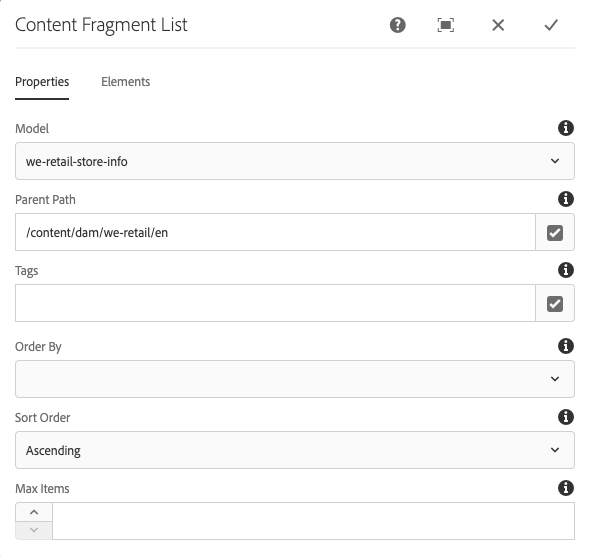

# 컨텐츠 조각 목록 구성 요소{#content-fragment-list-component}

핵심 구성 요소 컨텐츠 조각 목록 구성 요소를 사용하면 [컨텐츠 조각](https://helpx.adobe.com/experience-manager/6-5/assets/using/content-fragments.html)목록을 표시할 수 있습니다.

## 사용량 {#usage}

핵심 구성 요소 컨텐츠 조각 목록 구성 요소를 사용하면 컨텐츠 조각 모델을 기반으로 페이지에 [컨텐츠 조각](https://helpx.adobe.com/experience-manager/6-5/assets/using/content-fragments.html) 목록을 포함할 수 있습니다. 이 기능은 특히 다른 애플리케이션에서 손쉽게 사용할 수 있는 헤드리스 컨텐츠를  제작하는 데 유용합니다.

* 목록 및 해당 속성은 [구성 대화 상자에서](#configure-dialog)선택할 수 있습니다.
* 스타일은 [디자인 대화 상자에서](#design-dialog)구성 요소에 적용할 수 있습니다.

## 버전 및 호환성 {#version-and-compatibility}

컨텐츠 조각 구성 요소의 현재 버전은 v1이며, 이 버전은 2019년 5월 핵심 구성 요소 릴리스 2.4.0에서 도입되었으며 이 문서에 설명되어 있습니다.

다음 표에서는 구성 요소의 지원되는 모든 버전, 구성 요소 버전이 호환되는 AEM 버전 및 이전 버전에 대한 설명서 링크에 대해 자세히 설명합니다.

| 구성 요소 버전 | AEM 6.3 | AEM 6.4 | AEM 6.5 |
|--- |--- |--- |---|
| v1 | 호환 가능 | 호환 가능 | 호환 가능 |

핵심 구성 요소 버전 및 릴리스에 대한 자세한 내용은 핵심 구성 요소 [버전을 참조하십시오](versions.md).

## 샘플 구성 요소 출력 {#sample-component-output}

컨텐츠 조각 목록 구성 요소뿐만 아니라 구성 옵션 예와 HTML 및 JSON 출력을 보려면 구성 요소 라이브러리를 [방문하십시오](http://opensource.adobe.com/aem-core-wcm-components/library/content-fragment-list.html).

## 기술 정보 {#technical-details}

컨텐츠 조각 목록 구성 요소에 대한 최신 기술 문서는 GitHub에서 [찾을 수 있습니다](https://github.com/adobe/aem-core-wcm-components/blob/master/content/src/content/jcr_root/apps/core/wcm/components/contentfragmentlist/v1/contentfragmentlist).

핵심 구성 요소 개발에 대한 자세한 내용은 핵심 구성 요소 개발자 [설명서를](developing.md)참조하십시오.

## 구성 대화 상자 {#configure-dialog}

구성 대화 상자에서는 컨텐츠 작성자가 목록에 포함할 컨텐츠 조각과 해당 조각 요소를 정의할 수 있습니다.

### 속성 탭

속성 **탭에서는** 목록에 포함할 컨텐츠 조각을 정의합니다. 이는 기본적으로 선택된 컨텐츠 조각 모델을 기반으로 하지만 사용 가능한 다른 필터 옵션이 있습니다.

* **모델** - 목록이 기반으로 하는 컨텐츠 조각 모델의 경로입니다.
   * 기본적으로 모델 경로로 정의된 모델의 모든 컨텐츠 **조각이** 목록에 포함됩니다.
* **상위 경로** - 목록을 작성할 상위 경로입니다.
   * 선택한 모델 경로를 기반으로 **한** 컨텐츠 조각은 지정된 상위 경로에 있는 조각으로 **필터링됩니다**.
      * 필드 오른쪽의 **선택** 대화 상자 열기 단추를 클릭하거나 탭하여 경로를 지정합니다.
* **태그** - 지정된 태그가 있는 컨텐츠 조각만 목록에 포함됩니다.
   * 필드 오른쪽의 **선택** 대화 상자 열기 단추를 클릭하거나 탭하여 태그를 지정합니다.
   * 선택한 태그 옆의 X를 클릭하거나 탭하여 제거합니다.
* **정렬** 기준 - 목록이 정렬될 컨텐츠 조각 모델의 필드
   * 텍스트 필드(숫자, 날짜 및 시간 포함)만 선택할 수 있습니다.
* **정렬 순서** - 목록을 정렬 기준 **필드로 정렬하는** 방법
   * 오름차순 또는 내림차순
* **최대** 항목 - 목록에 표시할 최대 항목 수
   * 값이 없으면 모든 항목이 반환됩니다.

>[!NOTE]
>주문 **기준**, **정렬 순서**&#x200B;및 **최대 항목** 옵션은 코어 구성 요소 릴리스 2.7.0과 함께 도입되었습니다.

### 요소 탭

기본적으로 컨텐츠 조각 모델의 모든 요소는 목록에 포함됩니다(최대 항목 **필드로 제한되지 않는 경우** ). 요소 **탭에서는** 포함할 특정 요소만 지정할 수 있습니다.

* **요소** - 지정된 목록에 있는 컨텐츠 조각의 요소만 나타납니다.
   * 추가 단추를 클릭하거나 탭하여 **새** 요소를 추가합니다..
   * 삭제 **단추를 클릭하거나 탭하여** 선택한 요소를 제거합니다.
   * 순서 **핸들을 드래그하여** 요소의 순서를 다시 정렬합니다.

## 디자인 대화 상자 {#design-dialog}

템플릿 작성자는 디자인 대화 상자를 사용하여 컨텐츠 조각 목록 구성 요소에 적용된 스타일을 정의할 수 있습니다.
