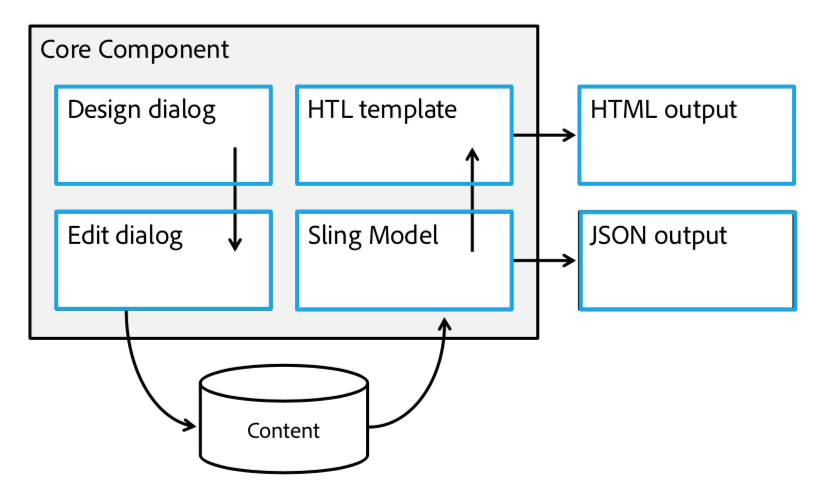

# 핵심 구성 요소 맞춤화{#customizing-core-components}

[핵심 구성 요소는](developing.md) 간단한 스타일링에서부터 고급 기능에 이르기까지 간편한 사용자 정의 기능을 제공하는 여러 패턴을 구현합니다.

## 유연한 아키텍처 {#flexible-architecture}

The core components was designed from the beginning to be flexible and scalability. 아키텍처에 대한 개요에서 사용자 지정 가능한 부분을 설명합니다.



* [디자인 대화 상자는](authoring.md#edit-and-design-dialogs) 편집 대화 상자에서 작성자가 수행할 수 있는 작업을 정의합니다.
* [편집 대화 상자에는](authoring.md#edit-and-design-dialogs) 작성자가 사용할 수 있는 옵션만 표시됩니다.
* [Sling 모델은](#customizing-the-logic-of-a-core-component) 보기 (템플릿) 에 대한 컨텐츠를 확인하고 준비합니다.
* [SPA 사용 사례를 위해 sling 모델의](#customizing-the-logic-of-a-core-component) 결과를 JSON로 직렬화할 수 있습니다.
* [HTL는 기존의 서버측 렌더링을 위해 HTML](#customizing-the-markup) 서버측을 렌더링합니다.
* [HTML 출력은](#customizing-the-markup) 의미, 액세스 가능성, 검색 엔진 최적화 및 간편한 스타일링입니다.

모든 핵심 구성 요소는 [스타일 시스템을 구현합니다](customizing.md).

## 맞춤화 패턴 {#customization-patterns}

### 대화 상자 사용자 정의 {#customizing-dialogs}

디자인 대화 상자 또는 편집 대화 상자여야 하는 핵심 구성 요소 대화 상자에서 사용할 수 있는 구성 [옵션을 사용자 정의할](authoring.md)수 있습니다.

각 대화 상자는 일관된 노드 구조를 가지고 있습니다. 이 구조는 원래 대화 상자의 섹션을 숨기거나 바꾸거나 순서를 변경하는 데 [Sling 리소스 병합](https://helpx.adobe.com/experience-manager/6-4/sites/developing/using/sling-resource-merger.html) 및 [숨기기 조건을](https://helpx.adobe.com/experience-manager/6-5/sites/developing/using/hide-conditions.html) 사용할 수 있도록 상속 구성 요소에서 복제하는 것이 좋습니다. 복제할 구조는 탭 항목 노드 수준까지 정의됩니다.

현재 버전에서 대화 상자의 변경 사항과 완전히 호환되게 하려면 탭 항목 수준 아래의 구조 (숨김, 추가, 대체, 순서 변경 등) 를 유지하는 것이 매우 중요합니다. 대신, 상위 항목의 탭 항목은 `sling:hideResource` 해당 속성을 통해 숨겨져야 합니다 ( [Sling Resource 합병 속성 참조](https://helpx.adobe.com/experience-manager/6-5/sites/developing/using/sling-resource-merger.html)). `sling:orderBefore` 필요한 경우 탭 항목을 다시 정렬하는 데 사용할 수 있습니다.

아래 대화 상자는 위에서 설명한 대로 상속된 탭을 숨기고 대체하는 방법은 물론, 권장되는 대화 상자 구조를 보여 줍니다.

<!-- 

Comment Type: annotation
Last Modified By: ims-author-CE1E2CE451D1F0680A490D45@AdobeID
Last Modified Date: 2017-04-17T17:43:20.265-0400

Should we provide guidance on how to name their CSS classes, etc. to align to component re-usability best-practices? We tout that we follow bootstrap css naming, should we be counseling customers to align similarly? .cmp- 
<component name="">
  -- 
 <element>
   - 
  <element descriptor="">
    ? 
  </element> 
 </element> 
</component>

 -->

```xml
<?xml version="1.0" encoding="UTF-8"?>
<jcr:root xmlns:sling="https://sling.apache.org/jcr/sling/1.0"
          xmlns:jcr="https://www.jcp.org/jcr/1.0"
          xmlns:nt="https://www.jcp.org/jcr/nt/1.0"
          xmlns:granite="https://www.adobe.com/jcr/granite/1.0"
          jcr:primaryType="nt:unstructured">
    <content jcr:primaryType="nt:unstructured">
        <items jcr:primaryType="nt:unstructured">
            <tabs jcr:primaryType="nt:unstructured">
                <items jcr:primaryType="nt:unstructured">
                        <originalTab
                                jcr:primaryType="nt:unstructured"
                                sling:hideResource="true"/>
                        </originalTab>
                        <myTab
                               jcr:primaryType="nt:unstructured"
                               jcr:title="My Tab"
                               sling:resourceType="granite/ui/components/coral/foundation/container"/>
                               <!-- myTab content -->
                        </myTab>
                </items>
            </basic>
        </items>
    </content>
</jcr:root>
```

### 핵심 구성 요소의 논리 사용자 지정 {#customizing-the-logic-of-a-core-component}

핵심 구성 요소에 대한 비즈니스 논리는 Sling 모델에서 구현됩니다. 이 로직은 Sling 위임 패턴을 사용하여 확장할 수 있습니다.

예를 들어 제목 핵심 구성 요소는 요청된 리소스의 `jcr:title` 속성을 사용하여 제목 텍스트를 제공합니다. `jcr:title` 속성을 정의하지 않으면 현재 페이지 제목으로의 폴백이 구현됩니다. 현재 페이지의 제목이 항상 표시되도록 동작을 변경하려고 합니다.

핵심 구성 요소 모델의 구현은 비공개이므로 위임 패턴으로 확장되어야 합니다.

```java
@Model(adaptables = SlingHttpServletRequest.class,
       adapters = Title.class,
       resourceType = "myproject/components/pageHeadline")
public class PageHeadline implements Title {
    @ScriptVariable private Page currentPage;
    @Self @Via(type = ResourceSuperType.class)
    private Title title;
    @Override public String getText() {
        return currentPage.getTitle();
    }
    @Override public String getType() {
        return title.getType();
    }
}
```

위임 패턴에 대한 자세한 내용은 Sling Models의 핵심 구성 요소 github Wiki [집필 위임 패턴을 참조하십시오](https://github.com/adobe/aem-core-wcm-components/wiki/Delegation-Pattern-for-Sling-Models).

### 마크업 사용자 정의 {#customizing-the-markup}

경우에 따라 고급 스타일링을 사용하려면 구성 요소의 서로 다른 마크업 구조가 필요합니다.

핵심 구성 요소에서 프록시 구성 요소로 수정해야 하는 HTL 파일을 복사하여 쉽게 수행할 수 있습니다.

핵심 브레드크럼 구성 요소의 예를 다시 한 번 탭하면, 해당 파일을 핵심 `breadcrumb.html` 브레드크럼 구성 요소를 가리키는 사이트가 `sling:resourceSuperTypes` 있는 사이트 특정 구성 요소로 복사해야 합니다.

<!-- 

Comment Type: annotation
Last Modified By: ims-author-CE1E2CE451D1F0680A490D45@AdobeID
Last Modified Date: 2017-04-17T17:43:20.265-0400

Should we provide guidance on how to name their CSS classes, etc. to align to component re-usability best-practices? We tout that we follow bootstrap css naming, should we be counseling customers to align similarly? .cmp- 
<component name="">
  -- 
 <element>
   - 
  <element descriptor="">
    ? 
  </element> 
 </element> 
</component>

 -->

### 구성 요소 스타일 지정 {#styling-the-components}

첫 번째 사용자 정의 형태는 CSS 스타일을 적용하는 것입니다.

이를 위해 핵심 구성 요소는 의미 마크업을 렌더링하고 Bootstrap에서 [영감을 얻은 표준화된 이름 지정 규칙을 따릅니다](https://getbootstrap.com/). 또한 개별 구성 요소에 대한 스타일을 쉽게 지정하고 네임스페이스를 지정하기 위해 각 핵심 구성 요소가 &quot; `cmp`&quot; 및 &quot; `cmp-<name>`&quot; 클래스를 포함하는 div 요소에 래핑됩니다.

예를 들어 v 1 코어 탐색 표시 구성 요소의 HTL 파일을 살펴보면 다음과 같습니다. [breadcrumb.html](https://github.com/adobe/aem-core-wcm-components/blob/master/content/src/content/jcr_root/apps/core/wcm/components/breadcrumb/v2/breadcrumb/breadcrumb.html)에서 요소 출력 계층은 `ol.breadcrumb > li.breadcrumb-item > a`다음과 같습니다. 따라서 CSS 규칙이 해당 구성 요소의 탐색 표시 클래스에만 영향을 주도록 하려면 모든 규칙은 아래와 같이 이름이어야 합니다.

```shell
.cmp-breadcrumb .breadcrumb {}  
.cmp-breadcrumb .breadcrumb-item {}  
.cmp-breadcrumb a {}
```

또한 각 핵심 구성 요소는 템플릿 작성자가 페이지 작성자가 구성 요소에 적용할 수 있는 추가 CSS 클래스 이름을 정의할 수 있도록 해주는 AEM [스타일 시스템 기능을](https://helpx.adobe.com/experience-manager/6-5/sites/authoring/using/style-system.html) 활용합니다. 이를 통해 각 템플릿에 허용된 구성 요소 스타일 목록 및 이 중 하나가 기본적으로 해당 유형의 모든 구성 요소에 적용되어야 하는지 여부를 지정할 수 있습니다.

## 사용자 정의 업그레이드 호환성 {#upgrade-compatibility-of-customizations}

세 가지 종류의 업그레이드가 가능합니다.

* AEM 버전 업그레이드
* 핵심 구성 요소를 새 보조 버전으로 업그레이드
* 주요 구성 요소를 주요 버전으로 업그레이드

일반적으로, 구성 요소의 버전이 마이그레이션되고 있는 새 AEM 버전도 지원하거나, 사용자 지정 또는 제거된 API가 사용되지 않는 경우 AEM를 새 버전으로 업그레이드하는 것은 핵심 구성 요소 또는 수행한 사용자 지정 기능에 영향을 [주지 않습니다](https://helpx.adobe.com/experience-manager/6-5/release-notes/deprecated-removed-features.html).

새 주요 버전으로 전환하지 않고 핵심 구성 요소를 업그레이드하는 것은 이 페이지에 설명된 사용자 지정 패턴이 사용되는 한 사용자 지정 사항에 영향을 주지 않습니다.

핵심 구성 요소 중 최신 주요 버전으로 전환하는 것은 컨텐츠 구조에만 호환되지만 사용자 지정을 리팩토링해야 할 수 있습니다. 각 구성 요소 버전에 대한 명확한 변경 로그가 이 페이지에 설명된 사용자 지정 유형의 영향을 강조하기 위해 각 구성 요소 버전에 대해 게시됩니다.

## 사용자 정의 지원 {#support-of-customizations}

AEM 구성 요소에 대해 다음과 같이 사용자 지정 사항에 대해 알아야 할 사항이 많이 있습니다.

1. **핵심 구성 요소의 코드를 직접 수정하지 마십시오.**

   이렇게 하면 이러한 구성 요소가 완전히 지원되지 않게 되며 향후 업데이트되는 구성 요소를 고통스러운 프로세스로 업데이트할 수 있습니다. 대신, 이 페이지에 설명된 사용자 지정 방법을 사용하십시오.

1. **사용자 지정 코드는 사용자의 책임입니다.**

   Adobe 지원 프로그램은 사용자 지정 코드를 포함하지 [않으며, 문서로 된](using.md) 바닐라 핵심 구성 요소로 재현할 수 없는 보고된 문제는 포함되지 않습니다.

1. **더 이상 사용되지 않거나 제거된 기능을 보십시오.**

   새로운 AEM 버전을 업그레이드할 때마다 [사용되지 않거나 제거된 기능](https://helpx.adobe.com/experience-manager/6-5/release-notes/deprecated-removed-features.html) 페이지를 지켜보면서 사용된 모든 API가 여전히 최상위 버전인지 확인합니다.

[핵심 구성 요소 지원](developing.md#core-component-support) 섹션을 참조하십시오.

**다음을 참조하십시오.**

* [핵심 구성 요소 사용](using.md) - 프로젝트에 핵심 구성 요소를 사용할 수 있습니다.
* [구성 요소 지침](guidelines.md) - 핵심 구성 요소의 구현 패턴을 학습합니다.
