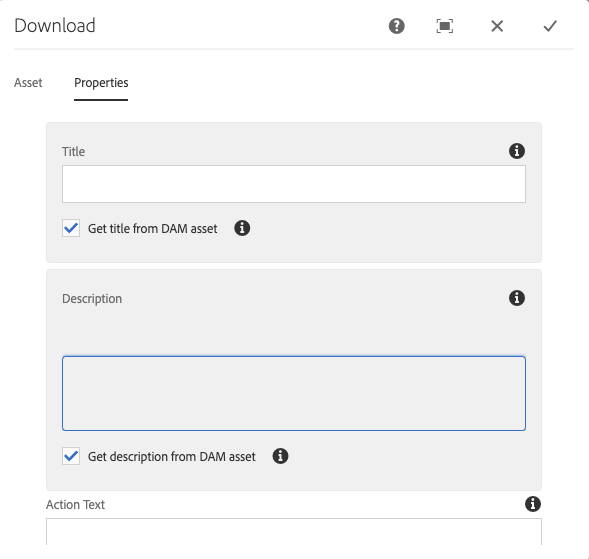

# Download Component{#download-component}

핵심 구성 요소 다운로드 구성 요소를 사용하면 페이지에서 다운로드 옵션을 만들 수 있습니다.

## 사용량 {#usage}

핵심 구성 요소 다운로드 구성 요소를 사용하면 다운로드 옵션과 관련 자산을 페이지에 포함할 수 있습니다.

* The download option&#39;s properties can be selected in the [configure dialog](#configure-dialog).
* Defaults for the download component can be defined in the [design dialog](#design-dialog).

## Version and Compatibility {#version-and-compatibility}

현재 버전의 다운로드 구성 요소는 2019 년 6 월에 핵심 구성 요소의 릴리스 2.5.0에서 처음 소개된 v 1 이며, 이 문서에서는 설명합니다.

다음 표에서는 구성 요소의 지원되는 모든 버전, 구성 요소의 버전과 호환되는 AEM 버전 및 이전 버전에 대한 설명서에 대한 링크를 제공합니다.

| 구성 요소 버전 | AEM 6.3 | AEM 6.4 | AEM 6.5 |
|--- |--- |--- |---|
| v1 | 호환 가능 | 호환 가능 | 호환 가능 |

For more information about Core Component versions and releases, see the document [Core Components Versions](versions.md).

## Sample Component Output {#sample-component-output}

To experience the Download Component as well as see examples of its configuration options as well as HTML and JSON output, visit the [Component Library](http://opensource.adobe.com/aem-core-wcm-components/library/download.html).

## Technical Details {#technical-details}

The latest technical documentation about the Download Component [can be found on GitHub](https://github.com/adobe/aem-core-wcm-components/tree/master/content/src/content/jcr_root/apps/core/wcm/components/download/v1/download).

Further details about developing Core Components can be found in the [Core Components developer documentation](developing.md).

## Configure Dialog {#configure-dialog}

구성 대화 상자에서 컨텐츠 작성자는 컨텐츠 작성자가 다운로드 항목을 정의하고 페이지에 대해 어떻게 행동하고 나타날지 정의할 수 있습니다.

### Asset Tab {#asset-tab}

The selection of a download asset is very similar to the functionality of the [Image Component](image.md) and likewise leverages AEM&#39;s DAM.

* **자산 다운로드**
   * [자산 브라우저에서 자산을](https://helpx.adobe.com/experience-manager/6-5/sites/authoring/using/author-environment-tools.html) 끌어 놓거나 **찾아보기** 옵션을 눌러 로컬 파일 시스템에서 업로드합니다.
   * **지우기를** 탭하거나 클릭하여 현재 선택한 이미지를 제거합니다.
   * **편집을** 탭하거나 [클릭하여 자산 편집기에서 자산의](https://helpx.adobe.com/experience-manager/6-5/assets/using/managing-assets-touch-ui.html) 표현물을 관리합니다.

### Properties Tab {#properties-tab}

* **제목** - 다운로드 항목에 대한 헤드라인으로 표시됩니다.
   * **DAM 자산에서 제목 가져오기** - 이 항목을 선택하면 제목이 DAM 자산 제목으로 자동으로 채워집니다.
* **설명** - 다운로드 항목의 설명적인 소제목으로 표시됩니다.
   * **DAM 자산에서 설명 가져오기** - 이 옵션을 선택하면 설명이 DAM 자산의 설명으로 자동 채워집니다.
* **작업 텍스트** - 다운로드 항목에 대한 작업 텍스트로 표시됩니다.
   * 이 필드는 파일 시스템에서 자산을 업로드할 때 필요합니다.
   * **인라인 표시** - 제공된 **작업 텍스트를** 선택하면 인라인 표시가 표시됩니다.

## Design Dialog {#design-dialog}

템플릿 작성자는 디자인 대화 상자를 사용하여 다운로드 구성 요소를 사용하는 컨텐츠 작성자가 사용할 수 있는 옵션을 정의할 수 있습니다.

### Properties Tab {#properties-tab-design}

* **기본 작업 텍스트** - 작성자가 페이지에 다운로드 구성 요소를 추가할 때 제공된 기본 **작업 텍스트를** 정의합니다.
* **파일 시스템에서 업로드 허용** - 컨텐츠 작성자가 자신의 로컬 파일 시스템에서 에셋을 다운로드 에셋으로 업로드할 수 있습니다.
   * 기본값은 선택 취소입니다.
* **제목 유형** - 다운로드 구성 요소의 제목에서 사용되는 HTML 요소입니다.
   * 값을 선택하지 않으면 기본값은 H 3 입니다.
* **디스플레이 파일 크기** - 선택한 경우 자산의 파일 크기가 다운로드 구성 요소에 표시됩니다.
   * 기본값이 선택됩니다.
* **디스플레이 파일 형식** - 선택한 경우 자산의 파일 형식이 다운로드 구성 요소에 표시됩니다.
   * 기본값이 선택됩니다.
* **파일 이름 표시** - 선택한 경우 자산의 파일 이름이 다운로드 구성 요소에 표시됩니다.
   * 기본값이 선택됩니다.

### Styles Tab {#styles-tab}

The Image Component supports the AEM [Style System](authoring.md#component-styling).
