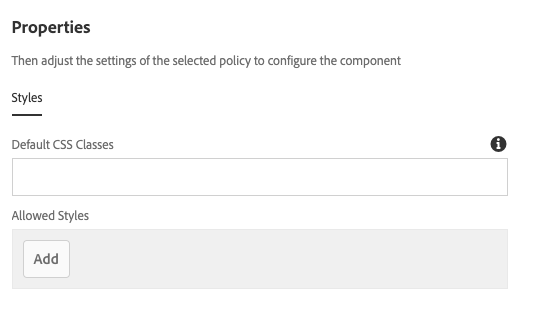

# 경험 조각 구성 요소{#experience-fragment-component}

컨텐츠 작성자는 핵심 구성 요소 경험 조각 구성 요소를 사용하여 현지화된 사이트 구조를 지원하면서 페이지에 경험 조각 변형을 배치할 수 있습니다.

## 사용량 {#usage}

컨텐츠 작성자는 핵심 구성 요소 경험 조각 구성 요소를 사용하여 기존 경험 조각 정렬에서 선택하고 컨텐츠 페이지에 배치할 수 있습니다. 경험 조각 구성 요소는 현지화된 사이트 구조도 지원합니다.

* 구성 요소의 속성은 [구성 대화 상자에서 정의할](#configure-dialog)수 있습니다.
* 구성 요소를 페이지에 추가할 때의 기본값은 [디자인 대화 상자에서 정의할 수](#design-dialog)있습니다.

## 현지화된 사이트 구조 지원 {#localized-site-structure}

경험 조각 구성 요소는 현지화된 사이트 구조에 적응형이며 페이지의 현지화를 기반으로 적절한 경험 조각을 렌더링합니다. 이렇게 하려면 경험 조각이 다음 조건을 충족해야 합니다.

* 경험 조각 구성 요소가 템플릿에 추가됩니다.
* 이 템플릿은 아래 지역화된 구조의 일부인 새 컨텐츠 페이지를 만드는 데 사용됩니다 `/content/<site>`.
* 컨텐츠 페이지에 참조된 경험 조각은 아래의 사이트와 동일한 패턴 이름 사용을 포함하여 아래의 `/content/experience-fragments``/content/<site>` 사이트와 동일한 패턴을 따르는 아래의 현지화된 경험 조각 구조에 속합니다.

이 경우 현재 페이지와 동일한 현지화 (언어, 블루프린트 또는 Live Copy) 를 갖는 조각은 템플릿의 일부로 렌더링됩니다.

이 동작은 템플릿에 추가된 경험 조각 구성 요소로 제한됩니다. 개별 컨텐츠 페이지에 추가된 경험 조각 구성 요소는 구성 요소 내에 구성된 정확한 경험 조각 표현물을 렌더링합니다.

* 경험 조각 구성 요소의 현지화 기능이 작동하는 방법의 예를 보려면 아래 섹션을 참조하십시오 [](#example).
* 핵심 구성 요소의 현지화 기능이 함께 작동하는 방법에 대한 예를 보려면 핵심 구성 요소 페이지의 [현지화 기능을 참조하십시오](localization.md).

### 예 {#example}

컨텐츠가 다음과 같이 표시됩니다.

```
/content
+-- experience-fragments
   \-- we-retail
      +-- language-masters
      +-- us
         +-- en
            +-- footerTextXf
            \-- headerTextXf
         \-- es
            +-- footerTextXf
            \-- headerTextXf
      \-- ch
         +-- de
            +-- footerTextXf
            \-- headerTextXf
         +-- fr
            +-- footerTextXf
            \-- headerTextXf
         \-- it
            +-- footerTextXf
            \-- headerTextXf
+-- we-retail
   +-- language-masters
   +-- us
      +-- en
      \-- es
   +-- ch
      +-- de
      +-- fr
      \-- it
+-- wknd-events
\-- wknd-shop
```

아래 구조는 구조를 `/content/experience-fragments/we-retail` 미러링합니다 `/content/we-retail`.

이 경우 경험 조각 구성 요소를 `/content/experience-fragments/we-retail/us/en/footerTextXf` 템플릿에 배치하면 해당 템플릿을 기반으로 만들어진 현지화된 페이지가 로컬라이제이션된 컨텐츠 페이지에 해당하는 지역화된 경험 조각을 자동으로 렌더링합니다.

따라서에서 동일한 템플릿을 사용하는 콘텐츠 `/content/we-retail/ch/de` 페이지로 이동하면 `/content/experience-fragments/we-retail/ch/de/footerTextXf``/content/experience-fragments/we-retail/us/en/footerTextXf`대신 동일한 템플릿이 렌더링됩니다.

### 폴백 {#fallback}

경험 조각 구성 요소는 다음 순서로 해당 현지화된 구성 요소를 찾으려고 시도합니다.

1. 우선 언어 루트를 찾습니다.
1. 찾을 수 없는 경우 블루프린트를 찾습니다.
1. 찾을 수 없는 경우 Live Copy가 검색됩니다.
1. 찾을 수 없으면 구성 요소에 구성된 경험 조각이 기본값으로 설정됩니다.

## 버전 및 호환성 {#version-and-compatibility}

경험 조각 구성 요소의 현재 버전은 2019 년 9 월에 핵심 구성 요소의 릴리스 2.6.0에 도입된 v 1 이며, 이 문서에서는 설명합니다.

다음 표에서는 구성 요소의 지원되는 모든 버전, 구성 요소의 버전과 호환되는 AEM 버전 및 이전 버전에 대한 설명서에 대한 링크를 제공합니다.

| 구성 요소 버전 | AEM 6.3 | AEM 6.4 | AEM 6.5 |
|--- |--- |--- |---|
| v1 | 호환 가능 | 호환 가능 | 호환 가능 |

핵심 구성 요소 버전 및 릴리스에 대한 자세한 내용은 문서 [코어 구성 요소 버전을 참조하십시오](versions.md).

## 샘플 구성 요소 출력 {#sample-component-output}

경험 조각 구성 요소를 경험하고 HTML 및 JSON 출력을 비롯하여 구성 옵션의 예를 보려면 [구성 요소 라이브러리를 참조하십시오](http://opensource.adobe.com/aem-core-wcm-components/library/experience-fragment.html).

## 기술 세부 정보 {#technical-details}

경험 조각 구성 요소에 [대한 최신 기술 설명서는 Github](https://github.com/adobe/aem-core-wcm-components/tree/master/content/src/content/jcr_root/apps/core/wcm/components/experience-fragment/v1/experience-fragment)에서 찾을 수 있습니다.

핵심 구성 요소 개발에 대한 자세한 내용은 [핵심 구성 요소 개발자 설명서를](developing.md)참조하십시오.

## 구성 대화 상자 {#configure-dialog}

컨텐츠 작성자는 구성 대화 상자를 사용하여 페이지에서 렌더링되어야 하는 경험 조각 변형을 선택할 수 있습니다.


선택 대화 상자 **열기** 단추를 사용하여 구성 요소 선택기를 열어 컨텐츠 페이지에 추가할 경험 조각 구성 요소 변형을 선택합니다.

경험 조각 구성 요소를 템플릿에 추가하는 경우 경험 조각이 현지화되어 있는 경우 해당 구성 요소가 자동으로 로컬라이제이션된다는 점을 참고하십시오. 따라서 페이지에서 렌더링되는 요소는 명시적으로 선택하는 구성 요소와 다를 수 있습니다. [자세한 내용은 위의](#example) 예를 참조하십시오.

## 디자인 대화 상자 {#design-dialog}

디자인 대화 상자를 사용하면 템플릿 작성자가 경험 조각 구성 요소를 사용하는 컨텐츠 작성자와 경험 조각 구성 요소를 배치할 때 설정한 기본값을 지정할 수 있습니다.



경험 조각 구성 요소는 AEM [스타일 시스템을 지원합니다](authoring.md#component-styling).
