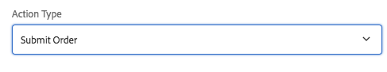

# 양식 컨테이너 구성 요소 (v 1){#form-container-component-v}

핵심 구성 요소 양식 컨테이너 구성 요소를 사용하면 간단한 제출 양식을 작성할 수 있습니다.

## 사용량 {#usage}

양식 컨테이너 구성 요소는 간단한 WCM 양식을 지원하고 중첩된 구조를 사용하여 추가 양식 구성 요소를 사용함으로써 간단한 정보 제출 양식 및 기능의 작성을 가능하게 했습니다.

컨텐츠 편집기에서 [설정 대화 상자를](form-container-v1.md#main-pars_title) 사용하면 양식 제출 트리거 유형, 제출된 컨텐츠를 저장해야 하는 위치, 워크플로우가 트리거되어야 하는 경우 등을 정의할 수 있습니다. 템플릿 작성자는 [디자인 대화 상자를](form-container-v1.md#main-pars_title_1995166862) 사용하여 템플릿 편집기의 [표준 레이아웃 컨테이너에 대한 디자인 대화 상자와 유사한 구성 요소 및 해당 매핑을 정의할 수 있습니다](https://helpx.adobe.com/experience-manager/6-4/sites/authoring/using/templates.html#main-pars_title_1754153843).

## 버전 및 호환성 {#version-and-compatibility}

이 문서에서는 원래 AEM 6.3 이 있는 핵심 구성 요소의 릴리스 1.0.0에 도입된 양식 컨테이너 구성 요소의 v 1에 대해 설명합니다.

다음 표에는 양식 컨테이너 구성 요소의 v 1 호환성이 나와 있습니다.

| AEM 버전 | 양식 컨테이너 구성 요소 v 1 |
|--- |--- |
| 6.3 | 호환 가능 |
| 6.4 | 호환 가능 |

>[!CAUTION]
>
>이 문서에서는 양식 컨테이너 구성 요소의 v 1에 대해 설명합니다.
>
>양식 컨테이너 구성 요소의 현재 버전에 대한 자세한 내용은 [양식 컨테이너 구성 요소](form-container.md) 문서를 참조하십시오.

## 설정 대화 상자 {#settings-dialog}

컨텐츠 작성자는 설정 대화 상자를 사용하여 구성 요소가 제출될 때 수행되는 작업을 정의할 수 있습니다.

선택한 **작업 유형에**따라 컨테이너 내의 사용 가능한 옵션이 변경됩니다. 사용 가능한 작업 유형은 다음과 같습니다.

* [메일](form-container-v1.md#main-pars_title_966511656)
* [컨텐츠 저장](form-container-v1.md#main-pars_title_2065985840)
* [주문 제출](form-container-v1.md#main-pars_title_686874527)
* [주문 업데이트](form-container-v1.md#main-pars_title_410109286)

유형에 관계없이 각 작업에 적용되는 [일반 설정이](form-container-v1.md#main-pars_title_375403046) 있습니다.

### 메일 {#mail}

양식을 제출하면 메일 작업 유형이 지정된 수신자에게 이메일을 전송합니다.

* **제목** - 양식 제출 시 전송될 이메일의 주제
* **보낸 사람** - 양식 제출 시 전송할 이메일의 이메일 주소
* **받는** 사람 - 양식 제출 시 이메일을 받을 수신자의 주소
   * 추가 주소를 **추가하려면** 추가 단추를 탭하거나 클릭합니다.
   * **삭제** 단추를 탭하거나 클릭하여 이메일 주소를 제거합니다.
* **CC** - 양식 제출 시 전송된 이메일을 받을 받는 사람의 주소
   * 추가 주소를 **추가하려면** 추가 단추를 탭하거나 클릭합니다.
   * **삭제** 단추를 탭하거나 클릭하여 이메일 주소를 제거합니다.

### 컨텐츠 저장 {#store-content}

양식을 제출하면 양식의 컨텐츠가 지정된 저장소 위치에 저장됩니다.

* **컨텐츠 경로** - 제출된 컨텐츠가 저장되는 컨텐츠 저장소 경로
* **데이터 보기** - 저장된 데이터를 JSON로 보려면 탭하거나 클릭합니다.
* **워크플로우 시작** - 양식 제출 시 저장된 컨텐츠를 페이로드로 사용하여 워크플로우를 시작하도록 구성합니다.

### 주문 제출 {#submit-order}

양식을 제출하면 주문이 제출됩니다.

### 주문 업데이트 {#update-order}

양식을 제출하면 주문이 업데이트됩니다.

### 일반 설정 {#general-settings}

선택한 작업 유형에 관계없이 감사 인사 페이지를 항상 정의할 수 있습니다.

양식 제출 완료 후 사용자가 지정된 페이지로 리디렉션됩니다.

* 선택 대화 상자를 사용하여 AEM 내의 리소스를 선택합니다.
* 감사 페이지가 AEM에 없는 경우 절대 URL를 지정합니다. 절대 URL 이 아닌 URL는 AEM를 기준으로 해석됩니다.
* 제출 후 양식을 다시 표시하려면 비워 두십시오.

## 디자인 대화 상자 {#design-dialog}

템플릿 작성자는 디자인 대화 상자를 사용하여 템플릿 편집기의 [표준 레이아웃 컨테이너에 대한 디자인 대화 상자와 유사한 컨테이너에 대한 허용된 구성 요소 및 해당 매핑을 정의할](https://helpx.adobe.com/experience-manager/6-4/sites/authoring/using/templates.html#main-pars_title_1754153843)수 있습니다.

## 기술 세부 정보 {#technical-details}

양식 컨테이너 구성 요소에 [대한 최신 기술 설명서는 Github](https://github.com/adobe/aem-core-wcm-components/tree/master/content/src/content/jcr_root/apps/core/wcm/components/form/container/v1/container)에서 찾을 수 있습니다.

Github에서 전체 핵심 구성 요소 프로젝트를 다운로드할 수 있습니다.

핵심 구성 요소 개발에 대한 자세한 내용은 [핵심 구성 요소 개발자 설명서를](developing.md)참조하십시오.
