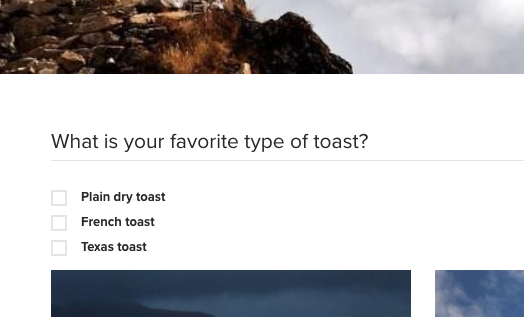

# Form Options Component (v1){#form-options-component-v}

코어 구성 요소 양식 옵션 구성 요소를 사용하면 다양한 포맷의 사전 정의된 옵션에서 선택할 수 있습니다.

## 사용량 {#usage}

핵심 구성 요소 양식 옵션 구성 요소를 사용하면 다양한 방법으로 제공되는 다양한 유형의 옵션을 제출할 수 있으며 [양식 컨테이너 구성 요소와](form-container.md)함께 사용할 수 있습니다.

옵션, 레이블 및 개별 옵션의 프레젠테이션은 [구성 대화 상자의](form-options-v1.md#main-pars_title)컨텐츠 편집기에서 정의할 수 있습니다.

## 버전 및 호환성 {#version-and-compatibility}

이 문서에서는 AEM 6.3의 핵심 구성 요소 릴리스 1.0.0에서 처음 소개된 양식 옵션 구성 요소의 v1에 대해 설명합니다.

다음 표에는 양식 옵션 구성 요소의 v1 호환성이 나와 있습니다.

| 구성 요소 버전 | AEM 6.3 | AEM 6.4 |
|--- |--- |--- |
| v2 | 호환 가능 | 호환 가능 |
| v1 | 호환 가능 | 호환 가능 |

>[!CAUTION]
>
>이 문서에서는 양식 옵션 구성 요소의 v1에 대해 설명합니다.
>
>양식 옵션 구성 요소의 현재 버전에 대한 자세한 내용은 양식 옵션 구성 [요소 문서를](form-options.md) 참조하십시오.

## 샘플 구성 요소 출력 {#sample-component-output}

다음은 We.Retail에서 [가져온 샘플입니다](https://helpx.adobe.com/experience-manager/6-4/sites/developing/using/we-retail.html).

### 스크린샷 {#screenshot}



### HTML {#html}

```
<div class="cmp cmp-form aem-GridColumn aem-GridColumn--default--12">
<form method="POST" action="/content/we-retail/us/en/experience.html" id="new_form" name="new_form" enctype="multipart/form-data" class="aem-Grid aem-Grid--12 aem-Grid--default--12 ">
    <input type="hidden" name=":formstart" value="/content/we-retail/us/en/experience/jcr:content/root/responsivegrid/container">
    
    <div class="cmp cmp-options aem-GridColumn aem-GridColumn--default--12">

    <fieldset class="form-group checkbox">
        <legend>What is your favorite type of toast?</legend>
        
        <div class="checkbox-item">
            <label>
              <input type="checkbox" name="toasttypes" value="dry">
              Plain dry toast
            </label>
        </div>
<div class="checkbox-item">
            <label>
              <input type="checkbox" name="toasttypes" value="french">
              French toast
            </label>
        </div>
<div class="checkbox-item">
            <label>
              <input type="checkbox" name="toasttypes" value="texas">
              Texas toast
            </label>
        </div>

    </fieldset>
    
</div>
    
</form></div>
```

### JSON {#json}

```
"container": {
              "columnClassNames": "aem-GridColumn aem-GridColumn--default--12",
              "columnCount": 12,
              "gridClassNames": "aem-Grid aem-Grid--12 aem-Grid--default--12",
              ":items": {
                "options": {
                  "columnClassNames": "aem-GridColumn aem-GridColumn--default--12",
                  ":type": "weretail/components/form/options",
                  "name": "toastTypes",
                  "jcr:title": "What is your favorite type of toast?",
                  "source": "local",
                  "type": "checkbox"
                }
              },
              ":itemsOrder": [
                "options"
              ],
              ":type": "weretail/components/form/container"
            }
```

>[!NOTE]
>
>핵심 구성 요소에서 JSON을 내보내려면 핵심 구성 요소 릴리스 1.1.0이 필요합니다. 자세한 내용은 핵심 구성 요소 v1의 [](versions.md#main-pars_title_236368006) 호환성 정보를 참조하십시오.

## 구성 대화 상자 {#configure-dialog}

구성 대화 상자에서는 컨텐츠 작성자가 표시되어야 하는 옵션 유형, 레이블 및 사용 가능한 옵션을 정의할 수 있습니다.


* **유형**&#x200B;옵션을 표시하는 방법

   * **확인란**
   * **라디오 단추**
   * **드롭다운**
   * **다중 선택 드롭다운**

* **제목** - 옵션에 대한 레이블로 표시되는 제목입니다.
* **이름** - 양식 데이터로 제출된 필드의 이름
* **출처** - 옵션이 정의된 위치

   * **로컬** - 구성 요소 내에서 정의됨
      * 추가 단추를 탭하거나 **클릭하여** 값을 추가하고, **삭제를** 클릭하여 값을 제거합니다.
      * **값** - 양식을 제출할 때 해당 옵션을 선택하면 저장된 값
      * **텍스트** - 양식에 표시된 옵션에 대한 레이블
      * **활성** - 양식이 로드될 때 이 옵션은 선택된 것으로 표시됩니다.
      * **비활성화** - 옵션을 선택할 수 없지만 여전히 표시됩니다.
      * **목록** - AEM에서 다른 곳에서 정의된 정적 목록이 옵션에 사용됩니다.
         * **목록** - AEM의 정적 목록 경로
            * 찾아보기 단추를 사용하여 목록 리소스를 찾습니다.
      * **데이터 소스** - 옵션에 데이터 소스가 사용됩니다.
         * **데이터 소스** - 데이터 소스의 리소스 유형
* **도움말 메시지** - 필드에 입력할 수 있는 항목의 힌트

## 디자인 대화 상자 {#design-dialog}

양식 옵션 구성 요소에 대한 디자인 대화 상자가 없습니다.

## 기술 정보 {#technical-details}

양식 옵션 구성 요소에 대한 최신 기술 문서는 GitHub에서 [찾을 수 있습니다](https://github.com/adobe/aem-core-wcm-components/tree/master/content/src/content/jcr_root/apps/core/wcm/components/form/options/v1/options).

전체 핵심 구성 요소 프로젝트는 GitHub에서 다운로드할 수 있습니다.

핵심 구성 요소 개발에 대한 자세한 내용은 핵심 구성 요소 개발자 [설명서를](developing.md)참조하십시오.
