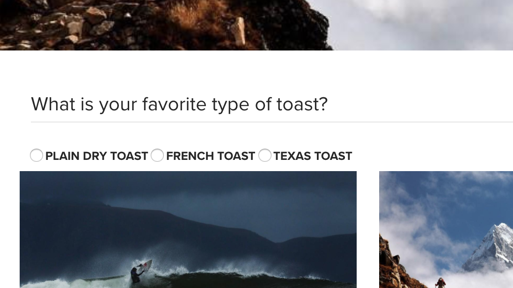

# 양식 옵션 구성 요소{#form-options-component}

핵심 구성 요소 양식 옵션 구성 요소를 사용하면 다양한 형식의 사전 정의된 옵션에서 선택할 수 있습니다.

## 사용량 {#usage}

핵심 구성 요소 양식 옵션 구성 요소는 다양한 방법으로 제공된 다양한 유형의 옵션을 제출할 수 있도록 하며 [양식 컨테이너 구성 요소와 함께 사용됩니다](form-container.md).

옵션, 레이블 및 개별 옵션은 [구성 대화 상자의 컨텐츠 편집기에서 정의할](#configure-dialog)수 있습니다.

## 버전 및 호환성 {#version-and-compatibility}

양식 옵션 구성 요소의 현재 버전은 2018 년 1 월에 핵심 구성 요소의 릴리스 2.0.0에 도입된 v 2 이며, 이 문서에는 설명되어 있습니다.

다음 표에서는 구성 요소의 지원되는 모든 버전, 구성 요소의 버전과 호환되는 AEM 버전 및 이전 버전에 대한 설명서에 대한 링크를 제공합니다.

| 구성 요소 버전 | AEM 6.3 | AEM 6.4 | AEM 6.5 |
|--- |--- |--- |--- |
| v2 | 호환 가능 | 호환 가능 | 호환 가능 |
| [v1](form-options-v1.md) | 호환 가능 | 호환 가능 | 호환 가능 |

핵심 구성 요소 버전 및 릴리스에 대한 자세한 내용은 문서 [코어 구성 요소 버전을 참조하십시오](versions.md).

## 샘플 구성 요소 출력 {#sample-component-output}

[다음은 We. Retail](https://helpx.adobe.com/experience-manager/6-5/sites/developing/using/we-retail.html)에서 가져온 샘플입니다.

### 스크린샷 {#screenshot}



### HTML {#html}

```
<form method="POST" action="/content/we-retail/us/en/experience.html" id="new_form" name="new_form" enctype="multipart/form-data" class="cmp-form aem-Grid aem-Grid--12 aem-Grid--default--12">
    <input type="hidden" name=":formstart" value="/content/we-retail/us/en/experience/jcr:content/root/responsivegrid/container">
    
    <div class="hidden aem-GridColumn aem-GridColumn--default--12">
<input type="hidden" id="form-hidden-66464844" name="hidden">

</div>
<div class="hidden aem-GridColumn aem-GridColumn--default--12">
<input type="hidden" id="form-hidden-858231075" name="hidden">

</div>
<div class="hidden aem-GridColumn aem-GridColumn--default--12">
<input type="hidden" id="form-hidden-862566768" name="hidden">

</div>
<div class="container responsivegrid aem-GridColumn aem-GridColumn--default--12">

    <input type="hidden" name=":formstart" value="/content/we-retail/us/en/experience/jcr:content/root/responsivegrid/container/container">
    
    <div class="options aem-GridColumn aem-GridColumn--default--12">

    <fieldset class="cmp-form-options">
        
            <legend class="cmp-form-options__legend">What is your favorite type of toast?</legend>
            <label class="cmp-form-options__field-label">
                <input class="cmp-form-options__field cmp-form-options__field--radio" type="radio" name="favToast" value="dryToast">
                Plain dry toast
            </label>
<label class="cmp-form-options__field-label">
                <input class="cmp-form-options__field cmp-form-options__field--radio" type="radio" name="favToast" value="frenchToast">
                French Toast
            </label>
<label class="cmp-form-options__field-label">
                <input class="cmp-form-options__field cmp-form-options__field--radio" type="radio" name="favToast" value="texasToast">
                Texas Toast
            </label>

    </fieldset>

</div>

</div></form>
```

### JSON {#json}

```
"container":{  
                           "columnClassNames":"aem-GridColumn aem-GridColumn--default--12",
                           "columnCount":12,
                           "gridClassNames":"aem-Grid aem-Grid--12 aem-Grid--default--12",
                           ":items":{  
                              "options_816658469":{  
                                 "columnClassNames":"aem-GridColumn aem-GridColumn--default--12",
                                 "id":"form-options-269951232",
                                 "title":"What is your favorite type of toast?",
                                 "name":"favToast",
                                 "type":"RADIO",
                                 "items":[  
                                    {  
                                       "value":"dryToast",
                                       "text":"Plain dry toast",
                                       "selected":false,
                                       "disabled":false
                                    },
                                    {  
                                       "value":"frenchToast",
                                       "text":"French Toast",
                                       "selected":false,
                                       "disabled":false
                                    },
                                    {  
                                       "value":"texasToast",
                                       "text":"Texas Toast",
                                       "selected":false,
                                       "disabled":false
                                    }
                                 ],
                                 ":type":"core/wcm/sandbox/components/form/options/v2/options"
                              }
                           },
                           ":itemsOrder":[  
                              "options_816658469"
                           ],
                           ":type":"core/wcm/sandbox/components/form/container/v2/container"
                        }
```

### 기술 세부 정보 {#technical-details}

양식 옵션 구성 요소에 [대한 최신 기술 설명서는 Github](https://github.com/adobe/aem-core-wcm-components/blob/master/content/src/content/jcr_root/apps/core/wcm/components/form/options/v2/options)에서 찾을 수 있습니다.

핵심 구성 요소 개발에 대한 자세한 내용은 [핵심 구성 요소 개발자 설명서를](developing.md)참조하십시오.

## 구성 대화 상자 {#configure-dialog}

컨텐츠 작성자는 구성 대화 상자를 사용하여 표시할 옵션 유형, 레이블 및 사용 가능한 옵션을 정의할 수 있습니다.


* **유형** - 옵션이 표시되는 방식
   * **확인란**
   * **라디오 단추**
   * **드롭다운**
   * **다중 선택 드롭다운**
* **제목옵션에**
대한 레이블로 표시되는 제목
* **이름**
양식 데이터와 함께 제출된 필드 이름
* **옵션이**정의된 소스
   * **구성**요소 내에 정의된 로컬
      * **추가** 단추를 탭하거나 클릭하여 값을 추가하고 **삭제하여** 값을 제거합니다.
      * **값양식을**
제출할 때 해당 옵션을 선택하면 저장되는 값
      * **텍스트양식에**
표시되는 옵션에 대한 레이블입니다.
      * **활성화**옵션이 양식 로드 시 선택된 것으로 표시됩니다.
      * **비활성화됨**옵션은 선택할 수 없지만 여전히 표시됩니다.
      * **목록**
AEM의 다른 곳에 정의된 정적 목록은 옵션에 사용됩니다.
         * **AEM**의 정적 목록 경로 나열
            * [찾아보기] 단추를 사용하여 목록 리소스 찾기
      * **Data Source**
a data source is used for the options
         * **데이터 소스의 데이터 소스**
리소스 유형
* **필드에 입력할 수 있는 사용자의 힌트에 대한**도움말 메시지

## 디자인 대화 상자 {#design-dialog}

### 스타일 탭 {#styles-tab}

양식 옵션 구성 요소는 AEM [스타일 시스템을 지원합니다](authoring.md#component-styling).