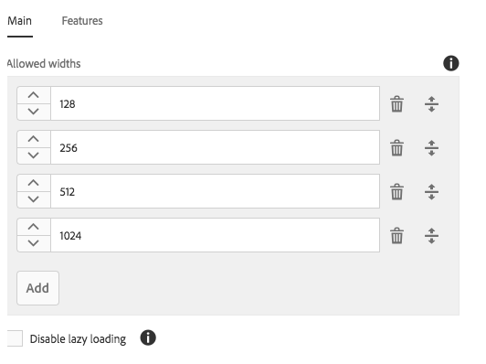
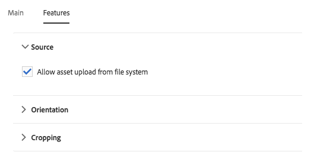

# 이미지 구성 요소(v1){#image-component-v}

핵심 구성 요소 이미지 구성 요소는 적응형 이미지 구성 요소 기능을 즉석 편집입니다.

## 사용량 {#usage}

이미지 구성 요소를 사용하면 이미지 에셋과 직접 편집 기능을 손쉽게 배치할 수 있습니다. 레이지 로딩과 컨텐츠 작성자를 위한 자르기 기능을 통해 적응형 이미지를 선택할 수 있습니다.

템플릿 작성자가 [디자인 대화 상자에서](image-v1.md#main-pars_title_1995166862)허용된 이미지 폭과 자르기 및 추가 설정을 정의할 수 있습니다. 컨텐츠 편집기는 [구성 대화 상자에서](image-v1.md#main-pars_title_55926120) 자산을 업로드하거나 선택하고 [편집 대화 상자에서](image-v1.md#main-pars_title)이미지를 자를 수 있습니다. 또한 편의를 위해 이미지를 직접 간단하게 수정할 수 있습니다.

## 버전 및 호환성 {#version-and-compatibility}

이 문서에서는 AEM 6.3의 핵심 구성 요소 릴리스 1.0.0에서 처음 소개된 이미지 구성 요소의 v1에 대해 설명합니다.

다음 표에는 이미지 구성 요소의 v1 호환성이 나와 있습니다.

| AEM 버전 | 이미지 구성 요소 v1 |
|--- |--- |
| 6.3 | 호환 가능 |
| 6.4 | 호환 가능 |

>[!CAUTION]
>
>이 문서에서는 이미지 구성 요소의 v1에 대해 설명합니다.
>
>이미지 구성 요소의 현재 버전에 대한 자세한 내용은 이미지 구성 [요소](image.md) 문서를 참조하십시오.

## 샘플 구성 요소 출력 {#sample-component-output}

다음은 We.Retail에서 [가져온 샘플입니다](https://helpx.adobe.com/experience-manager/6-4/sites/developing/using/we-retail.html).

### 스크린샷 {#screenshot}


### HTML {#html}

```
<div class="cmp cmp-image aem-GridColumn aem-GridColumn--default--12">
 
        <noscript data-cmp-image="{&#34;smartImages&#34;:[],&#34;smartSizes&#34;:[],&#34;lazyEnabled&#34;:true}">
            
        </noscript>

</div>
```

### JSON {#json}

```
"image": {
              "columnClassNames": "aem-GridColumn aem-GridColumn--default--12",
              "smartSizes": [],
              "smartImages": [],
              "lazyEnabled": true,
              "src": "/content/we-retail/us/en/equipment/equipment/jcr%3acontent/root/responsivegrid/image.img.jpeg",
              ":type": "weretail/components/content/image"
            }
```

>[!NOTE]
>
>핵심 구성 요소에서 JSON을 내보내려면 핵심 구성 요소 릴리스 1.1.0이 필요합니다. 자세한 내용은 핵심 구성 요소 v1의 [](versions.md#main-pars_title_236368006) 호환성 정보를 참조하십시오.

## 구성 대화 상자 {#configure-dialog}

표준 [편집 대화 상자](image-v1.md#main-pars_title) 및 [디자인 대화 상자](image-v1.md#main-pars_title_1995166862)외에도 이미지 구성 요소는 설명 및 기본 속성과 함께 이미지 자체가 정의된 구성 대화 상자를 제공합니다.


* **이미지 자산**
   * 자산 브라우저에서 [자산을 삭제하거나](https://helpx.adobe.com/experience-manager/6-3/sites/authoring/using/author-environment-tools.html#main-pars_title) 찾아보기 **** 옵션을 눌러 로컬 파일 시스템에서 업로드합니다.
   * 지우기를 탭하거나 **클릭하여** 현재 선택한 이미지를 선택 취소합니다.
   * 편집을 탭하거나 **클릭하여** 자산 [편집기에서 자산의](https://helpx.adobe.com/experience-manager/6-3/assets/using/managing-assets-touch-ui.html#main-pars_title_19) 표현물을관리합니다.

* **이미지가 장식용임** - 보조 기술로 이미지를 무시해야 하는지, 따라서 대체 텍스트가 필요하지 않은지 확인하십시오. 이는 장식 이미지에만 적용됩니다.
* **대체 텍스트** - 시각 장애가 있는 독자를 위해 이미지의 의미나 기능에 대한 텍스트 대체 텍스트입니다.
* **링크**
   * 이미지를 다른 리소스에 연결합니다.
   * 선택 대화 상자를 사용하여 다른 AEM 리소스에 연결합니다.
   * AEM 리소스에 연결되지 않은 경우 절대 URL을 입력합니다. 비솔루션 URL은 AEM을 기준으로 해석됩니다.

* **캡션** - 이미지 아래에 표시되는 이미지에 대한 추가 정보가 기본값입니다.
* **캡션을 팝업으로** 표시 - 선택하면 캡션이 이미지 아래에 표시되지 않고 이미지 위로 마우스를 가져가면 일부 브라우저가 팝업으로 표시합니다.

## Edit Dialog {#edit-dialog}

편집 대화 상자에서는 컨텐츠 작성자가 이미지를 자르고, 론치 맵을 수정하고, 확대/축소할 수 있습니다.


* 자르기 시작

   

   이 옵션을 선택하면 사전 정의된 자르기 비율에 대한 드롭다운이 열립니다.

   * [무료 손] 옵션을 **선택하여** 직접 자르기를 정의합니다.
   * [자르기 제거] 옵션을 **선택하여** 원본 자산을 표시합니다.
   자르기 옵션을 선택하면 파란색 핸들을 사용하여 이미지의 자르기 크기를 조정합니다.

   

* 오른쪽으로 회전

   

   이미지를 오른쪽(시계 방향)으로 90° 회전하려면 이 옵션을 사용합니다.

* 론치 맵

   

   이 옵션을 사용하여 이미지에 론치 맵을 적용합니다. 이 옵션을 선택하면 사용자가 맵의 모양을 선택할 수 있는 새 창이 열립니다.

   * **사각형 맵 추가**
   * **원형 맵 추가**
   * **다각형 맵 추가**

      * 기본적으로 삼각형 맵을 추가합니다. 모양의 선을 두 번 클릭하여 새로운 면에 파란색 크기 조정 핸들을 추가합니다.
   맵 모양을 선택하면 이미지 위에 겹쳐져 크기를 조정할 수 있습니다. 파란색 크기 조정 핸들을 드래그하여 놓아 모양을 조정합니다.

   

   론치 맵의 크기를 조정한 후 아이콘을 클릭하여 부동 도구 모음을 열어 링크의 경로를 정의합니다.

   * **경로**
      * 경로 선택 옵션을 사용하여 AEM에서 경로 선택
      * 경로가 AEM에 없으면 절대 URL을 사용합니다. 절대 경로가 아닌 경로는 AEM을 기준으로 해석됩니다.

      * **대체 텍스트경로**&#x200B;대상의 대체 설명
      * **타겟**
         * **동일한 탭**
         * **새 탭**
         * **상위 프레임**
         * **상위 프레임**
   파란색 확인 표시를 탭하거나 클릭하여 저장하고, 취소할 검은색 x를 누르고, 빨간색 휴지통을 눌러 맵을 삭제합니다.

   

* 확대/축소 재설정

   

   이미지가 이미 확대된 경우 이 옵션을 사용하여 확대/축소 수준을 재설정합니다.

* 확대/축소 슬라이더 열기

   

   이 옵션을 사용하여 이미지의 확대/축소 레벨을 제어하는 슬라이더를 표시합니다.

   

즉석 편집기를 사용하여 이미지를 수정할 수도 있습니다. 공간 제한으로 인해 온라인에서는 기본 옵션만 사용할 수 있습니다. 전체 편집 옵션의 경우 전체 화면 모드를 사용합니다.


>[!NOTE]
>
>이미지 편집 작업(자르기, 뒤집기, 회전)은 GIF 이미지에 대해 지원되지 않습니다. 편집 모드에서 GIF로의 이러한 변경 사항은 지속되지 않습니다.

## 디자인 대화 상자 {#design-dialog}

템플릿 작성자는 이 구성 요소를 사용할 때 내용 작성자가 가진 자르기, 업로드 및 회전을 정의할 수 있습니다.

### 기본 {#main}

On the **Main** tab you can define a list of allowed widths in pixels for the image to automatically load the most appropriate width from the list.



추가 단추를 탭하거나 클릭하여 다른 크기를 추가합니다.

* 그랩 핸들을 사용하여 크기 순서를 다시 정렬합니다.
* 삭제 아이콘을 사용하여 너비를 제거합니다.

기본적으로 이미지 로드는 표시될 때까지 지연됩니다. 페이지 로드 **시 이미지를 로드하려면 레이지 로드** 비활성화 옵션을 선택합니다.

### 기능 {#features}

기능 **탭에서** 업로드 옵션, 방향 및 자르기 옵션을 비롯한 구성 요소를 사용할 때 컨텐츠 작성자가 사용할 수 있는 옵션을 정의할 수 있습니다.

* 소스

   

   컨텐츠 작성자가 **로컬 컴퓨터에서 이미지를 업로드할 수 있도록 하려면 파일 시스템에서** 자산 업로드 허용 옵션을 선택합니다. 컨텐츠 작성자가 AEM에서 자산만 선택하도록 하려면 이 옵션을 선택 취소합니다.

* 방향

   

   * **회전** - 컨텐츠 작성자가 오른쪽으로 회전 **옵션을 사용할 수 있도록 하려면 이 옵션을 사용합니다** .
   * **뒤집기**&#x200B;이 옵션을 사용하여 컨텐츠 작성자가 [가로로 뒤집기] 및 [ **세로로 뒤집기** ] **옵션을 사용할 수** 있습니다.
   >[!CAUTION]
   >
   >대칭 **이동** 옵션은 기본적으로 비활성화됩니다. 이 옵션을 활성화하면 **이미지 구성 요소의** 편집 대화 상자에 세로로 뒤집기 및 **가로로 뒤집기** 단추가 표시되지만 현재 AEM에서 이 기능이 지원되지 않으며 이러한 옵션을 사용하여 변경한 내용은 지속되지 않습니다.

<!-- 
Comment Type: remark
Last Modified By: Chris Bohnert (bohnert)
Last Modified Date: 2017-11-20T05:51:34.378-0500

<p>Added caution based on CQDOC-11457. Hid the flip options in the procedure using the <strong>Draft</strong> option so that when this feature is implemented in CQ-4221539, the <strong>Draft</strong> property can simply be removed along with the caution.</p>
-->

* 자르기

   

   컨텐츠 작성자가 편집 **대화 상자의 구성 요소에서 이미지를 자를** 수 있도록 하려면 [자르기 허용] 옵션을 선택합니다.
   * 추가를 **클릭하여** 사전 정의된 자르기 종횡비를 추가합니다.
   * [자르기 시작] 드롭다운에 표시되는 설명 이름을 **입력합니다** .
   * 종횡비를 입력합니다.
   * 드래그 핸들을 사용하여 종횡비의 순서를 다시 정렬합니다.
   * 종횡비를 삭제하려면 휴지통 아이콘을 사용합니다.
   >[!CAUTION]
   >
   >Note that in AEM, crop aspect ratios are defined as **height/width**. 이는 폭/높이의 기존 정의와 다르며 이전 호환성 이유로 수행됩니다. 비율 자체가 아니라 UI에 이름이 표시되므로 비율의 명확한 이름을 제공하는 한 컨텐츠 작성자는 어떠한 차이도 알지 못합니다.

## 기술 정보 {#technical-details}

이미지 구성 요소에 대한 최신 기술 문서는 GitHub에서 [찾을 수 있습니다](https://github.com/adobe/aem-core-wcm-components/tree/master/content/src/content/jcr_root/apps/core/wcm/components/image/v1/image).

전체 핵심 구성 요소 프로젝트는 GitHub에서 다운로드할 수 있습니다.

핵심 구성 요소 개발에 대한 자세한 내용은 핵심 구성 요소 개발자 [설명서를](developing.md)참조하십시오.
