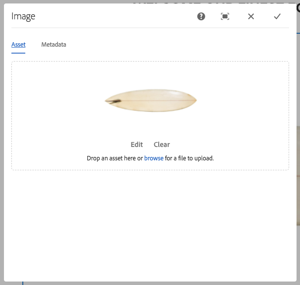

# 이미지 구성 요소{#image-component}

핵심 구성 요소 이미지 구성 요소는 즉석 편집을 특징으로 하는 응용 이미지 구성 요소입니다.

## 사용량 {#usage}

이미지 구성 요소를 사용하면 이미지 에셋을 손쉽게 배치할 수 있고 즉석 편집을 할 수 있습니다. 컨텐츠 작성자에 대한 자르기 작업은 물론 지연 로딩과 함께 적응형 이미지 선택 기능을 제공합니다.

The image widths as well as cropping and additional settings can be defined by the template author in the [design dialog](#design-dialog). The content editor can upload or select assets in the [configure dialog](#configure-dialog) and crop the image in the [edit dialog](#edit-dialog). 편의를 위해 이미지를 간단하게 수정할 수도 있습니다.

## Version and Compatibility {#version-and-compatibility}

현재 버전의 이미지 구성 요소는 2018 년 1 월에 출시된 핵심 구성 요소의 릴리스 2.0.0에 도입된 v 2 이며, 이 문서에서는 설명합니다.

다음 표에서는 구성 요소의 지원되는 모든 버전, 구성 요소의 버전과 호환되는 AEM 버전 및 이전 버전에 대한 설명서에 대한 링크를 제공합니다.

| 구성 요소 버전 | AEM 6.3 | AEM 6.4 | AEM 6.5 |
|--- |--- |--- |--- |
| v2 | 호환 가능 | 호환 가능 | 호환 가능 |
| [v1](image-v1.md) | 호환 가능 | 호환 가능 | 호환 가능 |

For more information about Core Component versions and releases, see the document [Core Components Versions](versions.md).

## SVG Support {#svg-support}

SVG (Scalable Vector Graphics) 는 이미지 구성 요소에서 지원합니다.

* DAM에서 SVG 에셋을 드래그하여 놓고 로컬 파일 시스템에서 SVG 파일 업로드를 업로드합니다.
* 응용 이미지 servlet 스트림이 원본 SVG 파일을 스트리밍합니다 (변형을 건너뜀).
* SVG 이미지의 경우 &quot;스마트 이미지&quot; 와 &quot;스마트 크기&quot; 가 이미지 모델에서 빈 배열로 설정됩니다.

### 보안 {#security}

보안상의 이유로 원본 SVG는 이미지 편집기에서 직접 호출되지 않습니다. It is called through ``. 이러한 브라우저에서는 SVG 파일에 임베드된 스크립트가 실행되지 않습니다.

>[!CAUTION]
>
>SVG support requires release 2.1.0 of the Core Components or higher along with [service pack 2](https://helpx.adobe.com/experience-manager/6-4/release-notes/sp-release-notes.html) for AEM 6.4 or [service pack 3](https://helpx.adobe.com/experience-manager/6-3/release-notes/sp3-release-notes.html) for AEM 6.3 or higher to support [new image editor features](https://helpx.adobe.com/experience-manager/6-4/sites/developing/using/image-editor.html) within AEM.

## Sample Component Output {#sample-component-output}

To experience the Image Component as well as see examples of its configuration options as well as HTML and JSON output, visit the [Component Library](http://opensource.adobe.com/aem-core-wcm-components/library/image.html).

### Technical Details {#technical-details}

The latest technical documentation about the Image Component [can be found on GitHub](https://github.com/adobe/aem-core-wcm-components/blob/master/content/src/content/jcr_root/apps/core/wcm/components/image/v2/image).

Further details about developing Core Components can be found in the [Core Components developer documentation](developing.md).

>[!NOTE]
>
>As of Core Components release 2.1.0, the Image Component supports [schema.org microdata](https://schema.org).

## Configure Dialog {#configure-dialog}

In addition to the standard [edit dialog](#edit-dialog) and [design dialog](#design-dialog), the image component offers a configure dialog where the image itself is defined along with its description and basic properties.

### Asset Tab {#asset-tab}

* **이미지 자산**
   * [자산 브라우저에서 자산을](https://helpx.adobe.com/experience-manager/6-5/sites/authoring/using/author-environment-tools.html) 끌어 놓거나 **찾아보기** 옵션을 눌러 로컬 파일 시스템에서 업로드합니다.
   * **지우기를** 탭하거나 클릭하여 현재 선택한 이미지를 제거합니다.
   * **편집을** 탭하거나 [클릭하여 자산 편집기에서 자산의](https://helpx.adobe.com/experience-manager/6-5/assets/using/managing-assets-touch-ui.html) 표현물을 관리합니다.

### Metadata Tab {#metadata-tab}

* **이미지가 보조** 기술로 무시되어야 하고 대체 텍스트가 필요하지 않은 경우에 이미지가 장식용입니다. 이것은 장식 이미지에만 적용됩니다.
* **시각 장애가 있는 독자를 위한 이미지 의미나 기능의 대체 텍스트**
대체 대체 요소
   * Get alternative text from DAM - When checked the image&#39;s alternative text will be populated with the value of the `dc:description` metadata in DAM.

* **캡션**
기본적으로 이미지 아래에 표시되는 이미지에 대한 추가 정보입니다.
   * **DAM**
에서 캡션 가져오기 이미지의 캡션 텍스트를 선택하면 DAM에서 `dc:title` 메타데이터 값으로 채워집니다.
   * **[캡션] 로 캡션을** 선택하면 캡션이 이미지 아래에 표시되지 않지만 이미지 위로 마우스를 가져가면 일부 브라우저에 표시되는 팝업으로 표시됩니다.

* **링크**
   * 이미지를 다른 리소스에 연결합니다.
   * 선택 대화 상자를 사용하여 다른 AEM 리소스로 링크합니다.
   * AEM 리소스에 연결하지 않은 경우 절대 URL를 입력합니다. 비solute URL는 AEM와 관련하여 해석됩니다.

## Edit Dialog {#edit-dialog}

편집 대화 상자에서 컨텐츠 작성자가 자르거나, 론치 맵을 수정하고, 이미지를 확대/축소할 수 있습니다.

* 자르기 시작

   

   이 옵션을 선택하면 미리 정의된 자르기 비율에 대한 드롭다운이 열립니다.

   * Choose the option **Free Hand** to define your own crop.
   * Choose the option **Remove Crop** to display the original asset.
   자르기 옵션을 선택한 후에는 파란색 핸들을 사용하여 이미지의 자르기 크기를 조정합니다.

   

* 오른쪽으로 회전

   

   이 옵션을 사용하여 이미지를 오른쪽 (시계 방향) 로 90도 회전합니다.

* 가로로 뒤집기

   

   이 옵션을 사용하여 이미지를 가로로 뒤집거나 Y 축을 따라 180 ° 이미지를 회전합니다.

* 세로로 뒤집기

   

   이 옵션을 사용하여 이미지를 세로로 뒤집거나 이미지를 x 축을 따라 180 ° 회전합니다.

* 론치 맵

   >[!CAUTION]
   >
   >The Launch Map feature requires release 2.1.0 of the Core Components or higher along with [service pack 2](https://helpx.adobe.com/experience-manager/6-4/release-notes/sp-release-notes.html) for AEM 6.4 or [service pack 3](https://helpx.adobe.com/experience-manager/6-3/release-notes/sp3-release-notes.html) for AEM 6.3 or higher to support [new image editor features](https://helpx.adobe.com/experience-manager/6-4/sites/developing/using/image-editor.html) within AEM.

   

   이 옵션을 사용하여 이미지에 론치를 적용합니다. 이 옵션을 선택하면 사용자가 맵 모양을 선택할 수 있는 새 창이 열립니다.

   * **사각형 맵 추가**
   * **원형 맵 추가**
   * **다각형 맵 추가**
      * 기본적으로 삼각형 맵을 추가합니다. 모양의 한 줄을 두 번 클릭하여 새로운 면에 새로운 파란색 크기 조정 핸들을 추가합니다.
   맵 모양을 선택하면 이미지 위에 겹쳐져 크기 조정이 가능합니다. 파란색 크기 조정 핸들을 드래그하여 놓아 모양을 조정합니다.

   

   론치 맵의 크기를 조정한 후, 이것을 클릭하여 부동 툴바를 열고 링크 경로를 정의합니다.

   * **경로**
      * 경로 선택기 옵션을 사용하여 AEM에서 경로를 선택합니다.
      * 경로가 AEM에 없는 경우 절대 URL를 사용합니다. 절대 경로는 AEM와 관련하여 해석됩니다.
   * **대체 텍스트경로**
대상에 대한 대체 설명
   * **타겟**
      * **동일한 탭**
      * **새 탭**
      * **상위 프레임**
      * **상위 프레임**
   파란색 체크 표시를 누르거나 클릭하여 저장할 검정색 X, 취소할 검정색 X 및 맵을 삭제합니다.

   

* 확대/축소 재설정

   

   이미지가 이미 확대된 경우 이 옵션을 사용하여 확대/축소 수준을 재설정합니다.

* 확대/축소 슬라이더 열기

   

   이 옵션을 사용하여 이미지의 확대/축소 수준을 제어하는 슬라이더를 표시할 수 있습니다.

   

또한 즉석 편집기를 사용하여 이미지를 수정할 수 있습니다. 공간 제한으로 인해 기본 옵션만 인라인 사용할 수 있습니다. 전체 편집 옵션의 경우 전체 화면 모드를 사용합니다.

>[!NOTE]
>
>이미지 편집 작업 (자르기, 뒤집기, 회전) 는 GIF 이미지에 지원되지 않습니다. 편집 모드에서 GIFS로 변경한 모든 내용은 지속되지 않습니다.

## Design Dialog {#design-dialog}

템플릿 작성자는 디자인 대화 상자를 사용하여 컨텐츠 작성자가 이 구성 요소를 사용할 때 자르기, 업로드 및 회전 및 업로드 옵션을 정의할 수 있습니다.

### Main Tab {#main-tab}

**메인** 탭에서 이미지의 폭 목록을 정의하여 목록에서 가장 적절한 너비를 자동으로 불러올 수 있습니다.

또한 작성자가 페이지에 구성 요소를 추가할 때 자동으로 또는 비활성화되어 있는 일반 구성 요소 옵션을 정의할 수 있습니다.

* **지연 로드**
활성화 이미지 구성 요소를 페이지에 추가할 때 Lazy loading 옵션이 자동으로 활성화되어 있는지 확인합니다.
* **이미지가 장식용 이미지 구성 요소를 페이지에 추가할 때 장식 이미지 옵션이 자동으로 활성화되는지 여부는 장식**
이미지입니다.
* **DAM**
에서 대체 텍스트 가져오기 이미지 구성 요소를 페이지에 추가할 때 DAM에서 대체 텍스트를 검색하는 옵션이 자동으로 활성화되어 있는 경우 DAM에서 대체 텍스트를 가져옵니다.
* **DAM**
에서 캡션 가져오기 이미지 구성 요소를 페이지에 추가할 때 DAM에서 캡션을 검색하는 옵션이 자동으로 활성화되어 있는지 확인합니다.
* **캡션을 팝업으로 표시 이미지 구성 요소를 페이지에 추가할 때 팝업 이미지로 이미지 캡션을 자동으로 표시할 수 있는 옵션을** 정의합니다.
* **UUID 추적**
확인을 비활성화하여 이미지 자산의 UUID 추적을 비활성화합니다.

* **너비목록에서**
가장 적절한 너비를 자동으로 로드하기 위해 이미지의 너비 목록을 정의합니다.
   * **추가** 단추를 탭하거나 클릭하여 다른 크기를 추가합니다.
      * 잡기 핸들을 사용하여 크기 순서를 다시 정렬합니다.
      * **삭제** 아이콘을 사용하여 너비를 제거합니다.
   * 기본적으로 이미지가 로드될 때까지 Ddeferredred. 가 표시됩니다.
      * Select the option **Disable lazy loading** to load the images upon page load.
* **JPEG 품질** 변형된 (예: 비율 조정되거나 잘린) JPEG 이미지에 대한 품질 계수 (0 및 100) 입니다.

>[!CAUTION]
>
>JPEG 품질 옵션은 핵심 구성 요소의 릴리스 2.2.0 부터 사용할 수 있습니다.

>[!NOTE]
>
>As of release 2.2.0 of the Core Components, the Image Component adds the unique UUID attribute `data-asset-id` to the image asset to allow tracking and analysis of the number of views that individual assets receive.

### Features Tab {#features-tab}

**기능** 탭에서 업로드 옵션, 방향 및 자르기 옵션을 포함한 구성 요소를 사용할 때 컨텐츠 작성자가 사용할 수 있는 옵션을 정의할 수 있습니다.

* 소스

   

   Select the option **Allow asset upload from file system** to allow content authors to upload images from his or her local computer. 컨텐츠 작성자가 AEM에서 에셋만 선택하도록 하려면 이 옵션을 선택 해제합니다.

* 방향

   

* **회전**
컨텐츠 작성자가 **회전 오른쪽** 옵션을 사용하도록 허용하려면 이 옵션을 사용합니다.
* **뒤집기컨텐츠**
작성자가 가로로 **뒤집기** 옵션을 사용하고 **세로로** 뒤집기를 사용하도록 하려면 이 옵션을 사용합니다.

   >[!CAUTION]
   >
   >**[뒤집기** ] 옵션은 기본적으로 비활성화되어 있습니다. Enabling it will display the **Flip Vertically** and **Flip Horizontally** buttons in the edit dialog of the image component, however the feature is not currently supported by AEM and any changes made using these options will not be persisted.

<!-- 
Comment Type: remark
Last Modified By: Chris Bohnert (bohnert)
Last Modified Date: 2017-11-20T05:51:34.378-0500

Added caution based on CQDOC-11457. Hid the flip options in the procedure using the <strong>Draft</strong> option so that when this feature is implemented in CQ-4221539, the <strong>Draft</strong> property can simply be removed along with the caution.

 -->

* 자르기

   

   Select the option **Allow crop** to allow the content author to crop the image in the component in the edit dialog.
   * **사전** 정의된 자르기 종횡비를 추가하려면 추가를 클릭합니다.
   * Enter a descriptive name, which will be shown in the **Start Crop** dropdown.
   * 종횡비의 숫자 비율을 입력합니다.
   * 드래그 핸들을 사용하여 종횡비 순서 다시 정렬
   * 휴지통 아이콘을 사용하여 종횡비를 삭제합니다.
   >[!CAUTION]
   >
   >Note that in AEM, crop aspect ratios are defined as **height/width**. 이는 기존의 폭/높이 정의와 다르며 이전 호환성 때문에 수행됩니다. 이름이 UI에 표시되고 비율 자체가 아닌 이름 이름을 제공하는 한 컨텐츠 작성자는 차이를 알지 못합니다.

### Styles Tab {#styles-tab-1}

The Image Component supports the AEM [Style System](authoring.md#component-styling).