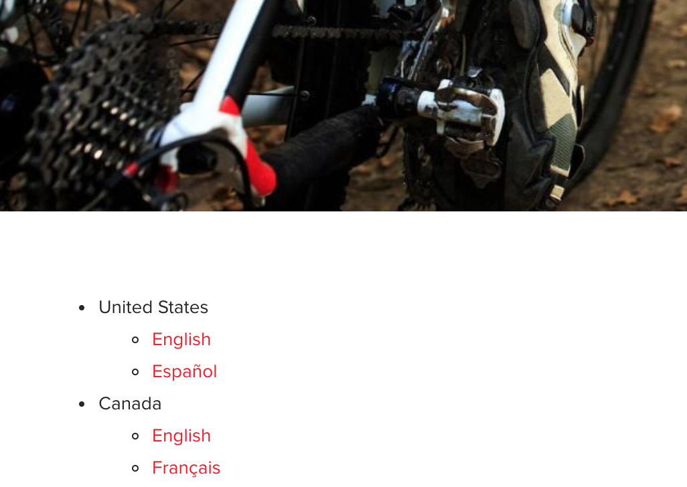

# 언어 탐색 구성 요소{#language-navigation-component}

언어 탐색 구성 요소는 방문자가 다른 로케일에서 동일한 페이지로 이동할 수 있도록 사이트에 대한 언어/국가 탐색을 제공합니다.

## 사용량 {#usage}

종종 웹 사이트는 지역마다 여러 언어로 제공됩니다. 언어 탐색 구성 요소를 사용하면 방문자가 다른 언어/로케일로 동일한 페이지를 볼 수 있습니다.

[편집 대화 상자에서는](#edit-dialog) 전역 사이트 탐색 루트에 대한 정의와 탐색이 이동하는 구조에 깊이를 허용할 수 있습니다. 템플릿 작성자는 [디자인 대화 상자를](#design-dialog)사용하여 동일한 옵션에 대한 기본값을 설정할 수 있습니다.

## 버전 및 호환성 {#version-and-compatibility}

언어 탐색 구성 요소의 현재 버전은 2018 년 1 월에 핵심 구성 요소의 릴리스 2.0.0에서 처음 소개된 v 1 이며, 이 문서에서는 설명합니다.

다음 표에서는 구성 요소의 지원되는 모든 버전, 구성 요소의 버전과 호환되는 AEM 버전 및 이전 버전에 대한 설명서에 대한 링크를 제공합니다.

| 구성 요소 버전 | AEM 6.3 | AEM 6.4 | AEM 6.5 |
|--- |--- |--- |--- |
| v1 | 호환 가능 | 호환 가능 | 호환 가능 |


핵심 구성 요소 버전 및 릴리스에 대한 자세한 내용은 문서 [코어 구성 요소 버전을 참조하십시오](versions.md).

## 샘플 구성 요소 출력 {#sample-component-output}

[다음은 We. Retail](https://helpx.adobe.com/experience-manager/6-5/sites/developing/using/we-retail.html)에서 가져온 샘플입니다.

### 스크린샷 {#screenshot}



### HTML {#html}

```
<nav class="cmp-languagenavigation">
    <ul class="cmp-languagenavigation__group">
        
    <li class="cmp-languagenavigation__item cmp-languagenavigation__item--langcode-en cmp-languagenavigation__item--level-0 cmp-languagenavigation__item--active">
        
    <span class="cmp-languagenavigation__item-title" lang="en">United States</span>

    <ul class="cmp-languagenavigation__group">
        
    <li class="cmp-languagenavigation__item cmp-languagenavigation__item--langcode-en cmp-languagenavigation__item--level-1 cmp-languagenavigation__item--active">

    <a class="cmp-languagenavigation__item-link" href="/content/we-retail/us/en/equipment.html" hreflang="en" lang="en" rel="alternate" title="English">English</a>

    </li>

    <li class="cmp-languagenavigation__item cmp-languagenavigation__item--langcode-es cmp-languagenavigation__item--level-1">

    <a class="cmp-languagenavigation__item-link" href="/content/we-retail/us/es.html" hreflang="es" lang="es" rel="alternate" title="Español">Español</a>

    </li>

    </ul>

    </li>

    <li class="cmp-languagenavigation__item cmp-languagenavigation__item--countrycode-CA cmp-languagenavigation__item--langcode-en-CA cmp-languagenavigation__item--level-0">
        
    <span class="cmp-languagenavigation__item-title" lang="en-CA">Canada</span>

    <ul class="cmp-languagenavigation__group">
        
    <li class="cmp-languagenavigation__item cmp-languagenavigation__item--countrycode-CA cmp-languagenavigation__item--langcode-en-CA cmp-languagenavigation__item--level-1">

    <a class="cmp-languagenavigation__item-link" href="/content/we-retail/ca/en/equipment.html" hreflang="en-CA" lang="en-CA" rel="alternate" title="English">English</a>

    </li>

    <li class="cmp-languagenavigation__item cmp-languagenavigation__item--countrycode-CA cmp-languagenavigation__item--langcode-en-CA cmp-languagenavigation__item--level-1">

    <a class="cmp-languagenavigation__item-link" href="/content/we-retail/ca/fr.html" hreflang="en-CA" lang="en-CA" rel="alternate" title="Français">Français</a>

    </li>

    </ul>

    </li>

    <li class="cmp-languagenavigation__item cmp-languagenavigation__item--countrycode-CH cmp-languagenavigation__item--langcode-de-CH cmp-languagenavigation__item--level-0">
        
    <span class="cmp-languagenavigation__item-title" lang="de-CH">Switzerland</span>

    <ul class="cmp-languagenavigation__group">
        
    <li class="cmp-languagenavigation__item cmp-languagenavigation__item--countrycode-CH cmp-languagenavigation__item--langcode-de-CH cmp-languagenavigation__item--level-1">

    <a class="cmp-languagenavigation__item-link" href="/content/we-retail/ch/de.html" hreflang="de-CH" lang="de-CH" rel="alternate" title="Deutsch">Deutsch</a>

    </li>

    <li class="cmp-languagenavigation__item cmp-languagenavigation__item--countrycode-CH cmp-languagenavigation__item--langcode-de-CH cmp-languagenavigation__item--level-1">

    <a class="cmp-languagenavigation__item-link" href="/content/we-retail/ch/fr.html" hreflang="de-CH" lang="de-CH" rel="alternate" title="Français">Français</a>

    </li>

    <li class="cmp-languagenavigation__item cmp-languagenavigation__item--countrycode-CH cmp-languagenavigation__item--langcode-de-CH cmp-languagenavigation__item--level-1">

    <a class="cmp-languagenavigation__item-link" href="/content/we-retail/ch/it.html" hreflang="de-CH" lang="de-CH" rel="alternate" title="Italiano">Italiano</a>

    </li>

    </ul>

    </li>

    <li class="cmp-languagenavigation__item cmp-languagenavigation__item--langcode-de cmp-languagenavigation__item--level-0">
        
    <span class="cmp-languagenavigation__item-title" lang="de">Germany</span>

    <ul class="cmp-languagenavigation__group">
        
    <li class="cmp-languagenavigation__item cmp-languagenavigation__item--langcode-de cmp-languagenavigation__item--level-1">

    <a class="cmp-languagenavigation__item-link" href="/content/we-retail/de/de.html" hreflang="de" lang="de" rel="alternate" title="Deutsch">Deutsch</a>

    </li>

    </ul>

    </li>

    <li class="cmp-languagenavigation__item cmp-languagenavigation__item--langcode-fr cmp-languagenavigation__item--level-0">
        
    <span class="cmp-languagenavigation__item-title" lang="fr">France</span>

    <ul class="cmp-languagenavigation__group">
        
    <li class="cmp-languagenavigation__item cmp-languagenavigation__item--langcode-fr cmp-languagenavigation__item--level-1">

    <a class="cmp-languagenavigation__item-link" href="/content/we-retail/fr/fr.html" hreflang="fr" lang="fr" rel="alternate" title="Français">Français</a>

    </li>

    </ul>

    </li>

    <li class="cmp-languagenavigation__item cmp-languagenavigation__item--langcode-es cmp-languagenavigation__item--level-0">
        
    <span class="cmp-languagenavigation__item-title" lang="es">Spain</span>

    <ul class="cmp-languagenavigation__group">
        
    <li class="cmp-languagenavigation__item cmp-languagenavigation__item--langcode-es cmp-languagenavigation__item--level-1">

    <a class="cmp-languagenavigation__item-link" href="/content/we-retail/es/es.html" hreflang="es" lang="es" rel="alternate" title="Español">Español</a>

    </li>

    </ul>

    </li>

    <li class="cmp-languagenavigation__item cmp-languagenavigation__item--langcode-it cmp-languagenavigation__item--level-0">
        
    <span class="cmp-languagenavigation__item-title" lang="it">Italy</span>

    <ul class="cmp-languagenavigation__group">
        
    <li class="cmp-languagenavigation__item cmp-languagenavigation__item--langcode-it cmp-languagenavigation__item--level-1">

    <a class="cmp-languagenavigation__item-link" href="/content/we-retail/it/it.html" hreflang="it" lang="it" rel="alternate" title="Italiano">Italiano</a>

    </li>

    </ul>

    </li>

    </ul>
</nav>
```

### JSON {#json}

```
"languagenavigation":{  
                     "columnClassNames":"aem-GridColumn aem-GridColumn--default--12",
                     "items":[  
                        {  
                           "children":[  
                              {  
                                 "children":[  

                                 ],
                                 "level":1,
                                 "active":true,
                                 "title":"English",
                                 "locale":"en",
                                 "country":"",
                                 "language":"en",
                                 "url":"/content/we-retail/us/en/equipment.html",
                                 "path":"/content/we-retail/us/en/equipment",
                                 "description":null,
                                 "lastModified":1515760174857
                              },
                              {  
                                 "children":[  

                                 ],
                                 "level":1,
                                 "active":false,
                                 "title":"Español",
                                 "locale":"es",
                                 "country":"",
                                 "language":"es",
                                 "url":"/content/we-retail/us/es.html",
                                 "path":"/content/we-retail/us/es",
                                 "description":null,
                                 "lastModified":1474673505454
                              }
                           ],
                           "level":0,
                           "active":true,
                           "title":"United States",
                           "locale":"en",
                           "country":"",
                           "language":"en",
                           "url":"/content/we-retail/us/en/equipment.html",
                           "path":"/content/we-retail/us/en/equipment",
                           "description":null,
                           "lastModified":1515760174857
                        },
                        {  
                           "children":[  
                              {  
                                 "children":[  

                                 ],
                                 "level":1,
                                 "active":false,
                                 "title":"English",
                                 "locale":"en_CA",
                                 "country":"CA",
                                 "language":"en-CA",
                                 "url":"/content/we-retail/ca/en/equipment.html",
                                 "path":"/content/we-retail/ca/en/equipment",
                                 "description":null,
                                 "lastModified":1477493028617
                              },
                              {  
                                 "children":[  

                                 ],
                                 "level":1,
                                 "active":false,
                                 "title":"Français",
                                 "locale":"en_CA",
                                 "country":"CA",
                                 "language":"en-CA",
                                 "url":"/content/we-retail/ca/fr.html",
                                 "path":"/content/we-retail/ca/fr",
                                 "description":null,
                                 "lastModified":1474673388792
                              }
                           ],
                           "level":0,
                           "active":false,
                           "title":"Canada",
                           "locale":"en_CA",
                           "country":"CA",
                           "language":"en-CA",
                           "url":"/content/we-retail/ca/en/equipment.html",
                           "path":"/content/we-retail/ca/en/equipment",
                           "description":null,
                           "lastModified":1477493028617
                        },
                        {  
                           "children":[  
                              {  
                                 "children":[  

                                 ],
                                 "level":1,
                                 "active":false,
                                 "title":"Deutsch",
                                 "locale":"de_CH",
                                 "country":"CH",
                                 "language":"de-CH",
                                 "url":"/content/we-retail/ch/de.html",
                                 "path":"/content/we-retail/ch/de",
                                 "description":null,
                                 "lastModified":1474673744891
                              },
                              {  
                                 "children":[  

                                 ],
                                 "level":1,
                                 "active":false,
                                 "title":"Français",
                                 "locale":"de_CH",
                                 "country":"CH",
                                 "language":"de-CH",
                                 "url":"/content/we-retail/ch/fr.html",
                                 "path":"/content/we-retail/ch/fr",
                                 "description":null,
                                 "lastModified":1474673356319
                              },
                              {  
                                 "children":[  

                                 ],
                                 "level":1,
                                 "active":false,
                                 "title":"Italiano",
                                 "locale":"de_CH",
                                 "country":"CH",
                                 "language":"de-CH",
                                 "url":"/content/we-retail/ch/it.html",
                                 "path":"/content/we-retail/ch/it",
                                 "description":null,
                                 "lastModified":1474673460578
                              }
                           ],
                           "level":0,
                           "active":false,
                           "title":"Switzerland",
                           "locale":"de_CH",
                           "country":"CH",
                           "language":"de-CH",
                           "url":"/content/we-retail/ch.html",
                           "path":"/content/we-retail/ch",
                           "description":null,
                           "lastModified":1474673057327
                        },
                        {  
                           "children":[  
                              {  
                                 "children":[  

                                 ],
                                 "level":1,
                                 "active":false,
                                 "title":"Deutsch",
                                 "locale":"de",
                                 "country":"",
                                 "language":"de",
                                 "url":"/content/we-retail/de/de.html",
                                 "path":"/content/we-retail/de/de",
                                 "description":null,
                                 "lastModified":1474673744681
                              }
                           ],
                           "level":0,
                           "active":false,
                           "title":"Germany",
                           "locale":"de",
                           "country":"",
                           "language":"de",
                           "url":"/content/we-retail/de.html",
                           "path":"/content/we-retail/de",
                           "description":null,
                           "lastModified":1474673019700
                        },
                        {  
                           "children":[  
                              {  
                                 "children":[  

                                 ],
                                 "level":1,
                                 "active":false,
                                 "title":"Français",
                                 "locale":"fr",
                                 "country":"",
                                 "language":"fr",
                                 "url":"/content/we-retail/fr/fr.html",
                                 "path":"/content/we-retail/fr/fr",
                                 "description":null,
                                 "lastModified":1474673321300
                              }
                           ],
                           "level":0,
                           "active":false,
                           "title":"France",
                           "locale":"fr",
                           "country":"",
                           "language":"fr",
                           "url":"/content/we-retail/fr.html",
                           "path":"/content/we-retail/fr",
                           "description":null,
                           "lastModified":1474672999375
                        },
                        {  
                           "children":[  
                              {  
                                 "children":[  

                                 ],
                                 "level":1,
                                 "active":false,
                                 "title":"Español",
                                 "locale":"es",
                                 "country":"",
                                 "language":"es",
                                 "url":"/content/we-retail/es/es.html",
                                 "path":"/content/we-retail/es/es",
                                 "description":null,
                                 "lastModified":1474673542068
                              }
                           ],
                           "level":0,
                           "active":false,
                           "title":"Spain",
                           "locale":"es",
                           "country":"",
                           "language":"es",
                           "url":"/content/we-retail/es.html",
                           "path":"/content/we-retail/es",
                           "description":null,
                           "lastModified":1474673075638
                        },
                        {  
                           "children":[  
                              {  
                                 "children":[  

                                 ],
                                 "level":1,
                                 "active":false,
                                 "title":"Italiano",
                                 "locale":"it",
                                 "country":"",
                                 "language":"it",
                                 "url":"/content/we-retail/it/it.html",
                                 "path":"/content/we-retail/it/it",
                                 "description":null,
                                 "lastModified":1474673426215
                              }
                           ],
                           "level":0,
                           "active":false,
                           "title":"Italy",
                           "locale":"it",
                           "country":"",
                           "language":"it",
                           "url":"/content/we-retail/it.html",
                           "path":"/content/we-retail/it",
                           "description":null,
                           "lastModified":1474673037021
                        }
                     ],
                     ":type":"core/wcm/sandbox/components/languagenavigation/v1/languagenavigation"
                  }
```

### 기술 세부 정보 {#technical-details}

언어 내비게이션 구성 요소에 [대한 최신 기술 설명서는 Github](https://github.com/adobe/aem-core-wcm-components/blob/master/content/src/content/jcr_root/apps/core/wcm/components/languagenavigation/v1/languagenavigation)에서 찾을 수 있습니다.

핵심 구성 요소 개발에 대한 자세한 내용은 [핵심 구성 요소 개발자 설명서를](developing.md)참조하십시오.

## 편집 대화 상자 {#edit-dialog}

편집 대화 상자에서는 전역 사이트 탐색 루트에 대한 정의와 탐색이 이동하는 구조에 깊이를 허용할 수 있습니다.


* **탐색 루트는**
탐색 구조의 루트 페이지를 정의합니다.
   * [선택 영역 **열기] 대화** 상자를 사용하여 컨텐츠 구조를 쉽게 탐색하고 루트를 선택합니다.
* **탐색 루트를 기준으로 한 글로벌 언어 구조의 언어 구조 깊이**
깊이입니다.

## 디자인 대화 상자 {#design-dialog}

템플릿 작성자는 디자인 대화 상자를 사용하여 편집 대화 상자에서 사용할 수 있는 동일한 옵션에 대한 기본값을 설정할 수 있습니다.

### 속성 탭 {#properties-tab}


* **컨텐츠 작성자가 컨텐츠 페이지에 언어 전환기 구성 요소를 배치할 때 탐색 루트의 탐색 루트**
기본값
* **컨텐츠 작성자가 컨텐츠 페이지에 언어 전환기 구성 요소를 배치할 때 언어 구조 깊이의 언어 구조 깊이**
기본값

### 스타일 탭 {#styles-tab}

언어 탐색 구성 요소는 AEM [스타일 시스템을 지원합니다](authoring.md#component-styling).