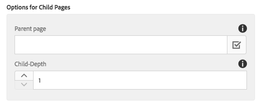
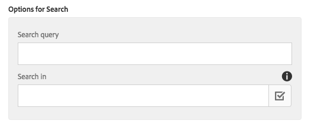

# 구성 요소 나열{#list-component}

핵심 구성 요소 목록 구성 요소를 사용하면 정적 목록과 동적 목록을 쉽게 만들 수 있습니다.

## 사용량 {#usage}

목록 구성 요소는 하위 페이지의 동적 목록 또는 임의 정의된 임의 항목의 정적 목록을 만드는 데 사용할 수 있습니다. The type of lists available and formatting options can be defined by the template author in the [design dialog](#design-dialog). The content editor can select from available list types and how to format the list elements in the [edit dialog](#edit-dialog).

## Version and Compatibility {#version-and-compatibility}

목록 구성 요소의 현재 버전은 2018 년 1 월에 핵심 구성 요소의 릴리스 2.0.0에 도입된 v 2 이며, 이 문서에서는 설명합니다.

다음 표에서는 구성 요소의 지원되는 모든 버전, 구성 요소의 버전과 호환되는 AEM 버전 및 이전 버전에 대한 설명서에 대한 링크를 제공합니다.

| 구성 요소 버전 | AEM 6.3 | AEM 6.4 | AEM 6.5 |
|--- |--- |--- |--- |
| v2 | 호환 가능 | 호환 가능 | 호환 가능 |
| [v1](list-v1.md) | 호환 가능 | 호환 가능 | 호환 가능 |

For more information about Core Component versions and releases, see the document [Core Components Versions](versions.md).

## Sample Component Output {#sample-component-output}

To experience the List Component as well as see examples of its configuration options as well as HTML and JSON output, visit the [Component Library](http://opensource.adobe.com/aem-core-wcm-components/library/list.html).

### Technical Details {#technical-details}

The latest technical documentation about the List Component [can be found on GitHub](https://github.com/adobe/aem-core-wcm-components/blob/master/content/src/content/jcr_root/apps/core/wcm/components/list/v2/list).

Further details about developing Core Components can be found in the [Core Components developer documentation](developing.md).

## Edit Dialog {#edit-dialog}

컨텐츠 작성자는 편집 대화 상자를 사용하여 목록 및 목록 항목을 구성할 수 있습니다.

### List Settings Tab {#list-settings-tab}

목록은 다른 방식으로 빌드할 수 있습니다.

* [하위 페이지](#child-pages)
* [고정 목록](#fixed-list)
* [검색](#search-options)
* [태그](#tags)

Regardless of how the list is built, there are [Sort Options](#sort-options) that can always be configured.

컨텐츠 작성자가 목록을 작성하는 방법에 따라 추가 구성 옵션이 변경됩니다.

#### 하위 페이지 {#child-pages}

현재 페이지 또는 다른 페이지의 하위 페이지로 목록을 작성할 수 있습니다.

* **상위 페이지**
   * 하위 페이지가 목록을 만들어야 하는 페이지
   * 현재 페이지를 사용하려면 비워 두십시오.

* **하위 깊이** 계층 구조에서 아래쪽으로 얼마나 많이 사용해야 합니까?

#### Fixed List {#fixed-list}

목록은 고정된 항목 목록을 사용하여 작성할 수 있습니다.

**추가** 단추를 탭하거나 클릭하여 목록에 새 항목을 삽입합니다.

* Enter text for the item in the list or use the **Selection Dialog** to choose an item from AEM.
* 드래그 핸들을 사용하여 목록의 항목을 다시 정렬합니다.
* 휴지통 아이콘을 사용하여 목록에서 항목을 삭제합니다.

#### 검색 {#search-options}

AEM 컨텐츠 검색 결과를 사용하여 목록을 작성할 수 있습니다.

* **검색 쿼리를**
사용하여 전체 텍스트 검색이 실행될 문자열을 검색합니다.
* **검색을 실행해야** 하는 위치 검색
   * **선택 대화 상자를** 사용하여 AEM에서 위치를 선택합니다.
   * 비워 두면 현재 페이지 사용

#### 태그 {#tags}

특정 위치 아래의 특정 태그와 일치하는 페이지를 사용하여 목록을 작성할 수 있습니다.

* **태그 일치를** 시작해야 하는 상위 페이지
   * **선택 대화 상자를** 사용하여 AEM에서 위치를 선택합니다.
   * 비워 두면 현재 페이지 사용
* **태그가** 일치해야 하는 태그
   * **탐색** 대화 상자를 사용하여 태그를 선택합니다.
* **일치 -**
목록에 포함할 페이지 자격이 있는 일치 항목을 정의합니다.
   * **임의의 태그**
   * **모든 태그**

#### Sort Options {#sort-options}

목록을 작성하는 방법에 관계없이 항상 정의할 수 있는 특정 정렬 옵션이 있습니다.

* **요소의 순서 지정** 방법
   * **제목**
   * **마지막으로 수정한 날짜**
* **정렬 순서**
항목을 주문해야 하는 순서
   * **오름차순**
   * **내림차순**
* **최대 항목**
목록에 표시되는 최대 항목 수입니다.
   * 모든 항목을 반환하려면 비워 둡니다.

### Item Settings Tab {#item-settings-tab}

항목 설정 탭을 사용하여 목록 요소의 서식을 구성할 수 있습니다.

* **항목을**해당 페이지에 링크 항목
연결
* **설명**
표시 링크 항목에 대한 설명 표시
* **날짜**항목의 수정 날짜 표시 날짜
표시

## Design Dialog {#design-dialog}

템플릿 작성자는 디자인 대화 상자를 사용하여 컨텐츠 작성자가 사용할 수 있는 목록과 사용 가능한 항목 설정을 정의할 수 있습니다.

### 목록 설정 {#list-settings}

**목록 설정** 탭에서는 컨텐츠 작성자에게 구성 요소에서 사용할 수 있어야 하는 목록과 날짜 형식을 정의할 수 있습니다.

* **마지막 수정 날짜 표시에 사용할 날짜 형식**
형식
* **하위**
비활성화 구성 요소에서 하위 목록 유형을 비활성화합니다.
* **정적**
비활성화 구성 요소의 정적 목록 유형 비활성화
* **검색**
비활성화 구성 요소에서 검색 목록 유형을 비활성화합니다.
* **구성 요소에서 태그**
비활성화 태그 목록 유형 비활성화

### 항목 설정 {#item-settings}

**[항목 설정** ] 탭에서 컨텐츠 작성자에 대해 구성 요소에서 사용할 수 있어야 하는 개별 목록 요소에 대한 서식 지정 옵션을 정의할 수 있습니다.

* **항목**
연결 [편집 대화 상자에서 항목 연결 옵션](#edit-dialog)
* **설명**
표시 편집 대화 상자에 설명 표시 [옵션](#edit-dialog)
* **편집 대화 상자에서 날짜** 표시 활성화 [날짜
표시](#edit-dialog)

### Styles Tab {#styles-tab}

The Image Component supports the AEM [Style System](authoring.md#component-styling).