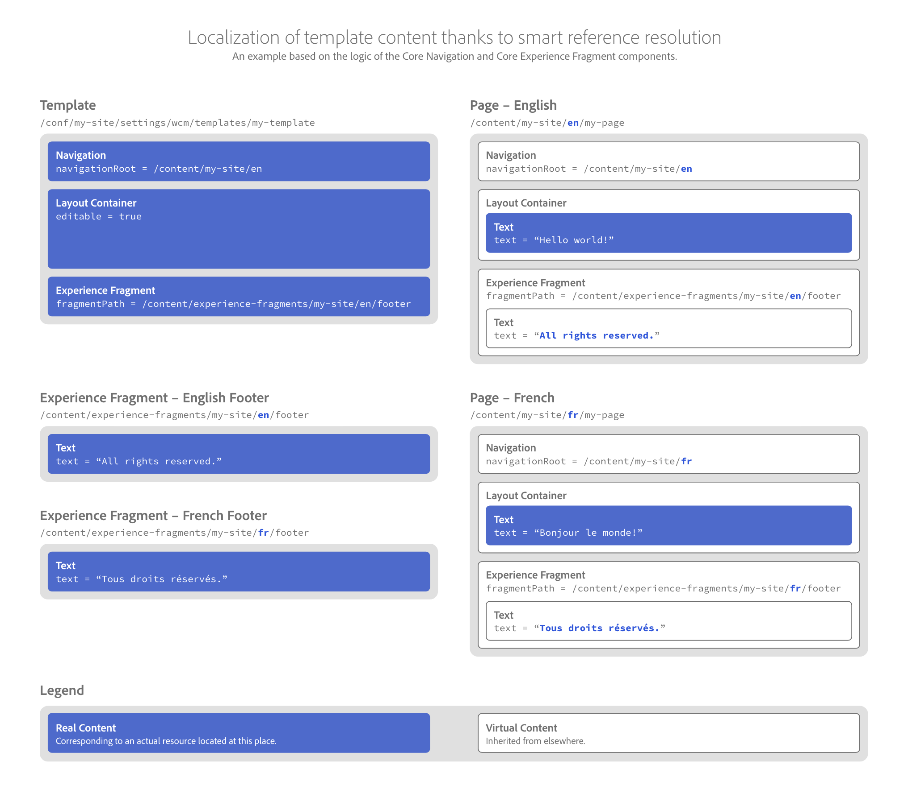

# 핵심 구성 요소의 로컬라이제이션 기능 {#localization-features-of-the-core-components}

많은 웹 사이트에서는 여러 언어와 지역에 걸쳐 현지화된 형식으로 컨텐츠를 전달해야 합니다. 선택한 핵심 구성 요소는 로컬라이제이션된 사이트 구조를 기반으로 자동으로 적용되는 로컬라이제이션된 모든 컨텐츠에 대한 통합 템플릿을 간단하게 만들 수 있도록 고급 참조 기능을 제공합니다.

## 예 - 탐색 및 바닥글이 있는 지역화된 페이지 {#example}

대부분의 사이트에는 모든 페이지에 바닥글이 있어야 합니다. 이러한 바닥글은 일반적으로 페이지의 모든 컨텐츠에 적용됩니다. 그러나 지역화된 컨텐츠 페이지에는 해당 머리글 또는 바닥글의 현지화된 버전을 표시해야 합니다.

마찬가지로 일반적으로 탐색 구성 요소는 모든 페이지에 표시되어야 합니다. 하지만 현지화된 페이지의 컨텐츠를 반영해야 합니다.

AEM의 편집 가능한 템플릿과 [함께 탐색 핵심 구성 요소](navigation.md) 및 [경험 조각 핵심 구성 요소의](experience-fragment.md) 로컬라이제이션 [기능을 사용하면 웃는 작업이 됩니다](https://docs.adobe.com/content/help/en/experience-manager-64/authoring/siteandpage/templates.html).

## 컨텐츠 구조 {#content-structure}

AEM 및 핵심 구성 요소의 모든 현지화 기능은 현지화된 컨텐츠에 대한 명확하고 논리적 컨텐츠 구조에 의존합니다.

사이트가 단순히 호출되었다고 `my-site` 가정해봅시다.

```
/content/my-site
```

또한 사이트를 영어로 작성하고 프랑스어로 제공한다고 가정합니다. 따라서 간단한 페이지가 있는 `my-page` 경우 사이트의 컨텐츠 트리에서 두 개의 현지화 분기에 있을 것입니다.

```
/content
\-- my-site
   +-- en
       \-- my-page
   \-- fr
       \-- my-page
```

이 로컬라이제이션 분기에서는 추가 사이트 페이지를 만들 수 있습니다.

페이지 바닥글은 일반적으로 경험 조각을 사용하여 만들어지므로 페이지와 같이 영어와 프랑스어 버전이 필요합니다. 그러나 경험 조각은 페이지가 아니라 페이지 전체에 다시 사용할 수 있는 페이지의 일부이므로 페이지의 다른 `/content` 부분으로 바로 라이브로 작동하지 않습니다. 대신, 해당 폴더는 자체 폴더 아래에 있지만 지역화해야 하므로 해당 구조는 사이트의 로컬라이제이션 구조를 반영해야 합니다.

```
/content
+-- experience-fragments
   +-- en
      \-- footer
   \-- fr
      \-- footer
\-- my-site
   +-- en
      \-- my-page
   \-- fr
      \-- my-page
```

미러 로컬라이제이션 구조를 통해 핵심 구성 요소가 해당 페이지에 필요한 현지화된 컨텐츠를 찾을 수 있습니다.

## 페이지 바닥글 - 경험 조각 {#xf-footer}

경험 조각 구성 요소는 매우 유연하며 페이지 머리글이나 바닥글에 적합합니다.

가설 웹 사이트는 영어 및 프랑스어로 제공되기 때문에 앞에서 설명한 위치에서 두 `footer`[개의 경험 조각을 만들어야 합니다.](#content-structure)


## 페이지 템플릿 {#template}

바닥글이 모든 페이지에 나타나므로 표준 페이지 템플릿에 경험 조각을 추가해야 합니다.

Adobe 템플릿은 `my-template` 단순히

```
/conf/my-site/settings/wcm/templates/my-template
```

이 템플릿에는 페이지를 기반으로 할 기본 구성 요소가 추가됩니다.

* [탐색 구성 요소](navigation.md)
   * 탐색 구성 요소는 모든 페이지의 맨 위에 표시됩니다.
   * 탐색 구성 요소에서 사이트의 탐색 구조가 시작되는 곳을 알려주는 탐색 루트를 정의합니다.
   * 구성 요소는 탐색 루트를 기반으로 해당 현지화된 컨텐츠를 자동으로 찾을 수 있습니다.
* [컨테이너 구성 요소](container.md)
   * 작성자가 페이지에 추가 컨텐츠를 배치할 수 있도록 모든 페이지에 편집 가능한 컨테이너 구성 요소가 포함됩니다.
* [경험 조각](experience-fragment.md)
   * Experinece 조각 구성 요소를 footer를 나타내는 조각의 작성 언어로 조각 경로에 지정합니다.
   * 해당 조각 경로와 현지화된 페이지 구조를 반영하는 경험 조각의 구조를 기반으로, 구성 요소는 해당 현지화된 컨텐츠를 자동으로 찾을 수 있습니다.
   

## 페이지 {#pages}

컨텐츠 작성자는 사이트 구조와 템플릿을 설정할 때 열심히 작업함으로써 필요한 컨텐츠를 페이지에 추가해야 합니다. 템플릿 및 구성 요소의 로컬라이제이션 로직 덕분에 내비게이션 및 바닥글이 페이지에 자동으로 추가되고 로컬라이즈됩니다.

예를 들어 작성자는 텍스트 구성 요소 (예: 영어 및 프랑스어 페이지) 에 텍스트 구성 요소와 같은 컨텐츠를 추가해야 합니다.

탐색 구성 요소 및 경험 조각 구성 요소는 페이지 템플릿에서 가져옵니다. 현지화 구조와 페이지 자체의 위치 (아래에서 흰색으로 표시됨) 를 기반으로 올바른 컨텐츠를 자동으로 표시할 수 있습니다.


## 모든 취합 {#fitting-it-all-together}

다음은 이러한 간단하지만 강력한 요소가 함께 작동하여 컨텐츠 작성자에게 현지화된 페이지를 전달하는 방법을 요약한 것입니다.


