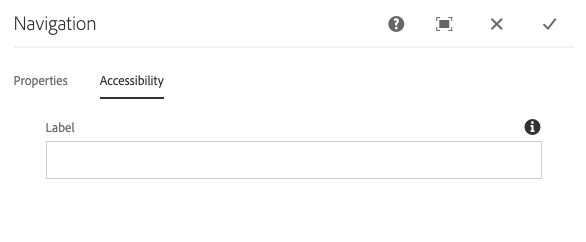

# 탐색 구성 요소{#navigation-component}

탐색 구성 요소를 사용하면 글로벌라이제이션 사이트 구조를 쉽게 탐색할 수 있습니다.

## 사용량 {#usage}

탐색 구성 요소 목록에는 사이트 사용자가 사이트 구조를 쉽게 탐색할 수 있도록 페이지 트리가 나열됩니다.

탐색 구성 요소는 사이트의 글로벌라이제이션 사이트 구조를 자동으로 감지하고 로컬라이즈된 페이지에 자동으로 [적용할 수 있습니다.](#localized-site-strucutre) 또한, 기본 컨텐츠 구조 이외의 다른 구조를 나타내기 위해 [그림자 리디렉션 페이지를](#shadow-structure) 사용하여 임의의 사이트 구조를 지원할 수 있습니다.

컨텐츠 작성자는 [편집 대화 상자를](#edit-dialog) 사용하여 탐색 깊이와 함께 내비게이션 루트 페이지를 정의할 수 있습니다. 템플릿 작성자는 [디자인 대화 상자를](#design-dialog) 사용하여 탐색 루트 및 깊이에 대한 기본값을 정의할 수 있습니다.

## 현지화된 사이트 구조 지원 {#localized-site-structure}

웹 사이트는 지역마다 여러 언어로 제공됩니다. 일반적으로 현지화된 각 페이지에는 페이지 템플릿의 일부로 포함된 navagation 요소가 포함됩니다. 탐색 구성 요소를 사용하면 사이트의 모든 페이지에 대한 템플릿에 한 번 배치하면 글로벌라이제이션된 사이트 구조를 기반으로 로컬라이제이션된 개별 페이지에 맞게 자동으로 조정됩니다.

* 탐색 구성 요소의 현지화 기능이 작동하는 방식에 대한 예를 보려면 아래 섹션을 [](#example-localiatzion)참조하십시오.
* 핵심 구성 요소의 현지화 기능이 함께 작동하는 방법에 대한 예를 보려면 핵심 구성 요소 페이지의 [현지화 기능을 참조하십시오](localization.md).

### 예 {#example-localization}

컨텐츠가 다음과 같이 표시됩니다.

```
/content
+-- we-retail
   +-- language-masters
      +-- de
         \-- experience
            \-- arctic-surfing-in-lofoten
      +-- en
         \-- experience
            \-- arctic-surfing-in-lofoten
      +-- es
      +-- fr
      \-- it
   +-- us
      +-- en
         \-- experience
            \-- arctic-surfing-in-lofoten
      \-- es
   \-- ch
      +-- de
         \-- experience
            \-- arctic-surfing-in-lofoten
      +-- fr
      \-- it
+-- wknd-events
\-- wknd-shop
```

We. Retail 사이트인 경우, 페이지 템플릿에 탐색 구성 요소를 헤더의 일부로 배치할 수 있습니다. 템플릿의 일부인 경우 구성 요소의 **탐색 루트를** 해당 사이트의 마스터 콘텐트가 시작되는 `/content/we-retail/language-masters/en` 곳부터 설정할 수 있습니다. 전체 컨텐츠 트리가 구성 요소로는 표시되지 않고 처음 두 수준이 개요 역할을 하기 때문에 **내비게이션 구조 깊이를** `2` 설정할 수도 있습니다.

**탐색 루트** 값이 있으면 탐색 구성 요소는 탐색이 `/content/we-retail/language-masters/en` 시작되고, 사이트의 두 수준 아래로 ( **탐색 구조 깊이** 값에 의해 정의됨) 구조를 재설정하여 탐색 옵션을 생성할 수 있음을 인식합니다.

사용자가 보고 있는 현지화된 페이지에 관계없이 탐색 구성 요소는 현재 페이지의 위치를 알고 있는 현재 페이지의 위치를 파악하고 해당 페이지로 이동하여 해당 현지화된 페이지를 찾을 수 있습니다.

따라서 방문자가 보고 `/content/ch/de/experience/arctic-surfing-in-lofoten`있는 경우 구성 요소는을 `/content/we-retail/language-masters/de`기반으로 탐색 구조를 생성합니다. 마찬가지로 방문자가 보는 `/content/us/en/experience/arctic-surfing-in-lofoten`경우 구성 요소는을 `/content/we-retail/language-masters/en`기반으로 탐색 구조를 생성하는 것을 인식합니다.

## 그림자 사이트 구조 지원 {#shadow-structure}

때때로 실제 사이트 구조와 다른 방문자의 탐색 메뉴를 만들어야 합니다. 판촉 행사는 컨텐츠 목록을 재정렬하여 메뉴의 특정 컨텐츠를 강조 표시해야 합니다. 탐색 구성 요소는 다른 컨텐츠 페이지로 리디렉션되는 그림자 페이지를 사용하여 임의 탐색 구조를 생성할 수 있습니다.

이렇게 하려면 다음을 수행해야 합니다.

1. 원하는 사이트 구조를 나타내는 Emtpy 페이지로 그림자 페이지를 만듭니다. 이를 종종 그림자 사이트 구조로 부르기도 합니다.
1. 페이지에 있는 **리디렉션** 값을 이 페이지의 [실제 컨텐츠] 페이지를 가리키도록 설정합니다.
1. 그림자 페이지의 페이지 속성에서 탐색 시 **숨기기** 옵션을 설정합니다.
1. 탐색 구성 요소의 **탐색 루트** 값을 설정하여 새 Shadow 사이트 구조의 루트를 가리킵니다.

그러면 탐색 구성 요소가 그림자 사이트 구조를 기반으로 메뉴를 렌더링합니다. 구성 요소로 렌더링되는 링크는 그림자 페이지가 아닌으로 리디렉션되는 실제 컨텐츠 페이지에 있습니다. 또한, 이 구성 요소는 탐색이 그림자 페이지를 기반으로 하는 경우에도 실제 페이지의 이름을 표시하고 활성 페이지를 올바로 강조 표시합니다. 탐색 구성 요소는 방문자에게 완전히 투명한 그림자 페이지를 효과적으로 만듭니다.

>[!NOTE]
>그림자 페이지를 사용하면 탐색 옵션을 훨씬 유연하게 만들 수 있지만 이 구조의 maintence는 완전히 수동이라는 점을 염두에 두십시오. 실제 사이트 컨텐츠를 재배치하거나 컨텐츠를 추가/제거하는 경우 필요에 따라 그림자 구조를 수동으로 업데이트해야 합니다.

>[!NOTE]
>그림자 사이트 구조를 렌더링할 때 그림자 페이지만 탐색 논리로 재귀화됩니다. 로직이 리디렉션 대상의 구조를 반복하지 않습니다.

## 버전 및 호환성 {#version-and-compatibility}

탐색 구성 요소의 현재 버전은 2018 년 1 월에 핵심 구성 요소의 릴리스 2.0.0에서 처음 소개된 v 1 이며, 이 문서에서는 설명합니다.

다음 표에서는 구성 요소의 지원되는 모든 버전, 구성 요소의 버전과 호환되는 AEM 버전 및 이전 버전에 대한 설명서에 대한 링크를 제공합니다.

| 구성 요소 버전 | AEM 6.3 | AEM 6.4 | AEM 6.5 |
|--- |--- |--- |--- |
| v1 | 호환 가능 | 호환 가능 | 호환 가능 |

핵심 구성 요소 버전 및 릴리스에 대한 자세한 내용은 문서 [코어 구성 요소 버전을 참조하십시오](versions.md).

## 샘플 구성 요소 출력 {#sample-component-output}

탐색 구성 요소를 경험하고 HTML 및 JSON 출력을 비롯하여 구성 옵션의 예를 보려면 [구성 요소 라이브러리를 참조하십시오](http://opensource.adobe.com/aem-core-wcm-components/library/navigation.html).

## 기술 세부 정보 {#technical-details}

탐색 구성 요소에 [대한 최신 기술 설명서는 Github](https://github.com/adobe/aem-core-wcm-components/blob/master/content/src/content/jcr_root/apps/core/wcm/components/navigation/v1/navigation)에서 찾을 수 있습니다.

핵심 구성 요소 개발에 대한 자세한 내용은 [핵심 구성 요소 개발자 설명서를](developing.md)참조하십시오.

>[!NOTE]
>
>코어 구성 요소 릴리스 2.1.0 부터는 탐색 구성 요소가 [schema.org 마이크로 데이터를 지원합니다](https://schema.org).

## Edit Dialog {#edit-dialog}

편집 대화 상자에서 컨텐츠 작성자는 탐색을 위한 루트 페이지와 탐색 구조의 깊이를 정의할 수 있습니다.

### 속성 탭 {#properties-tab}


* **탐색 루트**
탐색 트리를 생성하는 데 사용되는 루트 페이지입니다.
* **제외 탐색 루트**
결과 트리에서 탐색 루트를 제외시키고 그 하위 항목을 포함합니다.
* **모든 하위 페이지**
수집 탐색 루트의 하위 항목인 모든 페이지를 수집합니다.
* **탐색 구조 깊이는**
탐색 트리에서 구성 요소가 얼마나 많이 표시되어야 하는지를 정의합니다 (모든 하위 페이지를 **수집하지 않은 경우에만** 사용 가능).

### 액세스 가능성 탭 {#accessibility-tab}



**액세서빌러티** 탭에서 구성 요소의 [ARIA 액세서빌러티](https://www.w3.org/WAI/standards-guidelines/aria/) 레이블에 대해 값을 설정할 수 있습니다.

* **label** - 구성 요소에 대한 aria 레이블 속성의 값

## 디자인 대화 상자 {#design-dialog}

템플릿 작성자는 디자인 대화 상자를 사용하여 컨텐츠 작성자에게 표시되는 탐색 루트 페이지 및 탐색 깊이에 대한 기본값을 설정할 수 있습니다.

### 속성 탭 {#properties-tab-design}


* **탐색 루트에는**
탐색 트리를 생성하는 데 사용할 탐색 구조의 기본값, 컨텐츠 작성자가 구성 요소를 페이지에 추가할 때 기본값이 지정됩니다.
* **제외 탐색 루트**
결과 트리에서 탐색 루트를 제외하는 옵션의 기본값입니다.
* **탐색 루트의 하위 항목인 모든 페이지를 수집하는 옵션의**기본값을 모든 하위 페이지에
수집합니다.
* **탐색 구조 깊이탐색**
구조 깊이의 기본값입니다.

### 스타일 탭 {#styles-tab}

탐색 구성 요소는 AEM [스타일 시스템을 지원합니다](authoring.md#component-styling).
