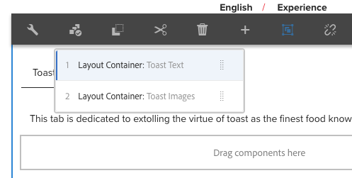

# 탭 구성 요소

핵심 구성 요소 탭 구성 요소를 사용하면 여러 탭에 컨텐츠를 구성할 수 있습니다.

## 사용량 {#usage}

컨텐츠 작성자는 탭 구성 요소를 사용하여 여러 탭 내에서 페이지 컨텐츠를 구성할 수 있습니다.

컨텐츠 작성자는 [편집 대화 상자를](#edit-dialog) 사용하여 활성 탭을 설정할 수 있을 뿐만 아니라 여러 탭을 정의할 수 있습니다. 템플릿 작성자는 [디자인 대화 상자를](#design-dialog)사용하여 탭에 추가할 수 있는 구성 요소를 정의하고 스타일을 사용자 지정할 수 있습니다.

>[!NOTE]
>
>중첩된 탭 구성 요소 (탭 내의 탭) 가 지원됩니다.
>
>[컨텐츠 트리를](https://helpx.adobe.com/experience-manager/6-5/sites/authoring/using/author-environment-tools.html)사용하여 간단한 (중첩되지 않은) 탭 구성 요소를 배치/선택할 수 있지만 중첩된 탭은 사용할 수 없습니다.

## 버전 및 호환성 {#version-and-compatibility}

탭 구성 요소의 현재 버전은 2018 년 10 월에 핵심 구성 요소의 릴리스 2.2.0에서 처음 소개된 v 1 이며, 이 문서에서는 설명합니다.

다음 표에서는 구성 요소의 지원되는 모든 버전, 구성 요소의 버전과 호환되는 AEM 버전 및 이전 버전에 대한 설명서에 대한 링크를 제공합니다.

| 구성 요소 버전 | AEM 6.3 | AEM 6.4 | AEM 6.5 |
|--- |--- |--- |--- |
| v1 | 호환 가능 | 호환 가능 | 호환 가능 |

핵심 구성 요소 버전 및 릴리스에 대한 자세한 내용은 문서 [코어 구성 요소 버전을 참조하십시오](versions.md).

## 샘플 구성 요소 출력 {#sample-component-output}

[다음은 We. Retail](https://helpx.adobe.com/experience-manager/6-5/sites/developing/using/we-retail.html)에서 가져온 샘플입니다.

### 스크린샷 {#screenshot}

### 구성 요소 라이브러리

탭 구성 요소를 경험하고 HTML 및 JSON 출력뿐만 아니라 구성 옵션의 예를 보려면 [구성 요소 라이브러리를 참조하십시오](http://opensource.adobe.com/aem-core-wcm-components/library/tabs.html).

### 기술 세부 정보 {#technical-details}

탭 구성 요소에 [대한 최신 기술 설명서는 Github](https://github.com/adobe/aem-core-wcm-components/blob/master/content/src/content/jcr_root/apps/core/wcm/components/tabs/v1/tabs)에서 찾을 수 있습니다.

핵심 구성 요소 개발에 대한 자세한 내용은 [핵심 구성 요소 개발자 설명서를](developing.md)참조하십시오.

## 편집 대화 상자 {#edit-dialog}

컨텐츠 작성자는 편집 대화 상자를 사용하여 탭을 만들고, 이름을 변경하고, 재정렬하고 활성 탭을 정의할 수 있습니다.

### 항목 탭 {#items-tab}

**추가** 단추를 사용하여 구성 요소 선택기를 열어 탭으로 추가할 구성 요소를 선택합니다. 추가된 항목이 목록에 추가되면 다음 열이 포함됩니다.

* **아이콘** - 목록에서 쉽게 식별할 수 있는 탭의 구성 요소 유형의 아이콘입니다. 마우스를 놓으면 전체 구성 요소 이름이 툴팁으로 표시됩니다.
* **설명** - 탭의 텍스트로 사용된 설명으로서, 탭에 대해 선택된 구성 요소의 이름을 기본값으로 지정합니다.
* **삭제** - 탭 구성 요소에서 탭을 탭하려면 탭하거나 클릭합니다.
* **재배치** - 탭 순서를 탭하거나 클릭하고 드래그하여 탭합니다.

### 속성 탭 {#properties-tab}

**속성** 탭에서 컨텐츠 작성자는 페이지를 로드할 때 활성 상태인 탭을 정의할 수 있습니다. **기본** 옵션을 사용하면 첫 번째 탭이 선택됩니다.

## 패널 선택 {#select-panel}

컨텐츠 작성자는 구성 요소 도구 모음의 패널 **선택** 옵션을 사용하여 편집을 위해 다른 패널로 변경할 수 있으며 탭 순서를 손쉽게 재정렬할 수 있습니다.

구성 요소 **도구 모음에서 선택 패널** 옵션을 선택하면 구성된 탭이 드롭다운으로 표시됩니다.

* 목록은 탭의 지정된 배열로 순서가 지정되며 번호 매기기에 반영됩니다.
* 먼저 탭의 구성 요소 유형이 표시되고, 그 다음에 더 밝은 글꼴의 탭 설명이 표시됩니다.

* 드롭다운에서 항목을 탭하거나 클릭하면 편집기의 보기를 해당 탭으로 전환합니다.
* 드래그 핸들을 사용하여 즉석에서 탭을 다시 정렬할 수 있습니다.

>[!NOTE]
>
>편집 모드에서 작성자가 탭을 **선택할** 수 없습니다. 게시된 컨텐츠의 판독기로 탭과 상호 작용하려면 [**미리 보기** 모드](https://helpx.adobe.com/experience-manager/6-5/sites/authoring/using/editing-content.html) **[또는 게시됨으로](https://helpx.adobe.com/experience-manager/6-5/sites/authoring/using/editing-content.html)** 보기를 사용합니다.

## 디자인 대화 상자 {#design-dialog}

템플릿 작성자는 디자인 대화 상자를 사용하여 탭 구성 요소에 항목으로 추가할 수 있는 구성 요소를 정의할 수 있을 뿐만 아니라 컨텐츠 작성자가 사용할 수 있는 사용자 지정 스타일을 정의할 수 있습니다.

### 허용된 구성 요소 탭 {#allowed-components-tab}

**허용된 구성 요소** 탭은 컨텐츠 작성자가 탭 구성 요소에 항목으로 추가할 수 있는 구성 요소를 정의하는 데 사용됩니다.

허용된 구성 요소 탭은 템플릿 편집기에서 레이아웃 컨테이너의 정책 및 속성을 [정의할 때 동일한 이름의 탭과 동일한 방식으로 작동합니다.](https://helpx.adobe.com/experience-manager/6-5/sites/authoring/using/templates.html)

### 스타일 탭 {#styles-tab}

탭 구성 요소는 AEM [스타일 시스템을 지원합니다](authoring.md#component-styling).