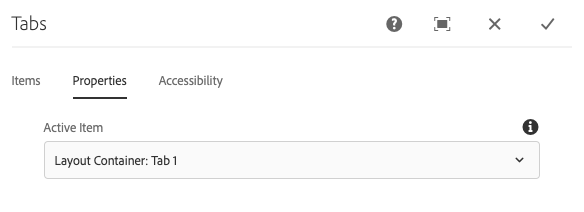
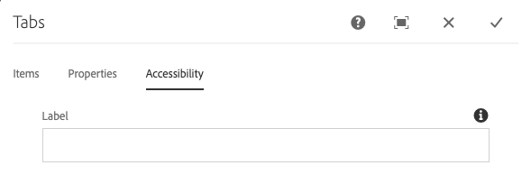

# 탭 구성 요소

핵심 구성 요소 탭 구성 요소를 사용하면 컨텐츠를 여러 탭에 구성할 수 있습니다.

## 사용량 {#usage}

탭 구성 요소를 사용하면 컨텐츠 작성자가 여러 탭 내에서 페이지 컨텐츠를 구성할 수 있습니다.

컨텐츠 작성자는 [편집 대화 상자를](#edit-dialog) 사용하여 여러 탭을 정의할 수 있을 뿐만 아니라 활성 탭을 설정할 수 있습니다. 템플릿 작성자는 [디자인 대화](#design-dialog)상자를 사용하여 탭에 추가할 수 있는 구성 요소를 정의하고 스타일을 사용자 정의할 수 있습니다.

>[!NOTE]
>
>중첩된 탭 구성 요소(탭 내의 탭)가 지원됩니다.
>
>단순(중첩된 아님) 탭 구성 요소는 [컨텐츠 트리를](https://docs.adobe.com/content/help/en/experience-manager-cloud-service/sites/authoring/fundamentals/environment-tools.html#content-tree)사용하여 찾거나 선택할 수 있지만 중첩된 탭은 없을 수 있습니다.

## 버전 및 호환성 {#version-and-compatibility}

현재 버전의 탭 구성 요소는 v1이며, 이 버전은 2018년 10월 핵심 구성 요소 릴리스 2.2.0과 함께 도입되었으며 이 문서에 설명되어 있습니다.

다음 표에서는 구성 요소의 지원되는 모든 버전, 구성 요소 버전이 호환되는 AEM 버전 및 이전 버전에 대한 설명서 링크에 대해 자세히 설명합니다.

| 구성 요소 버전 | AEM 6.3 | AEM 6.4 | AEM 6.5 | 클라우드 서비스로 AEM 사용 |
|--- |--- |--- |--- |---|
| v1 | 호환 가능 | 호환 가능 | 호환 가능 | 호환 가능 |

핵심 구성 요소 버전 및 릴리스에 대한 자세한 내용은 핵심 구성 요소 [버전을 참조하십시오](versions.md).

## 샘플 구성 요소 출력 {#sample-component-output}

탭 구성 요소뿐만 아니라 구성 옵션의 예와 HTML 및 JSON 출력을 보려면 구성 요소 [라이브러리를 참조하십시오](https://adobe.com/go/aem_cmp_library_tabs).

### 기술 정보 {#technical-details}

탭 구성 요소에 대한 최신 기술 문서는 GitHub에서 [찾을 수 있습니다](https://adobe.com/go/aem_cmp_tech_tabs_v1).

핵심 구성 요소 개발에 대한 자세한 내용은 핵심 구성 요소 개발자 [설명서를](developing.md)참조하십시오.

## Edit Dialog {#edit-dialog}

편집 대화 상자에서는 컨텐츠 작성자가 탭을 만들고 이름을 변경하고 재정렬할 수 있을 뿐만 아니라 활성 탭을 정의할 수 있습니다.

### 항목 탭 {#items-tab}

추가 **단추를 사용하여** 구성 요소 선택기를 열어 탭으로 추가할 구성 요소를 선택합니다. 항목이 추가되면 다음 열이 포함된 항목이 목록에 추가됩니다.

* **아이콘** - 목록에서 쉽게 식별할 수 있는 탭의 구성 요소 유형의 아이콘입니다. 도구 설명으로 전체 구성 요소 이름을 보려면 마우스를 위에 놓으십시오.
* **설명** - 탭의 텍스트로 사용된 설명으로서, 탭에 대해 선택한 구성 요소의 이름이 기본값으로 설정됩니다.
* **삭제** - 탭 구성 요소에서 탭을 삭제하려면 탭하거나 클릭합니다.
* **재배치** - 탭 순서를 다시 정렬하려면 탭하거나 클릭하고 드래그합니다.

>[!TIP]
>
>페이지의 뷰포트가 축소되어 편집 대화 상자가 전체 화면이 되면 추가 **단추가** 숨겨집니다. 구성 요소 브라우저에서 [드래그하고 페이지 편집기의](https://docs.adobe.com/content/help/en/experience-manager-cloud-service/sites/authoring/fundamentals/editing-content.html#inserting-a-component)탭 구성 요소를 놓아 탭 구성 요소를 추가할 수 있습니다.

### 속성 탭 {#properties-tab}

속성 **탭에서** 컨텐츠 작성자는 페이지를 로드할 때 활성 상태인 탭을 정의할 수 있습니다. 기본값 **옵션을** 사용하면 첫 번째 탭이 선택됩니다.

### 액세스 가능성 탭 {#accessibility-tab}

액세스 **가능성** 탭에서 구성 요소에 대한 ARIA 액세스 [가능](https://www.w3.org/WAI/standards-guidelines/aria/) 레이블에 대한 값을 설정할 수 있습니다.

* **레이블** - 구성 요소에 대한 ARIA 레이블 속성의 값

## Select Panel {#select-panel}

컨텐츠 작성자는 구성 **요소 도구** 모음의 [패널 선택] 옵션을 사용하여 편집할 수 있는 다른 패널로 변경할 수 있을 뿐만 아니라 탭의 순서를 쉽게 재정렬할 수 있습니다.

구성 요소 **도구 모음에서** 패널 선택 옵션을 선택하면 구성된 탭이 드롭다운으로 표시됩니다.

* 목록은 지정된 탭 배열별로 정렬되며 번호 매기기에 반영됩니다.
* 탭의 구성 요소 유형이 먼저 표시되고, 그 다음에 보다 밝은 글꼴로 탭에 대한 설명이 표시됩니다.

* 드롭다운에서 항목을 탭하거나 클릭하면 편집기의 보기가 해당 탭으로 전환됩니다.
* 드래그 핸들을 사용하여 탭을 제자리에 배치할 수 있습니다.

>[!NOTE]
>
>편집 모드에서는 작성자가 탭을 선택할 수 **없습니다** . 미리 **[보기](https://docs.adobe.com/content/help/en/experience-manager-cloud-service/sites/authoring/fundamentals/editing-content.html#preview-mode)**모드 또는**[&#x200B;게시됨으로](https://docs.adobe.com/content/help/en/experience-manager-cloud-service/sites/authoring/fundamentals/editing-content.html#view-as-published)** 보기 옵션을 사용하여 게시된 컨텐츠의 리더로 탭과 상호 작용합니다.

## 디자인 대화 상자 {#design-dialog}

템플릿 작성자는 디자인 대화 상자를 사용하여 탭 구성 요소에 항목으로 추가할 수 있는 구성 요소를 정의할 수 있을 뿐만 아니라 컨텐츠 작성자가 사용할 수 있는 사용자 정의 스타일을 정의할 수 있습니다.

### 허용된 구성 요소 탭 {#allowed-components-tab}

허용된 구성 **요소** 탭은 컨텐츠 작성자가 탭 구성 요소에 항목으로 추가할 수 있는 구성 요소를 정의하는 데 사용됩니다.

템플릿 편집기에서 레이아웃 컨테이너의 정책 및 속성을 [정의할 때 허용된 구성 요소 탭은 동일한 이름의 탭과 동일한 방식으로 작동합니다.](https://docs.adobe.com/content/help/en/experience-manager-cloud-service/sites/authoring/features/templates.html)

### 스타일 탭 {#styles-tab}

탭 구성 요소는 AEM 스타일 시스템을 [지원합니다](authoring.md#component-styling).
