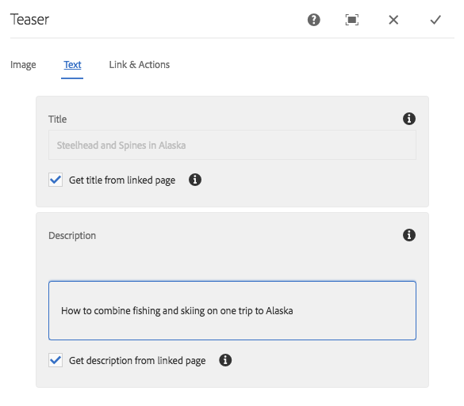

# Teaser Component{#teaser-component}

핵심 구성 요소 티저 구성 요소는 이미지, 제목, 리치 텍스트 및 추가적인 컨텐츠에 대한 선택적으로 링크를 표시할 수 있습니다.

## 사용량 {#usage}

Teaser 구성 요소를 사용하면 컨텐츠 작성자는 이미지, 제목 또는 리치 텍스트를 사용하여 추가 컨텐츠에 대한 티저를 쉽게 만들고 추가 컨텐츠나 다른 액션에 연결할 수 있습니다.

The template author can use the [design dialog](#design-dialog) to define if the options to create call-to-actions and add links are available as well as disabling various display options. The content author can use the [configure dialog](#configure-dialog) to set an image, define CTAs, set titles and descriptions, and configure links to the individual teaser. The [edit dialog](image.md#edit-dialog) of the [Image Component](image.md) can be accessed to modify the teaser image.

## Version and Compatibility {#version-and-compatibility}

티저 구성 요소의 현 버전은 2018 년 7 월에 핵심 구성 요소의 릴리스 2.1.0에 도입된 v 1 이며, 이 문서에서는 설명합니다.

다음 표에서는 구성 요소의 지원되는 모든 버전, 구성 요소의 버전과 호환되는 AEM 버전 및 이전 버전에 대한 설명서에 대한 링크를 제공합니다.

| 구성 요소 버전 | AEM 6.3 | AEM 6.4 | AEM 6.5 |
|---|---|---|---|
| v1 | 호환 가능 | 호환 가능 | 호환 가능 |

## Sample Component Output {#sample-component-output}

To experience the Teaser Component as well as see examples of its configuration options as well as HTML and JSON output, visit the [Component Library](http://opensource.adobe.com/aem-core-wcm-components/library/teaser.html).

### Technical Details {#technical-details}

The latest technical documentation about the Teaser Component [can be found on GitHub](https://github.com/adobe/aem-core-wcm-components/blob/master/content/src/content/jcr_root/apps/core/wcm/components/teaser/v1/teaser).

Further details about developing Core Components can be found in the [Core Components developer documentation](developing.md).

## Configure Dialog {#configure-dialog}

컨텐츠 작성자는 구성 대화 상자를 사용하여 개별 티저의 속성을 정의할 수 있습니다. There is also an [edit dialog](#edit-dialog) to modify the teaser image if one is selected.

### 이미지 {#image}

* **이미지 자산**
   * [자산 브라우저에서 자산을](https://helpx.adobe.com/experience-manager/6-5/sites/authoring/using/author-environment-tools.html) 끌어 놓거나 **찾아보기** 옵션을 눌러 로컬 파일 시스템에서 업로드합니다.
   * **지우기를** 탭하거나 클릭하여 현재 선택한 이미지를 제거합니다.
   * **편집을** 탭하거나 [클릭하여 자산 편집기에서 자산의](https://helpx.adobe.com/experience-manager/6-5/assets/using/managing-assets-touch-ui.html) 표현물을 관리합니다.

### 텍스트 {#text}

* **Title**
티저에 대한 헤드라인으로 표시할 제목을 정의합니다.
* **연결된 페이지에서**
제목 가져오기 확인란을 선택하면 제목이 연결된 페이지 제목으로 채워집니다.
* **description**
teaser의 하위 제목으로 표시할 설명을 정의합니다.
* **연결된 페이지에서**
설명 가져오기 선택하면 설명이 연결된 페이지 설명으로 채워집니다.

### Links &amp; Actions {#links-actions}

* **링크**
링크가 티저에 적용되었습니다. 경로 브라우저를 사용하여 링크 타겟을 선택합니다.
* **클릭유도문안 활성화** 시 클릭유도문안 정의를 활성화합니다. 목록의 첫 번째 클릭유도문안 링크는 다른 티저 요소에 대한 링크로 사용됩니다.

## Edit Dialog {#edit-dialog}

The Teaser Component delegates image rendering to the [Image Component](image.md). Therefore the [edit dialog](image.md#edit-dialog of the Image Component is available to the content author to manipulate the teaser image.

## Design Dialog {#design-dialog}

템플릿 작성자는 디자인 대화 상자를 사용하여 컨텐츠 작성자가 이 구성 요소를 사용할 때 티저 옵션을 정의할 수 있습니다.

### Teaser Tab {#teaser-tab}

* **클릭 유도 문안**
   * **클릭유도문안 비활성화컨텐츠**
작성자에 대한 클릭유도문안 **숨기기** 옵션
* **요소**
   * **제목 숨기기**
      * Hides the **Title** option for content authors
      * When selected the **Title Type** is hidden
   * **설명**
숨기기 컨텐츠 작성자에 대한 **설명** 숨기기 옵션
* **제목 유형은**
Teaser의 제목에서 사용할 H 태그를 정의합니다.
* **링크**
   * **이미지를 연결하지** 마십시오. 티저 이미지가 연결되어 있지 않습니다.
   * **제목을**
연결하지 마십시오. Teaser 제목이 연결되어 있지 않습니다.

### Styles Tab {#styles-tab}

The Teaser Component supports the AEM [Style System](authoring.md#component-styling).
