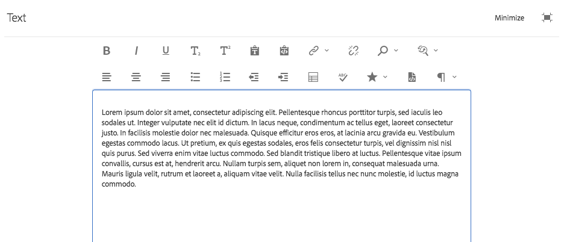
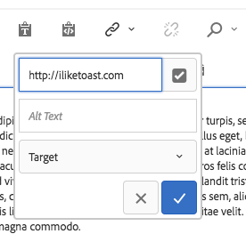
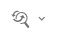
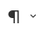

# 텍스트 구성 요소{#text-component}

코어 구성 요소 텍스트 구성 요소는 즉석 편집을 제공하는 리치 텍스트 편집 및 구성 요소입니다.

## 사용량 {#usage}

텍스트 구성 요소는 간소화된 인라인 편집기뿐만 아니라 전체 화면 포맷으로 손쉽게 텍스트를 편집할 수 있는 강력한 리치 텍스트 편집기를 제공합니다.

전체 화면 편집 대화 상자에서 사용할 수 있는 모든 기능을 갖춘 제한된 옵션을 사용하여 [편집 대화 상자를](#edit-dialog) 바로 편집할 수 있습니다. 제목, 특수 문자 및 단락 스타일과 같은 [텍스트 서식 지정 옵션은](#design-dialog)디자인 대화상자를 사용하여 내용 작성자를 위한 템플릿에 구성할 수 있습니다.

## 버전 및 호환성 {#version-and-compatibility}

텍스트 구성 요소의 현재 버전은 v2이며, 이 버전은 2018년 1월 핵심 구성 요소 릴리스 2.0.0에서 도입되었으며 이 문서에 설명되어 있습니다.

다음 표에서는 구성 요소의 지원되는 모든 버전, 구성 요소 버전이 호환되는 AEM 버전 및 이전 버전에 대한 설명서 링크에 대해 자세히 설명합니다.

| 구성 요소 버전 | AEM 6.3 | AEM 6.4 | AEM 6.5 | 클라우드 서비스로 AEM 사용 |
|---|---|---|---|---|
| v2 | 호환 가능 | 호환 가능 | 호환 가능 | 호환 가능 |
| [v1](text-v1.md) | 호환 가능 | 호환 가능 | 호환 가능 | - |

핵심 구성 요소 버전 및 릴리스에 대한 자세한 내용은 핵심 구성 요소 [버전을 참조하십시오](versions.md).

## 샘플 구성 요소 출력 {#sample-component-output}

텍스트 구성 요소뿐만 아니라 구성 옵션의 예와 HTML 및 JSON 출력을 보려면 구성 요소 [라이브러리를 참조하십시오](https://adobe.com/go/aem_cmp_library_text).

### 기술 정보 {#technical-details}

텍스트 구성 요소에 대한 최신 기술 문서는 GitHub에서 [찾을 수 있습니다](https://adobe.com/go/aem_cmp_tech_text_v2).

핵심 구성 요소 개발에 대한 자세한 내용은 핵심 구성 요소 개발자 [설명서를](developing.md)참조하십시오.

## 텍스트 구성 요소 및 리치 텍스트 편집기 {#the-text-component-and-the-rich-text-editor}

핵심 구성 요소 텍스트 구성 요소는 AEM Rich Text Editor(RTE)를 활용합니다. RTE 파섹 RTE는 구성에 매우 유연하며 다양한 옵션을 제공합니다. RTE를 구성하는 방법에 대한 자세한 내용은 리치 텍스트 편집기 구성 [및 리치 텍스트 편집기](https://docs.adobe.com/content/help/en/experience-manager-65/administering/operations/rich-text-editor.html) 구성 플러그인을참조하십시오.

이 문서의 나머지 부분에서는 기본 RTE 구성과 함께 핵심 구성 요소 텍스트 구성 요소의 표준 구성을 보여 줍니다.

>[!NOTE]
>
>RTE의 [UI 구성에서 활성화된](https://docs.adobe.com/content/help/en/experience-manager-65/administering/operations/configure-rich-text-editor-plug-ins.html) 옵션만 텍스트 구성 요소에서 사용할 수 있습니다.

## Edit Dialog {#edit-dialog}

편집 대화 상자에서는 사용자가 텍스트를 구성할 수 있는 표준 서식 지정 툴을 제공합니다.

### 굵게

선택한 텍스트에 굵게 서식을 적용하거나 커서 뒤에 입력한 텍스트에 굵게 서식을 지정하는 데 사용됩니다.

**Ctrl+B를** 키보드 단축키로 사용할 수 있습니다.

### 기울임체

선택한 텍스트에 기울임꼴 서식을 적용하거나 커서 뒤에 입력한 텍스트를 기울임꼴로 만드는 데 사용됩니다.

**Ctrl+I를** 키보드 단축키로 사용할 수 있습니다.

### 밑줄

선택한 텍스트에 밑줄 서식을 적용하거나 커서 뒤에 입력한 텍스트에 밑줄 서식을 적용하는 데 사용됩니다.

**Ctrl+U를** 키보드 단축키로 사용할 수 있습니다.

### 아래 첨자

커서 다음에 입력한 텍스트 또는 선택한 텍스트의 서식을 하위 스크립트로 지정하는 데 사용됩니다.

### 위 첨자

커서 다음에 입력한 텍스트 또는 선택한 텍스트의 서식을 위 첨자로 지정하는 데 사용됩니다.

### 텍스트로 붙여넣기

복사한 텍스트를 서식 없이 일반 텍스트로 붙여넣습니다.

이 옵션을 선택하면 텍스트를 텍스트에 삽입하기 전에 미리 보기로 서식을 지정하지 않고 일반 텍스트로 붙여넣을 수 있는 창이 열립니다. 확인 표시를 탭하거나 클릭하여 수락하고, x를 탭하거나 클릭하여 취소합니다.

### Word에서 붙여넣기

이 옵션을 선택하면 텍스트를 텍스트에 삽입하기 전에 미리 보기로 텍스트의 서식을 그대로 유지하면서 텍스트를 붙여넣을 수 있는 창이 열립니다. 확인 표시를 탭하거나 클릭하여 수락하고, x를 탭하거나 클릭하여 취소합니다.

### 하이퍼링크

이 옵션을 사용하여 선택한 텍스트를 하이퍼링크로 변환하거나 이미 정의된 링크를 수정합니다. 이 옵션은 텍스트가 이미 선택되어 있고 링크 설정에 대한 추가 옵션이 있는 창을 여는 경우에만 활성화됩니다.

* 위치 입력
   * 선택 열기 대화 상자를 사용하여 AEM에서 경로 선택
   * 링크가 AEM 내에 없는 경우 절대 URL을 입력합니다(절대 경로가 아닌 경로는 AEM에 대한 상대 경로로 해석됨).
* 링크에 대한 대체 설명 텍스트 입력
* 링크 동작 선택
   * 타겟
   * 동일한 탭
   * 새 탭
   * 상위 프레임
   * 상위 프레임
   확인란을 탭하거나 클릭하여 링크를 적용하거나 취소할 x를 적용합니다.

### 연결 해제

선택한 텍스트에 이미 적용된 링크를 제거하려면 이 옵션을 사용합니다. 이 옵션은 링크가 이미 선택된 경우에만 활성화됩니다.

### 찾기

이 옵션을 사용하여 텍스트를 검색하여 지정된 텍스트 문자열을 찾습니다. 이 옵션을 선택하면 검색 옵션을 지정하는 창이 열립니다.

검색할 텍스트를 입력하고 찾기를 탭하거나 클릭하여 **검색을** 시작합니다. 취소하려면 x를 탭하거나 클릭합니다.
대/소문자를 정확하게 일치시키려면 검색을 시작하기 전에 **대/소문자** 일치 옵션을 선택합니다.
일치하는 항목이 발견되면 강조 표시되고 검색 대화 상자가 흐리게 표시됩니다. 흐리게 표시된 **대화 상자에서** 찾기 단추를 다시 누르거나 클릭하여 다음 항목을 검색합니다.

추가 항목이 없으면 메시지가 표시되고 텍스트 시작부터 검색이 다시 시작됩니다.

### 바꾸기

이 옵션을 사용하여 텍스트를 검색하여 지정된 텍스트 문자열을 찾은 다음 일치하는 항목을 다른 문자열로 바꿉니다. 이 옵션을 선택하면 검색 및 바꾸기 옵션을 지정하는 창이 열립니다.

검색할 텍스트와 바꿀 텍스트를 입력합니다.

찾기를 탭하거나 **클릭하여** 검색을 시작합니다. 취소하려면 x를 클릭하거나 탭하십시오.

대/소문자를 정확하게 일치시키려면 검색을 시작하기 전에 **대/소문자** 일치 옵션을 선택합니다.

일치하는 항목이 발견되면 강조 표시되고 검색 대화 상자가 흐리게 표시됩니다. 흐리게 **표시된 대화 상자에서** 찾기 버튼을 다시 클릭하여 다음 항목을 검색하거나 바꾸기 **버튼을 선택하여** 강조 표시된 일치하는 텍스트를 대체합니다. [바꾸기] **단추는** 일치하는 경우에만 활성화됩니다.

모두 **바꾸기를** 선택하여 한 번에 모든 텍스트를 바꿉니다.

### 왼쪽으로 텍스트 정렬

텍스트를 왼쪽 여백에 정렬하는 데 사용됩니다.

### 텍스트를 가운데로

텍스트를 가운데로 맞추는 데 사용됩니다.

### 오른쪽으로 텍스트 정렬

텍스트를 오른쪽 여백에 정렬하는 데 사용됩니다.

### 글머리 기호

선택한 텍스트의 서식을 글머리 기호 목록으로 지정하거나 커서 뒤에 글머리 기호가 있는 목록을 삽입하기 시작하는 데 사용됩니다.

글머리 기호 목록을 끝내려면 글머리 기호 **단추를 다시** 탭하거나 클릭하거나 두 개의 캐리지 리턴을 입력합니다.

### 번호 매기기

선택한 텍스트의 서식을 번호 매기기 목록으로 지정하거나 커서 뒤에 번호 매기기 목록을 삽입하기 시작하는 데 사용됩니다.

번호 매기기 목록을 끝내려면 번호 매기기 **단추를 다시 누르거나** 클릭하거나 두 개의 캐리지 리턴을 입력합니다.

### 내어쓰기

커서 뒤에 입력한 선택한 텍스트나 텍스트의 들여쓰기 수준을 줄이는 데 사용됩니다.

선택한 텍스트 또는 커서의 위치를 이미 들여 쓴 경우에만 활성화됩니다.

### 들여쓰기

커서 뒤에 입력한 선택한 텍스트나 텍스트의 들여쓰기 수준을 높이는 데 사용됩니다.

### 표

표에 텍스트를 삽입하는 데 사용됩니다. 이 옵션을 선택하면 테이블의 세부 사항을 지정하는 창이 열립니다.

* **열**&#x200B;표의 열 수(필수)
* **행표의**&#x200B;행 수(필수)
* **너비표의**&#x200B;폭입니다.
* **높이**&#x200B;표의 높이입니다.
* **셀 패딩셀**&#x200B;내용 주위의 공간
* **셀 간격**&#x200B;셀 사이의 간격
* **테두리**&#x200B;표의 테두리 선 두께
* 표의 머리글에 대해 다음을 수행합니다.
   * 첫 번째 행을 사용해야 합니다.
   * 첫 번째 열을 사용해야 합니다.
   * 첫 번째 행과 첫 번째 열을 사용해야 합니다.
   * 또는 헤더를 사용하지 않아야 합니다.
* **캡션**&#x200B;표의 캡션

### 맞춤법 검사

텍스트 내용의 맞춤법을 검사하는 데 사용됩니다. 맞춤법이 틀린 빨간색 선으로 밑줄이 그어져 있을 수 있습니다.

맞춤법 검사 및 맞춤법 검사 사전 사용자 지정에 대한 자세한 내용은 리치 텍스트 편집기 플러그인 [구성 문서를 참조하십시오](https://docs.adobe.com/content/help/en/experience-manager-65/administering/operations/configure-rich-text-editor-plug-ins.html).

### 특수 문자 {#special-characters}

텍스트에 특수 문자를 삽입하는 데 사용됩니다. 이 옵션을 선택하면 사용 가능한 문자가 표시되는 창이 열립니다.

원하는 문자를 탭하거나 클릭하여 커서 뒤에 있는 텍스트에 삽입합니다. 여러 문자를 삽입할 수 있습니다. x를 탭하거나 클릭하여 선택 창을 닫습니다.

### 소스 편집

텍스트의 HTML 소스를 보고 수정하는 데 사용됩니다.

소스 편집 **아이콘을 탭하거나 클릭하여** 서식이 지정된 보기에서 텍스트 컨텐츠를 변경하여 원시 HTML을 봅니다. 이 모드에서는 다른 모든 서식 옵션이 비활성화됩니다. 소스 편집 **아이콘을 다시** 탭하거나 클릭하여 서식이 지정된 보기로 돌아갑니다.

>[!CAUTION]
>
>Raw HTML에 액세스할 수 있는 경우와 마찬가지로 소스 편집 옵션을 사용할 때는 주의해야 **합니다** .
>
>소스 편집을 통해 **입력한 HTML에서** XSS 위험에 대해 검색되고 삽입된 스크립트는 제거되고 결과 페이지에 나타나지 않습니다. 그러나 소스 편집에 입력한 HTML **의 형식이 잘못되어** 페이지에 대한 템플릿이 중단되거나 결과 페이지가 사용할 수 없는 것으로 렌더링될 수 있습니다.

>[!NOTE]
>
>소스 편집을 통해 **입력한 HTML이** XSS 위험과 스크립트를 스캔하여 자동으로 제거되므로 실제 컨텐츠는 소스 편집에 입력된 내용과 다를 수 **있습니다**. 이러한 이유로 소스 편집을 사용하여 변경한 내용을 저장하려면 **먼저**&#x200B;소스 편집을 **종료하여** 저장하기 전에 일반 편집기에서 텍스트를 확인해야 합니다.

### 단락 형식

선택한 텍스트나 커서 뒤에 삽입된 텍스트에 단락 서식을 적용하는 데 사용됩니다. 이 옵션을 선택하면 단락 형식이 선택된 드롭다운이 열립니다.

텍스트 구성 요소를 인라인 편집할 수도 있지만 공간 제한으로 인해 일부 서식 지정 옵션을 오프라인으로 사용할 수는 없습니다. 모든 옵션을 보려면 전체 화면 모드로 전환합니다.

## 디자인 대화 상자 {#design-dialog}

템플릿 작성자는 디자인 대화 상자를 사용하여 컨텐츠 작성자가 사용할 수 있는 텍스트 서식 옵션을 정의할 수 있습니다.

### 플러그인 탭 {#plugins-tab}

플러그인 탭은 컨텐츠 작성자가 사용할 수 있는 다양한 텍스트 서식 옵션을 활성화하거나 비활성화하는 데 사용됩니다.

### 기능 {#features}

구성 요소에 대해 다음 기능을 활성화하거나 비활성화할 수 있습니다.

* 일반 텍스트 붙여넣기
* 이전 단어
* 찾기 및 바꾸기
* 맞춤법 검사기
* 소스 편집

### 형식 지정 {#formatting}

구성 요소에 대해 다음 서식 옵션을 활성화하거나 비활성화할 수 있습니다.

* 표
* 목록
* 정렬
* 굵게, 기울임꼴, 밑줄
* 링크
* 하위/위 첨자

### 단락 스타일 {#paragraph-styles}

구성 요소에 대해 단락 스타일을 활성화하거나 비활성화할 수 있습니다. 활성화되면 허용되는 형식을 정의할 수 있습니다.

* 추가 단추를 누르거나 클릭하여 **새** 스타일을 삽입합니다.
* 스타일 코드와 편집 대화 상자에 표시할 설명을 입력합니다.
* 스타일을 제거하려면 삭제 **단추를** 탭하거나 클릭합니다.
* 포맷의 순서를 재정렬하려면 핸들을 누르거나 클릭하고 드래그합니다.

### 특수 문자 구성 {#configuring-special-characters}

특수 문자 삽입 옵션은 구성 요소에 대해 활성화하거나 비활성화할 수 있습니다. 활성화되면 허용되는 문자를 정의할 수 있습니다.

* 추가 단추를 누르거나 클릭하여 **새** 문자를 삽입합니다.
* 문자 HTML 코드와 편집 대화 상자에 표시할 설명을 입력합니다.
* 문자를 제거하려면 삭제 **단추를** 탭하거나 클릭합니다.
* 문자 순서를 재정렬하려면 핸들을 누르거나 클릭하고 드래그합니다.

## 스타일 탭 {#styles-tab}

텍스트 구성 요소는 AEM [스타일 시스템을](authoring.md#component-styling)지원합니다.
