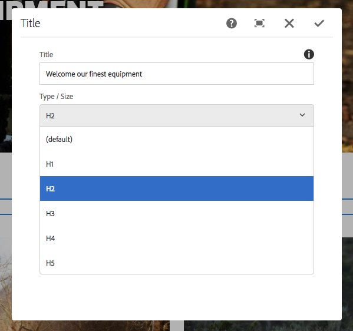

# 제목 구성 요소 (v 1){#title-component-v}

핵심 구성 요소 제목 구성 요소는 즉석 편집을 특징으로 하는 섹션 제목 구성 요소입니다.

## 사용량 {#usage}

제목 구성 요소는 컨텐츠 섹션의 제목 또는 제목으로 사용됩니다.

사용 가능한 머리글 수준은 [디자인 대화 상자에서 템플릿 작성자가 정의할](title-v1.md#main-pars_title_1995166862)수 있습니다. 컨텐츠 편집기는 [편집 대화 상자에서 사용 가능한 머리글 수준 중에서 선택할](title-v1.md#main-pars_title)수 있습니다. 편의를 위해 제목 텍스트를 간단하게 즉석에서 편집할 수도 있습니다.

## 버전 및 호환성 {#version-and-compatibility}

이 문서에서는 원래 AEM 6.3 이 있는 핵심 구성 요소의 릴리스 1.0.0에 도입된 제목 구성 요소의 v 1에 대해 설명합니다.

다음 표에는 제목 구성 요소의 v 1 호환성이 나와 있습니다.

| AEM 버전 | 제목 구성 요소 v 1 |
|--- |--- |
| 6.3 | 호환 가능 |
| 6.4 | 호환 가능 |

>[!CAUTION]
>
>이 문서에서는 제목 구성 요소의 버전 1에 대해 설명합니다.
>
>제목 구성 요소의 현재 버전에 대한 자세한 내용은 [제목 구성 요소](title.md) 문서를 참조하십시오.

## 샘플 구성 요소 출력 {#sample-component-output}

[다음은 We. Retail](https://helpx.adobe.com/experience-manager/6-4/sites/developing/using/we-retail.html)에서 가져온 샘플입니다.

### 스크린샷 {#screenshot}


### HTML {#html}

```
<div class="cmp cmp-title aem-GridColumn aem-GridColumn--default--12">
     <h2>Welcome! This is our finest equipment!</h2>
</div>
```

### JSON {#json}

```
"title": {
              "columnClassNames": "aem-GridColumn aem-GridColumn--default--12",
              ":type": "weretail/components/content/title",
              "jcr:title": "Welcome! This is our finest equipment!",
              "type": "h2"
            }
```

>[!NOTE]
>
>핵심 구성 요소에서 JSON 내보내기를 사용하려면 핵심 구성 요소의 릴리스 1.1.0 이 필요합니다. 자세한 내용은 [핵심 구성 요소 v 1](versions.md#main-pars_title_236368006) 의 호환성 정보를 참조하십시오.

## 편집 대화 상자 {#edit-dialog}

컨텐츠 작성자는 편집 대화 상자를 사용하여 제목 텍스트를 정의하고 제목 수준을 선택할 수 있습니다.

>[!NOTE]
>
>제목 값이 비어 있으면 페이지 제목이 표시됩니다.



즉석 편집기를 사용하여 제목 구성 요소의 텍스트를 편집할 수도 있습니다.


## 디자인 대화 상자 {#design-dialog}

템플릿 작성자는 디자인 대화 상자를 사용하여 컨텐츠 작성자가 만들 때 제목 구성 요소가 가질 기본 머리글 수준을 정의할 수 있습니다.


## 기술 세부 정보 {#technical-details}

제목 구성 요소에 [대한 최신 기술 설명서는 Github](https://github.com/adobe/aem-core-wcm-components/tree/master/content/src/content/jcr_root/apps/core/wcm/components/title/v1/title)에서 찾을 수 있습니다.

Github에서 전체 핵심 구성 요소 프로젝트를 다운로드할 수 있습니다.

핵심 구성 요소 개발에 대한 자세한 내용은 [핵심 구성 요소 개발자 설명서를](developing.md)참조하십시오.
