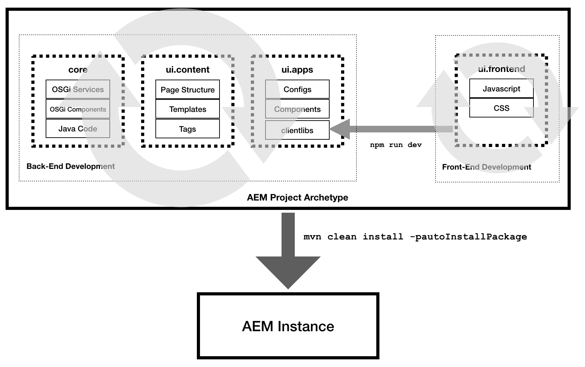

# AEM 프로젝트 원형형의 ui.frontend 모듈 {#uifrontend-module}

AEM Project Tranype에는 Webpack을 기반으로 하는 선택적 전용 프런트 엔드 빌드 메커니즘이 포함되어 있습니다. 따라서 ui.frontend 모듈은 JavaScript 및 CSS 파일을 비롯한 모든 프로젝트의 프런트 엔드 리소스의 중앙 위치가 됩니다. 이 유용하고 유연한 기능을 최대한 활용하려면 프런트 엔드 개발이 AEM 프로젝트에 어떻게 적합한지 이해하는 것이 중요합니다.

## AEM 프로젝트 및 프런트 엔드 개발 {#aem-and-front-end-development}

크게 간소화된 용어로, AEM 프로젝트는 두 개의 분리된 관련 부분으로 구성될 수 있습니다.

* AEM의 논리를 지원하고 Java 라이브러리, OSGi 서비스 등을 생성하는 백엔드 개발
* 결과 웹 사이트의 표시 및 동작을 유도하고 JavaScript 및 CSS 라이브러리를 생성하는 프런트 엔드 개발

이러한 두 개발 프로세스는 프로젝트의 서로 다른 부분에 중점을 두므로 백엔드 및 프런트엔드 개발이 동시에 발생할 수 있습니다.



그러나 결과로 발생하는 모든 프로젝트는 백엔드 및 프런트엔드 등 두 개발 노력의 결과물을 사용해야 합니다.

실행을 `npm run dev` 하면 ui.frontend 모듈에 저장된 JavaScript 및 CSS 파일을 수집하는 프런트 엔드 빌드 프로세스가 시작되고, 호출된 축소 클라이언트 라이브러리 또는 클라이언트 라이브러리 두 개를 만들어 ui.apps 모듈에 `clientlib-site` 예치하게 `clientlib-dependencies` 됩니다. clientlibs는 AEM 파섹

clientlibs를 포함한 `mvn clean install -PautoInstallPackage` 모든 프로젝트 아티팩트를 사용하여 전체 AEM 프로젝트 전형 실행이 실행되면 AEM 인스턴스로 푸시됩니다.

>[!TIP]
>AEM 개발 설명서의 [clientlibs와](https://helpx.adobe.com/experience-manager/6-5/sites/developing/using/clientlibs.html) ui.frontend 모듈에서 [](#clientlib-generation)클라이언트 사용 방법에 대해 자세히 알아보십시오.

## 가능한 프런트 엔드 개발 워크플로우 {#possible-workflows}

프런트 엔드 빌드 모듈은 유용하고 유연한 도구이지만 사용 방법에 대한 특별한 의견은 없습니다. 다음은 *가능한* 사용법에 대한 두 가지 예입니다. 그러나 개별 프로젝트에 다른 사용 모델이 필요할 수 있습니다.

### Webpack 정적 개발 서버 사용 {#using-webpack}

Webpack을 사용하면 ui.frontend 모듈 내의 AEM 웹 페이지의 정적 출력을 기반으로 스타일을 지정하고 개발할 수 있습니다.

1. 페이지 미리 보기 모드를 사용하거나 URL로 전달하여 AEM에서 페이지 미리 `wcmmode=disabled` 보기
1. 페이지 소스 보기 및 ui.frontend 모듈 내의 정적 HTML로 저장
1. [웹 팩을](#webpack-dev-server) 시작하고 필요한 JavaScript 및 CSS를 생성하고 스타일링을 시작합니다.
1. Run `npm run dev` to generate the clientlibs

이 흐름에서 AEM 개발자는 1단계와 2단계를 수행하고 AEM HTML 출력을 기반으로 개발하는 프런트 엔드 개발자에게 정적 HTML을 전달할 수 있습니다.

>[!TIP]
>
>또한 구성 요소 라이브러리를 [활용하여](https://opensource.adobe.com/aem-core-wcm-components/library.html) 각 구성 요소의 마크업 출력 샘플을 캡처하여 페이지 수준이 아닌 구성 요소 수준에서 작업할 수 있습니다.

### 스토리북 사용 {#using-storybook}

Storybook [을](https://storybook.js.org) 사용하면 보다 원자적인 프런트 엔드 개발을 수행할 수 있습니다. Storybook은 AEM Project Tranype에 포함되어 있지 않지만, 이 Storybook을 설치하고 ui.frontend 모듈 내에 Storybook 객체를 저장할 수 있습니다. AEM 내에서 테스트할 준비가 되면 실행으로 clientlibs로 배포할 수 `npm run dev`있습니다.

>[!NOTE]
>
>[Storybook](https://storybook.js.org) 은 AEM 프로젝트 원형에는 포함되지 않습니다. 사용하려는 경우 별도로 설치해야 합니다.

### 마크업 결정 {#determining-markup}

프로젝트에 맞게 구현하려는 프런트 엔드 개발 워크플로우에서 백엔드 개발자와 프런트 엔드 개발자는 마크업에 먼저 동의해야 합니다. 일반적으로 AEM은 주요 구성 요소에서 제공하는 마크업을 정의합니다. [하지만 필요한](https://docs.adobe.com/content/help/en/experience-manager-core-components/using/developing/customizing.html#customizing-the-markup)경우 이 항목을 사용자 지정할 수 있습니다.

## ui.frontend 모듈 {#ui-frontend-module}

AEM 프로젝트 전형(선택 사항)에는 다음 기능이 포함된 웹팩을 기반으로 하는 전용 프런트 엔드 빌드 메커니즘이 포함되어 있습니다.

* 전체 TypeScript, ES6 및 ES5 지원(적용 가능한 웹 팩 래퍼 포함)
* TSLint 규칙 세트를 사용한 TypeScript 및 JavaScript 린팅
* 기존 브라우저 지원을 위한 ES5 출력
* Globbing
   * 어디에서나 가져오기 추가 필요 없음
   * 이제 모든 JS 및 CSS 파일을 각 구성 요소에 추가할 수 있습니다.
      * 우수 사례는 `/clientlib/js`또는 `/clientlib/css`또는 `/clientlib/scss`
   * 모든 것이 웹 팩을 통해 실행되므로 `.content.xml` 필요 `js.txt`또는`css.txt` 파일이 없습니다.
   * 글로벌 번호는 `/component/` 폴더 아래의 모든 JS 파일을 가져옵니다.
      * Webpack을 사용하면 CSS/SCSS 파일을 JS 파일을 통해 체인으로 연결할 수 있습니다.
      * 그들은 두 개의 진입점을 통해 `sites.js` , 그리고 `vendors.js`있습니다.
   * AEM에서 사용되는 유일한 파일은 출력 파일이며, 출력 파일뿐만 `site.js` 아니라, `site.css``/clientlib-site` `dependencies.js` `dependencies.css` 및 `/clientlib-dependencies`
* 청크
   * 기본(사이트 js/css)
   * 공급업체(종속성 js/css)
* 전체 Sass/Scss 지원(Sass는 Webpack을 통해 CSS로 컴파일됨)
* AEM의 로컬 인스턴스에 내장 프록시가 있는 정적 웹 팩 개발 서버

>[!NOTE]
>
>ui.frontend 모듈에 대한 자세한 기술 정보는 GitHub에 대한 [설명서를 참조하십시오](https://github.com/adobe/aem-project-archetype/blob/master/src/main/archetype/ui.frontend/README.md).

## 설치 {#installation}

1. NodeJS [](https://nodejs.org/en/download/) (v10+)를 전역적으로 설치합니다. npm도 설치합니다.
1. 프로젝트에서 ui.frontend로 이동하고 실행합니다 `npm install`.

>[!NOTE]
>
>ui.frontend 폴더를 채우는 옵션을 [사용하여 원형 유형을](overview.md) `-DoptionIncludeFrontendModule=y` 실행해야 합니다.

## 사용량 {#usage}

다음 npm 스크립트는 프런트 엔드 워크플로우를 구동합니다.

* `npm run dev` - JS 최적화가 비활성화되어 있고(트리 흔들기 등) 소스 맵이 활성화되어 있으며 CSS 최적화가 비활성화되어 있습니다.
* `npm run prod` - JS 최적화(트리 흔들기 등)가 활성화된 완벽한 빌드, 소스 맵 비활성화 및 CSS 최적화가 활성화된 소스 맵
* `npm run start` - AEM에 대한 종속성을 최소화하여 로컬 개발을 위한 정적 웹팩 개발 서버를 시작합니다.

## 출력 {#output}

ui.frontend 모듈은 폴더 아래의 코드를 컴파일하고 컴파일된 CSS 및 JS와 이름이 지정된 폴더 아래의 모든 리소스를 출력합니다. `ui.frontend/src` `ui.frontend/dist`

* **사이트** - `site.js``site.css` 및 레이아웃 종속 이미지와 글꼴을 위한 `resources/` 폴더가 `dist/`clientlib-site 폴더에 생성됩니다.
* **종속성** - `dependencies.js` 폴더에 `dependencies.css` `dist/clientlib-dependencies` 만들어집니다.

### JavaScript {#javascript}

* 최적화 - 프로덕션 빌드의 경우 사용 중이거나 호출되지 않는 모든 JS가 제거됩니다.

### CSS {#css}

* 자동 수정 - 모든 CSS는 사전 수정을 통해 실행되며 사전 수정이 필요한 모든 속성은 자동으로 CSS에 추가됩니다.
* 최적화 - 이후 모든 CSS는 다음 기본 규칙에 따라 표준화하는 최적기(cssnano)를 통해 실행됩니다.
   * 브라우저 호환성 및 압축을 모두 보장하여 가능한 경우 CSS 계산 표현식을 줄이고 등가 길이, 시간 및 각도 값 간을 전환합니다. 기본적으로 길이 값은 변환되지 않습니다.
   * 규칙, 선택기 및 선언과 관련된 주석 제거
   * 중복된 규칙, at-rules 및 선언을 제거합니다.
      * 이 기능은 정확한 복제에만 작동합니다.
   * 출력에 영향을 주지 않으므로 빈 규칙, 미디어 쿼리 및 빈 선택기가 있는 규칙을 제거합니다.
   * 인접한 규칙을 선택기와 겹쳐진 속성/값 쌍으로 병합
   * CSS 파일에 하나의 @charset만 있고 문서 맨 위로 이동하는지 확인
   * 결과 출력이 작으면 CSS 초기 키워드를 실제 값으로 바꿉니다.
   * SVGO를 사용하여 인라인 SVG 정의 압축
* 정리 - 생성된 CSS, JS 및 Map 파일을 On-Demand로 정리하기 위한 명시적 정리 작업을 포함합니다.
* 소스 매핑 - 개발 빌드만

>[!NOTE]
>프런트 엔드 빌드 옵션은 일반 구성 파일을 공유하는 개발 전용 및 prod 전용 웹 팩 구성 파일을 사용합니다. 이렇게 하면 개발 및 제작 설정을 개별적으로 수정할 수 있습니다.

### 클라이언트 라이브러리 생성 {#clientlib-generation}

ui.frontend 모듈 빌드 프로세스는 [aem-clientlib-generator](https://www.npmjs.com/package/aem-clientlib-generator) 플러그인을 활용하여 컴파일된 CSS, JS 및 모든 리소스를 ui.apps 모듈로 이동합니다. aem-clientlib-generator 구성은 에 정의되어 `clientlib.config.js`있습니다. 다음 클라이언트 라이브러리가 생성됩니다.

* **clientlib-site** - `ui.apps/src/main/content/jcr_root/apps/<app>/clientlibs/clientlib-site`
* **clientlib-dependencies** - `ui.apps/src/main/content/jcr_root/apps/<app>/clientlibs/clientlib-dependencies`

### 페이지에 클라이언트 라이브러리 포함 {#clientlib-inclusion}

`clientlib-site` 및 `clientlib-dependencies` 카테고리는 페이지 정책 구성을 [통해](https://helpx.adobe.com/experience-manager/6-5/sites/developing/using/page-templates-editable.html#TemplateDefinitions) 기본 템플릿의 일부로 페이지에 포함됩니다. 정책을 보려면 컨텐츠 페이지 템플릿 &gt; 페이지 **정보 &gt; 페이지 정책을 편집합니다**.

사이트 페이지에 클라이언트 라이브러리를 최종 포함시키는 방법은 다음과 같습니다.

```
<HTML>
    <head>
        <link rel="stylesheet" href="clientlib-base.css" type="text/css">
        <script type="text/javascript" src="clientlib-dependencies.js"></script>
        <link rel="stylesheet" href="clientlib-dependencies.css" type="text/css">
        <link rel="stylesheet" href="clientlib-site.css" type="text/css">
    </head>
    <body>
        ....
        <script type="text/javascript" src="clientlib-site.js"></script>
        <script type="text/javascript" src="clientlib-base.js"></script>
    </body>
</HTML>
```

위의 포함은 페이지 정책을 업데이트하거나 해당 클라이언트 라이브러리의 카테고리 및 포함 속성을 수정하여 수정할 수 있습니다.

### 정적 Webpack 개발 서버 {#webpack-dev-server}

ui.frontend 모듈에 포함되어 있는 웹 팩-개발 서버는 AEM 외부의 신속한 프런트 엔드 개발을 위해 라이브 재로드를 제공하는 웹 팩-개발 서버입니다. 이 설정은 html-webpack-plugin을 활용하여 ui.frontend 모듈에서 컴파일된 CSS 및 JS 파섹

#### 중요 파일 {#important-files}

* `ui.frontend/webpack.dev.js`
   * 여기에는 webpack-dev-serve에 대한 구성이 포함되며 사용할 html 템플릿을 가리킵니다.
   * 또한 localhost:4502에서 실행되는 AEM 인스턴스에 대한 프록시 구성이 포함되어 있습니다.
* `ui.frontend/src/main/webpack/static/index.html`
   * 서버가 실행할 정적 HTML입니다.
   * 이를 통해 개발자는 CSS/JS를 변경하고 마크업에 즉시 반영되는 내용을 볼 수 있습니다.
   * 이 파일에 배치된 마크업은 AEM 구성 요소에서 생성된 마크업을 정확하게 반영한다고 가정합니다.
   * 이 파일의 마크업은 AEM 구성 요소 마크업과 자동으로 동기화되지 않습니다.
   * 또한 이 파일에는 코어 구성 요소 CSS 및 응답형 격자 CSS와 같은 AEM에 저장된 클라이언트 라이브러리에 대한 참조가 포함되어 있습니다.
   * 웹 팩 개발 서버는 에 있는 구성을 기준으로 로컬 실행 AEM 인스턴스에서 이러한 CSS/JS를 포함하도록 설정되어 `ui.frontend/webpack.dev.js`있습니다.

#### 사용 {#using-webpack-server}

1. 프로젝트의 루트 내에서 명령을 실행하여 전체 프로젝트를 에서 실행 중인 AEM 인스턴스에 `mvn -PautoInstallSinglePackage clean install` 설치합니다 `localhost:4502`.
1. 폴더 안을 `ui.frontend` 탐색합니다.
1. 다음 명령을 실행하여 webpack 개발 서버를 `npm run start` 시작합니다. 시작한 후에는 브라우저(`localhost:8080` 또는 사용 가능한 다음 포트)를 열어야 합니다.

이제 CSS, JS, SCSS 및 TS 파일을 수정할 수 있으며 변경된 내용은 웹팩 개발 서버에 즉시 반영됩니다.
